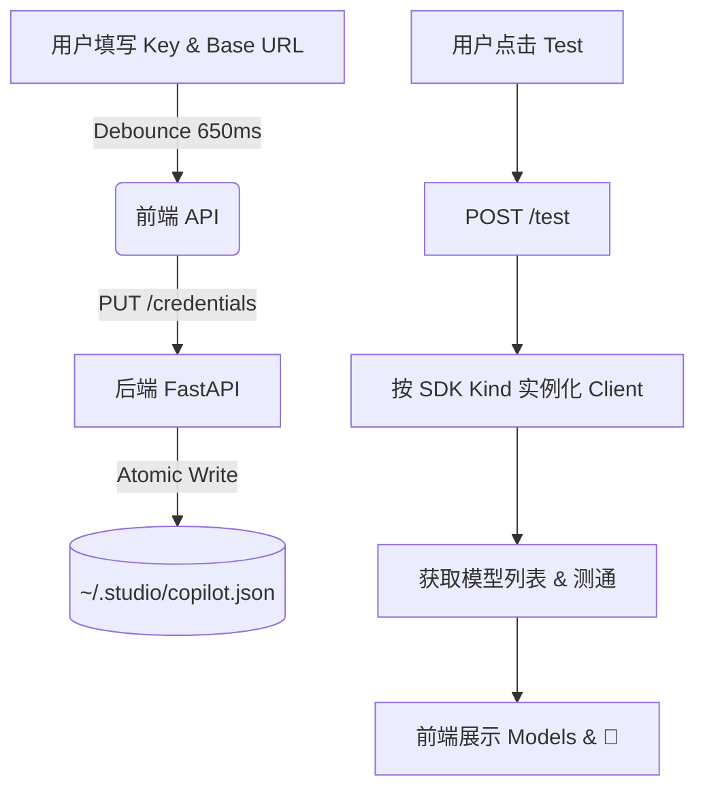

# Design Doc: Studio Copilot Providers (v3)

**Status**: Draft — v3 基于 v2.5 实测用户反馈重设计, 2026-05-14
**Author**: a2 Gemini
**Related Requirements**: `requirements.md`

## 1. 架构概览

为了彻底解决“模型厂商”与“API 提供方”混淆的问题，并提供业内最佳的设置体验（参考 VS Code Continue / Cline / Cursor），v3 采用 **“模型厂商 (Vendor) -> 接口提供方 (Provider)” 的两层结构**。

- **Vendor (模型厂商)**: 概念层，代表底层大模型的创造者（Claude / OpenAI / DeepSeek / Gemini 等），支持自定义扩展。
- **Provider (接口提供方)**: 具体的 API 接入点（官方直连 / OpenRouter / 各种中转代理 / Ollama 本地部署等）。每个 Provider 绑定一套特定的调用协议（SDK Kind）。

**数据流向 (Mermaid):**


## 2. Storage Schema

彻底推翻旧版字典结构，采用两层结构的平铺化表达。增加 Vendor 实体以支持用户自定义厂商扩展。

### 2.1 JSON Schema v3 (`~/.studio/copilot.json`)

```json
{
  "vendors": [
    {
      "id": "claude",
      "name": "Claude",
      "is_preset": true
    },
    {
      "id": "custom-mistral",
      "name": "Mistral",
      "is_preset": false
    }
  ],
  "providers": [
    {
      "id": "prov-claude-official",
      "vendor_id": "claude",
      "name": "Official API",
      "sdk_kind": "anthropic-native",
      "api_key": "sk-ant-...",
      "use_custom_url": false,
      "base_url": "",
    }
  ]
}
```

### 2.2 Pydantic Models

```python
from typing import Literal, List, Optional
from pydantic import BaseModel, Field

SDKKind = Literal["anthropic-native", "openai-compat", "google-genai", "ollama"]

class VendorInfo(BaseModel):
    id: str = Field(..., description="唯一标识，预设项使用 claude/openai 等")
    name: str = Field(..., description="UI 显示名称")
    is_preset: bool = Field(default=False, description="预设厂商不可删除")

class ProviderConfig(BaseModel):
    id: str = Field(..., description="唯一标识，如 prov-xxx")
    vendor_id: str = Field(..., description="归属的模型厂商 ID，用于 UI 分组")
    name: str = Field(..., description="提供方名称 (e.g. Official API, OpenRouter)")
    sdk_kind: SDKKind = Field(..., description="决定后端调用的客户端协议")
    api_key: str = Field(default="", description="明文存储的 API Key")
    use_custom_url: bool = Field(default=False, description="是否使用自定义 Base URL")
    base_url: str = Field(default="", description="自定义请求地址")

class CopilotCredentials(BaseModel):
    vendors: List[VendorInfo] = Field(default_factory=list)
    providers: List[ProviderConfig] = Field(default_factory=list)
```

### 2.3 Migration 策略
**直接覆盖默认模板**。遇到 v1/v2 的旧格式 JSON 报错时，不写迁移逻辑（原型期避免向后兼容债务）。直接初始化 4 个 Preset Vendor (Claude/OpenAI/DeepSeek/Gemini)，并为每个 Preset Vendor 初始化 1 个默认的 Official Provider 模板。自定义 Vendor 列表默认为空。

## 3. 后端 API 契约

### 3.1 GET `/api/copilot/credentials`
- **返回**: 完整的 `CopilotCredentials` 对象，**下发明文 `api_key`**。

### 3.2 PUT `/api/copilot/credentials`
- **接收**: 完整的 `CopilotCredentials` 对象，执行全量原子覆盖。

### 3.3 POST `/api/copilot/test`
- **接收**: 单个 `ProviderConfig` (无论是否已保存，用于 Draft 测试)。
- **返回**:
  ```json
  {
    "status": "ok",
    "latency_ms": 240,
    "message": "Connected",
    "models": [
      {
        "id": "claude-3-7-sonnet-20250219",
        "supports_thinking": true,
        "supports_vision": true,
        "supports_function_calling": true
      }
    ]
  }
  ```
  如果出错，返回 `"status": "error", "message": "错误详情..."`。

### 3.4 鉴权
所有 API 通过 `STUDIO_DEV_TUNNEL_TOKEN` middleware 保护，复用目前的鉴权实现（见 studio-tunnel-safety）。

## 4. 前端 UI 设计 (对齐反馈)

### 4.1 布局与居中
- 放弃原本贴左侧的流式布局，在右侧 ScrollArea 的 Content 内部使用 `<div className="mx-auto max-w-2xl py-8">` 实现居中。

### 4.2 Vendor -> Provider 两层视觉结构
UI 以 **Vendor (模型厂商)** 为顶级区块（Section）。例如：

```text
======================================================================
[ 总体 Active Provider 选择: Claude - Official API  v ]
======================================================================

### Claude 
(管理基于 Claude 的所有接入渠道)

  +--------------------------------------------------------------+
  | Provider: Official API (SDK: anthropic-native)               |
  | API Key: [••••••••••••••••••••] [Eye]               [ Test ] |
  | Type: (o) Official Endpoint  ( ) Custom Endpoint             |
  | Status: ✓ Connected (150ms)                                  |
  +--------------------------------------------------------------+
  [ + Add Custom Provider ]
  
### OpenAI
... (同上)

[ + Add Vendor ]
```

### 4.3 彻底杜绝 Chrome 强密码弹窗
- **方案**: 不使用 `type="password"`，也不使用 `autocomplete="new-password"`。
- **实施**: 强制使用 `<Input type="text" className={!keyVisible ? "text-security-disc" : ""} />`。
- CSS `.text-security-disc { -webkit-text-security: disc; }` 将在视觉上呈现黑点，但 Chrome password manager 完全不会将其识别为凭据字段，从而完美绕开强密码生成器的拦截。

### 4.4 对话框设计与 Advanced 替代
- **取消 Collapsible 折叠面板**。将 Base URL 与“官方/第三方 Provider”的 RadioGroup (Official Endpoint / Custom Endpoint) 联动。选 Custom 时 inline 展开 Base URL Input。
- **Add Custom Provider Dialog 设计**: 
  - 字段: `Name` (Input), `SDK Kind` (Select: openai-compat 等，一般不选 anthropic-native 除非官方), `API Key` (Input), `Use Custom URL` (Toggle/Radio), `Base URL` (Input, 当 Use Custom URL 为真时必填)。
  - 交互: 提交后向当前 Vendor 的 Provider 列表 push 一项，触发 debounce 保存。
- **Add Vendor Dialog 设计**:
  - 字段: `Name` (Input, 用于 display_name, 自动生成内部 ID)。
  - 交互: 提交后新增一个 Vendor，并**自动在其下创建一个空白的 Provider** 以供填写。

### 4.5 Test 按钮状态与交互
- **状态逻辑**: Test 按钮 **disabled** 条件为：`api_key === ""`（若 `use_custom_url` 为 true，则同时要求 `base_url` 非空）。
- **提示信息**: disabled 状态下悬浮 tooltip 提示 `"Please enter API Key first"`。
- 状态展示与 Test 结果合并，作为 Card 底部的一个紧凑 Indicator (`✓ Connected`, `⚠ Untested`, `❌ Error`)。

### 4.6 模型列表与 🧠 Thinking 标识
- 测试成功后，后端返回真实的 Model list。
- UI 呈现 Active Model 选择框 `<Select>`，下拉列表中附带 Thinking 能力的视觉标识 (如 `🧠` chip)。

## 5. 安全细节

- **本机明文存储**: API Key 以明文保存在本机 `~/.studio/copilot.json` (0600 权限) 是桌面端应用的标配，由 OS 用户隔离保护。
- **防 SSRF / Reflection**: Test endpoint 会尝试请求用户提供的 `base_url`。在桌面应用语境下，假设用户自身具有完全的内网访问权限是合理的，无需做严格的域名白名单过滤，但必须对超大 Payload 和超时做硬性截断，防止导致后端 OOM。

## 6. 与其他系统集成

**Settings 职责边界**: 本 spec 只管 API Key 池 (vendors + providers 配置) 的持久化和管理 UI，**不维护任何"当前选了哪个 provider / 哪个 model"的状态**。

**Copilot Panel 集成契约**:
- Copilot WS 握手 / 调用前，由 Copilot Panel UI 自己决定用哪个 provider + 哪个 model (Copilot Panel 顶部应有自己的 Picker，类似 ChatGPT / Cursor)。
- Copilot Panel 通过 GET `/api/copilot/credentials` 读凭据池，自己在前端 state 里管运行时选择。
- 后端在收到 Copilot 调用请求时，由请求体显式传 `provider_id` (和可选 `model`)，后端按该 provider 的 `sdk_kind` 实例化客户端。
- 运行时选择状态的持久化方案 (localStorage / 单独 file / 内存) **归 Copilot Panel 自身 spec，不在本 spec scope**。

## 7. 命名词汇表

- **Vendor**: 模型厂商 (Claude / OpenAI / DeepSeek / Gemini)，包含 `preset_vendor` (预设) 和 `custom_vendor` (自定义)。
- **Provider**: 具体 API 提供方实体 (如 Anthropic 官方、OpenRouter 中转等)。
- **SDK Kind (`sdk_kind`)**: 决定调用 LLM 采用的协议适配器 (`anthropic-native`, `openai-compat`, `google-genai`, `ollama`)。
- **废弃词汇**: `backend` (已全面被 vendor 和 provider 取代)。

## 8. YAGNI (不引入的复杂度)

- 不引入 OAuth 或 Cloud Sync (纯本地桌面应用，免登录)。
- 不引入 Multi-tenant 租户隔离。
- 不引入 Audit Log。
- 不引入 v1.5 placeholder 的历史占位逻辑。
- **Add Vendor 边界**: 不支持修改 Vendor 名称，不支持自定义 `sdk_kind` 的拓展列表。
- **Settings 不持久化 active provider / active model 选择 (运行时状态归 Copilot Panel)**。列表。��表。�。 Multi-tenant 租户隔离。
- 不引入 Audit Log。
- 不引入 v1.5 placeholder 的历史占位逻辑。
- **Add Vendor 边界**: 不支持修改 Vendor 名称，不支持自定义 `sdk_kind` 的拓展列表。列表。��表。�。���。�。