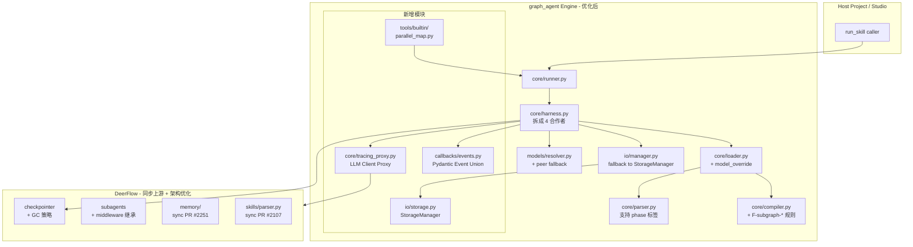
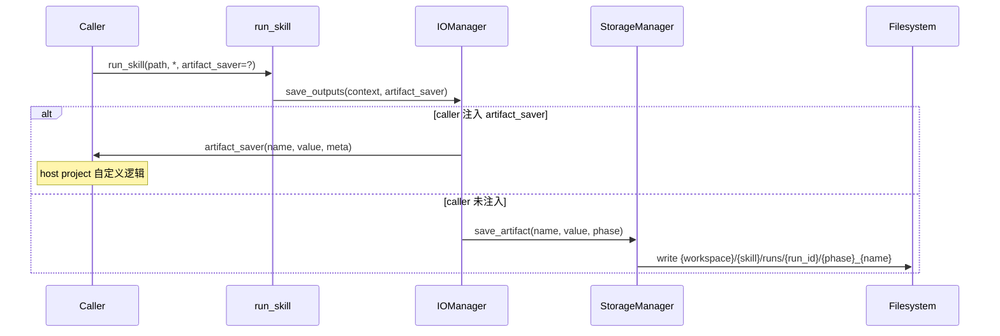
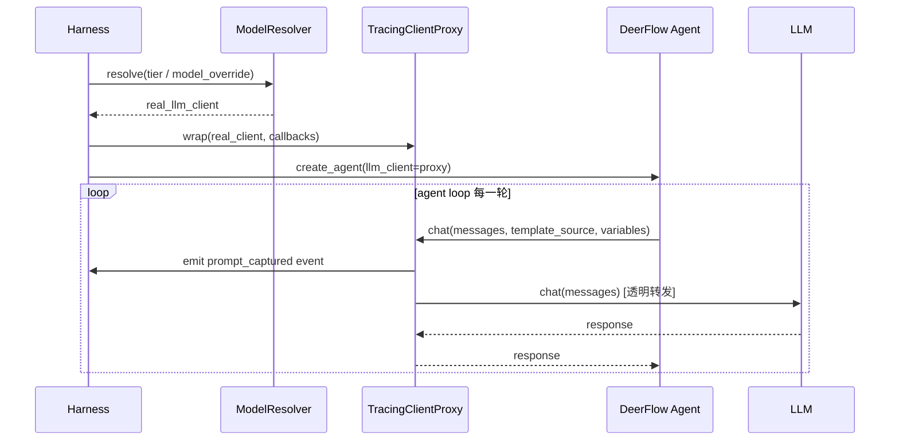
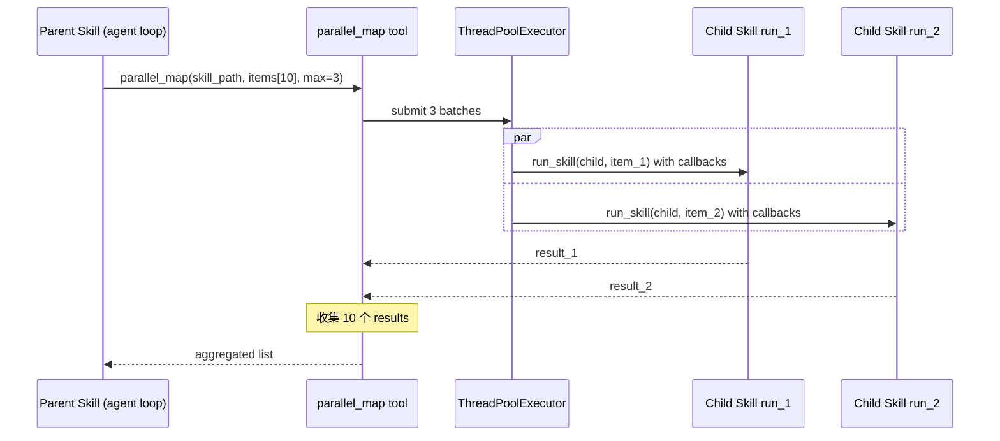

# Design Document

## Overview

**Purpose**：整合 graph_agent 引擎侧的 21 条优化需求（见 requirements.md），给出统一的架构改动方案、组件接口、执行顺序和风险控制。

**Users**：Owner 本人实施；Studio 开发团队作为下游消费者。

**Impact**：
- 引擎层 4 处主要新增/改造：`io/storage.py`（新增 StorageManager）、`callbacks/events.py`（新增 Pydantic 事件）、`tools/builtin/parallel_map.py`（新增 builtin 工具）、`core/tracing_proxy.py`（新增 LLM Proxy 拦截层）
- 引擎层多处调整：`core/parser.py`（支持 `<phase>` 标签）、`core/loader.py`（model_override 字段）、`core/harness.py` 拆分、`skills/compiler/data/rules.yaml`（F-*/W-* 新规则）
- DeerFlow 层同步 6 个上游 bug fix + 3 个架构优化（不改原始 `# MODIFIED` 保留标记）
- 仓库结构调整：物理整理 `src/core/graph_agent/` → `packages/graph-agent/src/graph_agent/`

### Goals
- 让 Studio MVP 的所有功能依赖项（StorageManager / Prompt Capture / CallbackEvent / 断点续跑 / parallel_map）在引擎层完整就绪
- 清掉现有已知 bug（特别是 DeerFlow memory update bug 和 compiler 静默丢弃）
- 统一术语和目录约定（phase），为未来协作减少认知成本

### Non-Goals
- ❌ 不碰 Studio UI 层（那是 Studio 开发团队的事）
- ❌ 不引入 Rust 重写（out of scope，见 `FRAMEWORK_UNDERSTANDING.md`）
- ❌ 不引入 uv workspace（保留给 Studio 项目启动时做）
- ❌ 不实现 MCP / community tools 恢复（DeerFlow 被裁剪的两个模块 P3+ 再说）
- ❌ 不实现意图偏离检测 / Working Memory 一致性评分（Studio MVP3 的事）
- ❌ 不破坏 host project (story_forge) 现有代码（保留 legacy DataManager / ArtifactManager 作为兼容层）

## Architecture

### Existing Architecture Analysis

当前 graph_agent 架构（见 `docs/graph_agent_docs/FRAMEWORK_UNDERSTANDING.md`）：
- 外层 `GraphAgentHarness`（`core/harness.py` 952 行）驱动 LangGraph 编排 + nudge + checkpoint
- 中间层 middleware（`cognitive/middlewares.py`）做认知约束
- 内层 DeerFlow agent loop（11k 行 vendored 代码）

现有缺口/bug：
- compiler 对 subgraph + tools/prompt 混写**静默丢弃不报错**（bug）
- 没有内置 StorageManager，PM 直接用框架看不到产出
- 没有 builtin parallel_map，业务 skill 用 Python dispatcher 绕过框架
- CallbackEvent 是 string-based dict，前端消费不稳定
- Prompt Capture 三元组没有埋点（PM 调试黑盒）
- 术语 phase/node 混用
- DeerFlow copy 落后上游 1 月，至少 6 个重要修复未同步
- Subagent 不继承父 agent 中间件（行为失控风险）

### Architecture Pattern & Boundary Map



**Architecture Integration**：
- 所有新增组件（TracingProxy、StorageManager、Events、parallel_map）都是**外层插入**，不改 DeerFlow 源码（红线 #1）
- Kitchen-Pass 红线保留：StorageManager 作为 default saver，caller 注入的 `artifact_saver` 优先级更高
- Phase 三模式互斥硬约束保留，compiler 补 FATAL 规则让"静默丢弃"变成"编译报错"
- Subagent 中间件继承是对 DeerFlow 的**一处小修改**（加 `# MODIFIED` 注释），符合 NOTICE.md 的标记规范

### Technology Stack

| Layer | Choice / Version | Role | Notes |
|-------|------------------|------|-------|
| Core engine | Python 3.12 + LangGraph ≥1.2 | 现有不变 | |
| Agent loop | DeerFlow vendored，sync from 2026-03-28 → latest main | 同步 6 个 PR | 保留 MODIFIED 标记 |
| Events | Pydantic v2 discriminated union | 现有 12 + 新增 2 = 14 事件 | schema_version="1.0" |
| Checkpointer | LangGraph 原生 Checkpointer（memory/sqlite/postgres） | 现有不变，加 GC | |
| Storage | 新 StorageManager + 原 artifact_saver 回调 | 默认 + 覆盖 | |
| Compiler rules | `skills/compiler/data/rules.yaml` 扩展 | 加 F-subgraph-exclusive-* 3 条 FATAL | |
| Build system | 独立子包 pyproject.toml | `packages/graph-agent/` | 不引入 workspace |

## System Flows

### Flow 1: StorageManager 作为 default saver 的路径



### Flow 2: Prompt Capture 埋点路径



### Flow 3: parallel_map 子 skill 并发执行



## Components and Interfaces

### Engine Layer

#### StorageManager（新增）

| Field | Detail |
|-------|--------|
| Intent | graph_agent 内置的默认 artifact 落盘实现 |
| Requirements | R5, R6 |

**位置**：`packages/graph-agent/src/graph_agent/io/storage.py`

**Service Interface**：
```python
from pathlib import Path
from typing import Any

class StorageManager:
    def __init__(
        self,
        workspace_root: Path,
        skill_id: str,
        run_id: str,
        *,
        history_retention: int = 10,
    ) -> None: ...

    def get_output_dir(
        self,
        *,
        pipeline_prefix: str | None = None,
    ) -> Path:
        """返回当前 run 的落盘目录，自动创建并触发 history 清理。

        默认路径: {workspace_root}/{skill_id}/runs/{run_id}/
        有 prefix: {workspace_root}/{pipeline_prefix}/{skill_id}/runs/{run_id}/
        """

    def save_artifact(
        self,
        name: str,
        content: Any,
        *,
        phase: str | None = None,
    ) -> Path:
        """落盘一个 artifact。传 phase 时文件名加 phase 前缀。
        例: phase="setup", name="output" → setup_output.json
        """

    def load_latest(self, phase: str, name: str) -> Any | None:
        """加载最近一次 run 的指定 artifact"""

    def _cleanup_history(self) -> int:
        """检查 .history/ 下非 .golden 目录，超限物理删除最老的。返回删除数。"""
```

**关键不变量**：
- 签名**不含 `user_id`**（user 是 Studio 概念，Studio 自己拼好 workspace_root 传入）
- `.golden` 后缀目录**永不删除**
- `pipeline_prefix` 作为**运行时上下文**传入（不读取任何配置文件）

#### TracingClientProxy（新增）

| Field | Detail |
|-------|--------|
| Intent | 在 LLM client 外层包一层，拦截每次 chat 调用前 emit prompt_captured 事件 |
| Requirements | R7 |

**位置**：`packages/graph-agent/src/graph_agent/core/tracing_proxy.py`

**Service Interface**：
```python
class TracingClientProxy:
    def __init__(
        self,
        wrapped_client: Any,  # 原始 LLM client
        callbacks: list[Any],  # graph_agent callbacks
        *,
        llm_role: str,
        resolved_model: str,
    ) -> None: ...

    def chat(
        self,
        messages: list[dict],
        *,
        template_source: str | None = None,
        variables: dict | None = None,
        **kwargs,
    ) -> Any:
        """emit prompt_captured event, then call real client.chat()"""

    def __getattr__(self, name: str):
        """其他方法透明转发给 wrapped_client"""
```

**集成点**：`core/harness.py` 的 `_resolve_model_for_phase` 里，resolved client 进入 DeerFlow `create_agent()` 之前，用 `TracingClientProxy` 包一层。

#### Events（新增 Pydantic 模型）

| Field | Detail |
|-------|--------|
| Intent | 14 个事件的 Pydantic discriminated union |
| Requirements | R8 |

**位置**：`packages/graph-agent/src/graph_agent/callbacks/events.py`

```python
from typing import Annotated, Literal, Union
from datetime import datetime
from pydantic import BaseModel, Field

class BaseEvent(BaseModel):
    schema_version: Literal["1.0"] = "1.0"
    timestamp: datetime
    phase_name: str | None = None

class PromptCapturedPayload(BaseModel):
    template_source: str
    variables: dict[str, Any]
    final_prompt: str
    loop_index: int
    llm_role: str
    resolved_model: str

class PromptCapturedEvent(BaseEvent):
    event_type: Literal["prompt_captured"]
    payload: PromptCapturedPayload

# ... 其他 13 个事件类型

CallbackEvent = Annotated[
    Union[
        PhaseStartEvent, PhaseEndEvent, LLMCallEvent, ToolCallEvent,
        ValidationFailEvent, RetryEvent, FinishTaskEvent, NudgeEvent,
        WorkingMemoryUpdateEvent, DeadEndPrunedEvent, CompactionEvent,
        AmbiguityReportEvent,
        # 新增
        PromptCapturedEvent, LLMFallbackEvent,
    ],
    Field(discriminator="event_type"),
]
```

**迁移策略**：现有 `callbacks/base.py` 的 14 个钩子改 emit Pydantic 事件；下游消费者（logging / metrics / tracing）同步改。

#### parallel_map（新增 builtin tool）

| Field | Detail |
|-------|--------|
| Intent | 让 agent loop 并发调用同一子 skill N 次 |
| Requirements | R4 |

**位置**：`packages/graph-agent/src/graph_agent/tools/builtin/parallel_map.py`

**Tool Signature**（给 LLM 看的）：
```python
def parallel_map(
    skill_path: str,
    item_list: list[Any],
    item_as: str,
    *,
    max_concurrent: int = 3,
) -> list[Any]:
    """并发调用同一个子 skill 多次，对 item_list 的每个 item 跑一遍子 skill。

    Args:
        skill_path: 子 skill 的 SKILL.md 路径（相对当前 skill 或绝对路径）
        item_list: 要并发处理的 item 列表
        item_as: 把当前 item 作为子 skill 的哪个 input 字段名传入
        max_concurrent: 最大并发数，默认 3（对齐 DeerFlow subagent）

    Returns:
        每个 item 对应子 skill 运行结果组成的 list
    """
```

**内部实现**：
- 用 `ThreadPoolExecutor(max_workers=max_concurrent)` 并发
- 每个 item 调用 `run_skill(skill_path, {item_as: item, ...})` 完整走框架（不绕过认知循环）
- 父 callbacks 通过 `runtime_inputs` propagate 到子 skill（保证 trace 可见）
- 聚合结果返回

### Compiler Rules

#### 新增 FATAL 规则

**位置**：`skills/compiler/data/rules.yaml`

```yaml
fatal:
  F-subgraph-exclusive-tools:
    scope: phase
    check: subgraph_excludes_tools
    description: "subgraph 模式的 phase 不能同时有 tools"
    reason: "subgraph 模式下 phase 本身不跑 LLM/Code，tools 会被静默丢弃；请挪到独立的 code-only phase"

  F-subgraph-exclusive-prompt:
    scope: phase
    check: subgraph_excludes_prompt
    description: "subgraph 模式的 phase 不能同时有 <system_prompt> 或 <user_prompt>"
    reason: "subgraph 模式下 phase 本身不跑 LLM，prompt 会被静默丢弃；请删除或改用 Agent-Loop 模式"

  F-subgraph-exclusive-sub-skills:
    scope: phase
    check: subgraph_excludes_sub_skills
    description: "subgraph 模式的 phase 不能同时有 sub_skills"
    reason: "subgraph 模式下没有 agent loop，sub_skills 无意义；请改用 Agent-Loop 模式 phase"

warning:
  W-node-to-phase-migration:
    scope: tag
    check: node_tag_used
    description: "建议把 <node id=...> 标签迁移为 <phase id=...>"
    reason: "术语统一：代码 dataclass 是 Phase，SKILL.md 推荐用 <phase>"

  W-python-glue-orchestrator:
    scope: skill
    check: orchestrator_uses_python_glue
    description: "Orchestrator skill 用 Python dispatcher 胶水组合子 skill，建议改用 subgraph: 或 sub_skills:"
    reason: "原生 subgraph/sub_skills 能让子 skill 独立测试、可视化、trace 保持完整"
```

### Data Models

#### Phase dataclass 扩展

位置：`packages/graph-agent/src/graph_agent/core/types.py`

```python
@dataclass
class Phase:
    # 现有字段（不变）
    name: str
    tier: str
    tools: list
    system_prompt: str | None
    user_prompt_template: str | None
    validator: Callable | None
    retry_target: str | None
    max_retries: int
    max_iterations: int
    max_nudges: int = 1  # R10: 默认从 3 改到 1
    dead_end_threshold: int
    requires_llm: bool
    subgraph: "GraphAgentHarness | None"
    context_bridge: "ContextBridge | None"
    data_architecture: str | None

    # 新增字段 R9
    model_override: str | None = None  # 优先于 tier
```

#### llm_roles.yaml 扩展格式

```yaml
# 原有三段式不变
models: { ... }
providers: { ... }
roles: { balanced, fast, premium, ... }

# 新增：单模型 role（用于确定性测试）
single_model_roles:
  deepseek-reasoner-fixed:
    model_code: DS_R1
    provider_code: OC_DS  # 只一个，无 fallback
  gpt4o-fixed:
    model_code: GPT4O
    provider_code: OPENAI

# 新增：同级模型组（R9.4 peer fallback）
peer_model_groups:
  code_strong:
    - { model_code: CL46, provider_code: OC_CL }
    - { model_code: GPT4O, provider_code: OPENAI }

# 新增：熔断阈值可配置（R9.5）
circuit_breaker:
  default_window_minutes: 30
  default_error_threshold: 30
  per_provider:
    OC_CL: { window_minutes: 15, error_threshold: 20 }
```

## Requirements Traceability

| Requirement | Summary | Components | Files |
|-------------|---------|------------|-------|
| R1 | Phase/node 术语统一 | parser, compiler, skills/ | `core/parser.py`, `skills/compiler/data/rules.yaml`, 6 个业务 skill |
| R2 | Compiler subgraph 互斥 FATAL 规则 | compiler | `skills/compiler/data/rules.yaml`, `skills/examples/bad-samples/` |
| R3 | `<step>` 规范化标签 | parser, compiler | `core/parser.py`, `skills/compiler/data/rules.yaml` |
| R4 | builtin parallel_map | new tool | `tools/builtin/parallel_map.py` |
| R5 | StorageManager 内置化 | new component | `io/storage.py`, `io/manager.py` |
| R6 | History 清理 + .golden 锁定 | StorageManager | `io/storage.py` |
| R7 | TracingClientProxy | new component | `core/tracing_proxy.py`, `core/harness.py` |
| R8 | CallbackEvent 类型化 | callbacks | `callbacks/events.py`, `callbacks/base.py` + 14 钩子 |
| R9 | model_override + peer fallback | loader, resolver | `core/types.py`, `models/resolver.py`, `config/llm_roles.yaml` |
| R10 | Nudge 默认 1 | types | `core/types.py` |
| R11 | 独立子包整理 | repo 结构 | `packages/graph-agent/` + `pyproject.toml` |
| R12 | Story-deconstruction 样板改造 | skills | `skills/story-deconstruction/`, `skills/examples/bad-samples/` |
| R13 | DeerFlow 上游同步 | deerflow/* | 6 个 PR |
| R14 | Subagent 中间件继承 | deerflow | `deerflow/agents/lead_agent/agent.py` |
| R15 | Checkpointer GC | deerflow | `deerflow/agents/checkpointer/provider.py` |
| R16 | Plan Mode / WorkingMemory 边界 | cognitive + deerflow | `cognitive/middlewares.py`, `deerflow/client.py` |
| R17 | Studio checkpointer 配置 | harness | `core/harness.py`, 环境变量 |
| R18 | .gitignore + legacy 清理 | repo | `.gitignore`, `skills/builtin/script/`, legacy 文件 |
| R19 | 多模态工具单测 | tests | `tests/tools/` |
| R20 | Harness.py 拆分 | refactor | `core/harness.py` → 4 合作者 |
| R21 | 文档合并 | docs | `docs/graph_agent_docs/` + symlink |

## Error Handling

### Migration 期间的兼容性

**兼容性策略**：
- R5 StorageManager：保留旧的 `DataManager` / `ArtifactManager` 作为 deprecated shim，加日志警告。**host project (story_forge) 不需要立即迁移**，但新代码推荐用 StorageManager
- R8 CallbackEvent 类型化：旧的 dict-based callback 接口保持一段时间（emit 事件时同时发旧格式 dict + 新 Pydantic 实例），3 个月后 deprecated 移除
- R11 包结构调整：`from src.core.graph_agent import X` 通过 `src/core/graph_agent/__init__.py` 的 re-export 兼容 shim 保留 2 版本

### DeerFlow 同步冲突处理

当同步上游 PR 时遇到 `# MODIFIED` 标记的文件（`models/factory.py`、`agents/lead_agent/agent.py`、`agents/middlewares/tool_error_handling_middleware.py`）：
- 先读 NOTICE.md 确认本地修改语义
- merge 上游改动时 **保留 MODIFIED 标记和本地逻辑**
- 冲突部分手动 merge，测试回归

### DeerFlow #2251 Memory Bug 修复后的回归

这个 bug 影响 working_memory 持久化。修复后需要跑一次 smoke test：
- 启动一个有 working_memory update 的 skill
- 故意让 `FileMemoryStorage.save()` 失败（mock disk full）
- 验证 cache 和 on-disk 状态一致
- 验证重启后 working_memory 不丢

## Testing Strategy

### Default sections

- **Unit Tests**：
  1. `StorageManager.get_output_dir()` 的路径模板 + pipeline_prefix 注入
  2. `StorageManager._cleanup_history()` 保留 N 个 + 跳过 `.golden`
  3. `TracingClientProxy.chat()` emit prompt_captured 事件并透明转发
  4. `CallbackEvent` Pydantic union 对所有 14 种事件 round-trip 正确
  5. `parallel_map` 对 10 个 items 用 max_concurrent=3 并发跑完
  6. Compiler 规则 F-subgraph-exclusive-tools / -prompt / -sub-skills 对 bad-samples 触发 FATAL

- **Integration Tests**：
  1. End-to-end：跑一个改造后的 story-deconstruction（subgraph 组合），验证 4 个子 skill 正确执行 + context 传递
  2. 断点续跑：跑到 phase_3 手动 kill，用 `harness.resume(state, thread_id)` 从 checkpoint 继续
  3. 人工接入：skill 调用 `request_human_input`，harness.resume 注入答案后正常跑完
  4. parallel_map：10 个 item 的并发场景，验证并发数 3 限流 + callback 事件正确 propagate

- **Regression Tests**（针对 DeerFlow 同步）：
  1. Memory update 在 disk full 模拟下 cache 和磁盘一致
  2. Subagent 继承父 agent 的 WorkingMemory / DeadEndPruning 中间件

- **Performance** (次优先级)：
  1. Checkpoint 在 50 次循环 batch_loop 下磁盘占用不超过 100MB

## Migration Strategy

```mermaid
flowchart LR
    A[当前状态<br/>多处 bug + 静默丢弃] --> B[Step 1<br/>.gitignore + legacy 清理]
    B --> C[Step 2<br/>同步 DeerFlow PR #2251 等]
    C --> D[Step 3<br/>StorageManager + Events 类型化]
    D --> E[Step 4<br/>TracingProxy + parallel_map]
    E --> F[Step 5<br/>Compiler 新规则 + Phase 术语统一]
    F --> G[Step 6<br/>model_override + Nudge 降权]
    G --> H[Step 7<br/>Harness 拆分 + 仓库结构整理]
    H --> I[Step 8<br/>Story-deconstruction 样板改造]
    I --> J[就绪状态<br/>Studio MVP1 可启动]
```



**Rollback 触发**：
- 任一 Step 的回归测试失败 → 回退该 Step，分析原因
- DeerFlow 同步冲突无法手动 merge → 暂缓该 PR，记录 backlog，继续其他
- StorageManager 破坏现有 host project → 回退到"legacy only"模式，加 deprecated shim

## Supporting References

- `docs/graph_agent_docs/FRAMEWORK_UNDERSTANDING.md` — 引擎架构完整心智模型
- `docs/studio/README.md` — Studio 项目对齐文档（消费者视角）
- `plan.md` — 原始需求记录（所有需求的权威来源）
- DeerFlow 上游：https://github.com/bytedance/deer-flow
