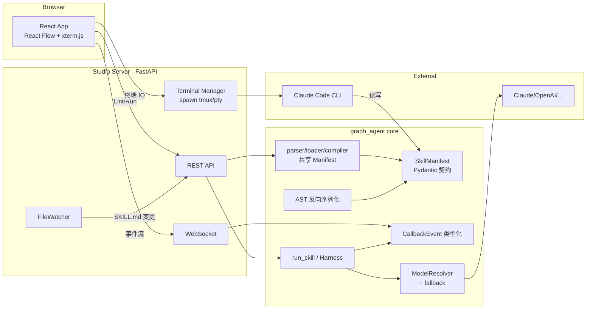
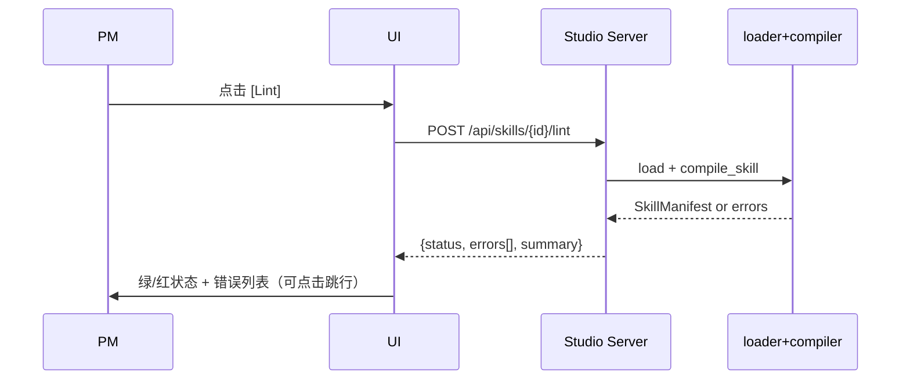
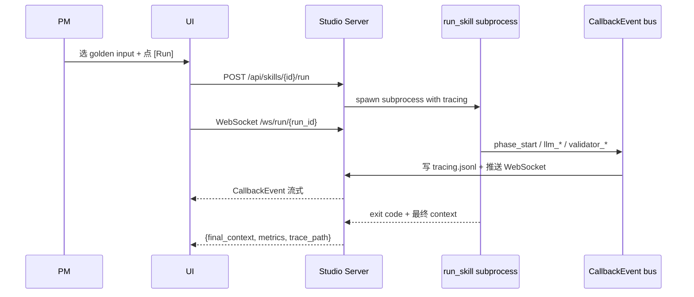
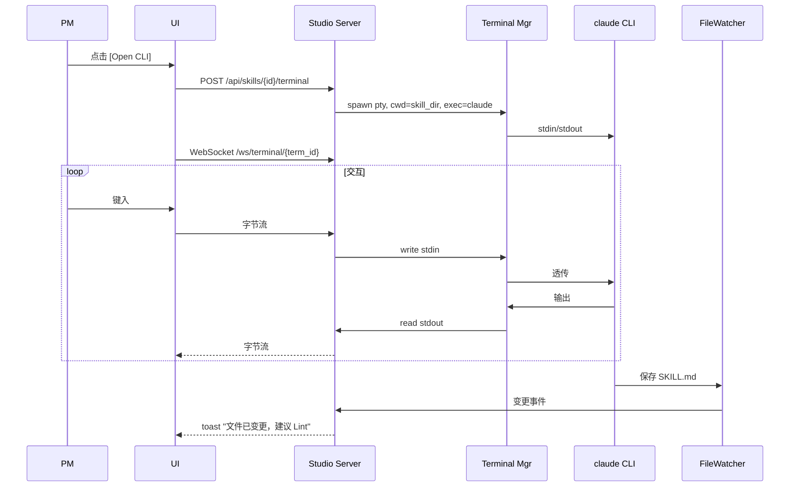
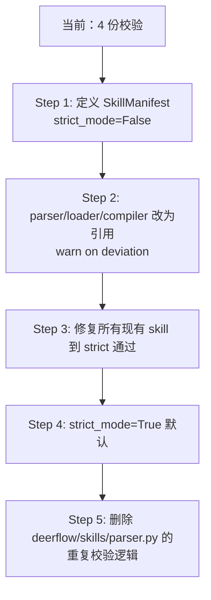

# Design Document

## Overview

**Purpose**: 给 graph_agent 加一个 Web 配套工具（Studio），让 PM 能在浏览器里完成 skill 的校验、运行、观察，所有 skill 编辑走 Claude Code CLI（P1 档位 A 明确设计决策，不自造 Copilot）。

**Users**: 产品经理（PM）。他们通过 Studio 看图、跑 skill、读 trace；通过 Claude Code CLI 改 SKILL.md。

**Impact**: 引入 Studio Server（FastAPI 后端 + React 前端）。框架核心侧新增四项引擎增量：单一 `SkillManifest` Pydantic 契约、AST 反向序列化、`CallbackEvent` 类型化、`Step.when` 表达式求值。不改 DeerFlow 源码。

### Goals
- P0：把框架层的四项引擎增量做干净，作为所有后续工具的地基
- P1 档位 A：交付 PM 可用的 Studio（Lint / Run / Open CLI / 只读可视化），最小可用（MVP）
- P1.5：强制用户验证关卡，在 P2 之前获取真实反馈
- 通过极简 CLI 按钮借用 Claude Code 的全部 Copilot 能力，**不**自造 Copilot

### Non-Goals
- ❌ 完整 Copilot SDK 集成（自愈 diff / AST patch / golden set 自动生成）— 推迟到 P2+ 按 P1.5 反馈决定
- ❌ 画布 Topology 编辑（拖拽改 DSL）— 推迟到 P2+ 且需 AST 反向序列化成熟后才考虑
- ❌ SKILL.md Monaco 内嵌编辑器 — P1 档位 A 明确不做，强制走 CLI
- ❌ 版本管理 / A/B Test / Golden Dataset 对话式录入 — 推迟
- ❌ Sandbox 容器化隔离 — 当前风险面（PM 不直接写 Python）不足以要求 Docker，只做 Path Jailing + 高危命令白名单
- ❌ Rust 重写 — 明确 out of scope（见 research.md D7）

## Architecture

### Existing Architecture Analysis

`graph_agent` 当前以 SKILL.md 为 DSL，运行时分两层：
- **外层** LangGraph `StateGraph`（`core/harness.py` 952 行）驱动阶段流转和重试路由
- **内层** vendored DeerFlow `create_agent()`（`deerflow/` 11k 行）驱动 LLM 调用和工具执行

引擎现状：
- `core/parser.py` + `core/loader.py` + `core/compiler.py` + `deerflow/skills/parser.py` 各有一套 SKILL.md 校验，CHANGELOG 声称"by design"但实质是债
- `callbacks/` 有 14 个钩子但未类型化，前端消费会追 bug
- `tools/md_to_json.py` 有 MD→Pydantic 的正向能力，无反向
- `models/resolver.py` 有 provider failover 但参数硬编码

本次设计尊重既有边界：
- **不改 DeerFlow 源码**，扩展靠外层 harness 和 callbacks
- **框架层零业务逻辑**，业务只在 skill 目录
- **Kitchen-Pass**：产物先进 context，由 IOManager + artifact_saver 落盘

### Architecture Pattern & Boundary Map



**Architecture Integration**:
- 模式：**Ports & Adapters**（Studio Server 是 adapter，engine 是 port）。Studio 不依赖 engine 内部结构，只消费 `SkillManifest` + `CallbackEvent` 两个契约。
- 边界：**Terminal Manager 严格隔离**（每个 PM session 独立 pty），避免跨 session 污染。
- 既有模式保留：LangGraph StateGraph、DeerFlow agent loop、ModelResolver 三段式 tier/role/model/provider。
- 新组件必要性：
  - `SkillManifest` 合并 4 份校验逻辑的债（见 R1）
  - `serialize_skill()` 为 future 画布 patch 预留接口（P1 不直接使用，但 R2 要求必须存在）
  - `CallbackEvent` 解决前端解析稳定性（R3）
  - Studio Server 是全新的进程，独立于 engine 部署

### Technology Stack

| Layer | Choice / Version | Role in Feature | Notes |
|-------|------------------|-----------------|-------|
| Frontend | React 18 + Vite + TypeScript | Studio UI | 选 Vite 而非 Next.js — P1 档位 A 是 SPA 不需要 SSR |
| UI Libs | React Flow 11 + xterm.js 5 + Monaco (read-only) | 图/终端/只读代码视图 | Monaco 只读是红线，见 R5.4 |
| Backend | FastAPI 0.115 + Uvicorn | REST + WebSocket | 已在 graph_agent 生态 (Python 3.12+) |
| Terminal | ptyprocess / tmux | spawn Claude Code CLI | macOS/Linux 用 pty，远程部署可选 tmux |
| Engine | graph_agent (本仓库) | 校验 + 运行 | 作为 Python 包被 Studio Server import |
| Expression Eval | simpleeval 1.0 | Step.when 求值 | 见 research.md D3 |
| Serialization | ruamel.yaml (round-trip) | frontmatter 序列化 | 保留注释/引号风格，见 research.md D2 |
| Process Mgmt | Python multiprocessing | Run 隔离 | 避免 PM 长 run 阻塞主进程 |

## System Flows

### Flow 1: Lint 按钮



### Flow 2: Run + WebSocket Trace



### Flow 3: Open CLI



## Requirements Traceability

| Requirement | Summary | Components | Interfaces | Flows |
|-------------|---------|------------|------------|-------|
| 1 | Pydantic 单一契约 | SkillManifest, parser/loader/compiler 整合 | `model_validate()` | — |
| 2 | AST 反向序列化 | serialize_skill() | Public API | — |
| 3 | CallbackEvent 类型化 | callbacks/events.py | Pydantic union | Flow 2 |
| 4 | Prompt Capture 埋点 | DeerFlow wrapper callback | PromptCapturedEvent | Flow 2 |
| 5 | Lint Button | REST /lint + 前端 LintPanel | HTTP | Flow 1 |
| 6 | Run Button | REST /run + WebSocket + TraceTimeline | HTTP + WS | Flow 2 |
| 7 | Open CLI Button | TerminalManager + 前端 xterm | PTY + WS | Flow 3 |
| 8 | 只读可视化 | React Flow SkillGraph + DetailPanel | — | — |
| 9 | 用户验证关卡 | Dogfood playbook（文档） | — | — |
| 10 | when 条件字段 | Step.when + SimpleEvalContext | Engine 内部 | — |
| 11 | Copilot Fallback | ModelResolver 扩展 + ReadOnlyMode | Engine + Studio | — |

## Components and Interfaces

### Engine Layer

#### SkillManifest (Pydantic v2)

| Field | Detail |
|-------|--------|
| Intent | SKILL.md 在内存里的唯一 AST 表示 |
| Requirements | 1, 2, 10 |

**Responsibilities & Constraints**
- frontmatter + body 的全部结构校验
- `schema_version: Literal["1.0"]` 字段强制存在
- discriminated union：`phases: list[Phase | CodePhase]`
- invariants: phase name 唯一 / retry_target 存在 / sub_skills 路径可解析

**Dependencies**
- Inbound: `core/parser.py`, `core/loader.py`, `core/compiler.py`, `deerflow/skills/parser.py`（全改为引用 SkillManifest）
- Outbound: Pydantic v2
- External: —

**Contracts**: Service [x] / API [x] / Event [ ] / Batch [ ] / State [ ]

##### Service Interface
```python
from pydantic import BaseModel

class SkillManifest(BaseModel):
    schema_version: Literal["1.0"]
    name: str
    description: str
    type: Literal["graph", "code"]
    io: IoDeclaration
    phases: list[PhaseConfig]
    sub_skills: list[SubSkillSpec] = []
    context_mapping: dict[str, str] = {}

class PhaseConfig(BaseModel):
    name: str
    tier: Literal["premium", "balanced", "fast"] | None = None
    model_override: str | None = None  # 细粒度模型指定（见 research.md D4）
    tools: list[str]
    steps: list[Step] = []  # 扁平 step，不嵌套
    validator: str | None = None
    retry_target: str | None = None
    max_retries: int = 3
    output_schema: str | None = None
    # ... Phase dataclass 原有字段

class Step(BaseModel):
    name: str
    goal: str
    tools: list[str] = []
    validator: str | None = None
    when: str | None = None  # simpleeval 表达式
    skip_if: str | None = None
```
- Preconditions: SKILL.md 已被 YAML+XML 解析为 dict
- Postconditions: 返回 SkillManifest 或 抛出 ValidationError
- Invariants: 同一段 SKILL.md 多次 validate 结果幂等

**Implementation Notes**
- Integration: `core/parser.py` 保留对 YAML+XML 的底层解析，把 dict 喂给 `SkillManifest.model_validate()`
- Validation: discriminated union on `type` 字段
- Risks: 现有 5 个业务 skills 可能触发新规则，需要过渡期。策略：新增 `strict_mode=False` 默认，逐步收紧

#### serialize_skill()

| Field | Detail |
|-------|--------|
| Intent | SkillManifest → 格式稳定的 SKILL.md 文本 |
| Requirements | 2 |

**Responsibilities & Constraints**
- frontmatter: ruamel.yaml round-trip 模式，保留 key 顺序
- body: 固定 `<node>` / `<phase_config>` / `<step>` 的缩进、换行、属性顺序
- 幂等：`parse(serialize(m)) == m` 且 `serialize(parse(s)) == s`（经空白规范化后）

**Contracts**: Service [x]

##### Service Interface
```python
def serialize_skill(manifest: SkillManifest, *, indent: int = 2) -> str: ...
```
- Preconditions: manifest 已通过校验
- Postconditions: 返回合法 UTF-8 Markdown，EOF 换行

### Callback Layer

#### CallbackEvent（Pydantic discriminated union）

| Field | Detail |
|-------|--------|
| Intent | 所有运行时事件的类型化 schema |
| Requirements | 3, 4 |

**Responsibilities & Constraints**
- 14 个现有事件类型全部编入 union，新增必须注册
- `schema_version: Literal["1.0"]` + `event_type: Literal[...]` + `timestamp: datetime` + `phase_name: str | None` + `payload: <具体 payload 类型>`
- 序列化：每行一个 `model_dump_json()` 到 `tracing.jsonl`

**Contracts**: Event [x]

##### Event Contract
- 已有事件：`phase_start`, `phase_end`, `llm_call`, `llm_fallback`, `tool_call`, `tool_result`, `validator_start`, `validator_end`, `nudge_injected`, `dead_end_detected`, `subgraph_start`, `subgraph_end`, `checkpoint_compacted`, `finish_task_called`
- 新增事件：`prompt_captured`（R4）、`llm_fallback`（R11 扩展）
- 订阅者：`LoggingCallback`、`MetricsCallback`、`TracingCallback`、`StudioBroadcaster`（新增，把事件推 WebSocket）
- Ordering：按 timestamp 单调；WebSocket 推送保序

##### PromptCapturedEvent Payload
```python
class PromptCapturedPayload(BaseModel):
    template_source: str           # 原始模板
    variables: dict[str, object]   # 变量字典
    final_prompt: str              # 注入后最终文本
    loop_index: int                # agent loop 第几轮
    llm_role: str                  # 角色（如 balanced）
    resolved_model: str            # 实际模型代号
```

### Studio Server Layer

#### StudioAPI (FastAPI)

| Field | Detail |
|-------|--------|
| Intent | Lint / Run / Terminal 三个 REST + WebSocket 端点 |
| Requirements | 5, 6, 7 |

**Contracts**: API [x]

##### API Contract
| Method | Endpoint | Request | Response | Errors |
|--------|----------|---------|----------|--------|
| GET | /api/skills | — | `list[SkillSummary]` | 500 |
| GET | /api/skills/{id} | — | `SkillDetail`（含 SkillManifest） | 404, 500 |
| POST | /api/skills/{id}/lint | — | `LintResult` | 404, 500 |
| POST | /api/skills/{id}/run | `{input: dict, golden_id?: str}` | `{run_id}` | 400, 404, 500 |
| WS | /ws/run/{run_id} | — | stream of `CallbackEvent` | 404 |
| POST | /api/skills/{id}/terminal | — | `{term_id}` | 404, 500 |
| WS | /ws/terminal/{term_id} | — | 字节双向 | 404 |
| GET | /api/skills/{id}/trace/{run_id} | — | `{events[], metrics, final_context}` | 404 |

#### TerminalManager

| Field | Detail |
|-------|--------|
| Intent | 管理 PM 的 pty 会话生命周期 |
| Requirements | 7 |

**Responsibilities & Constraints**
- 每个 PM session 独立 pty，TTL 默认 1 小时
- 启动命令：`claude` 或 `gemini`（配置切换）
- cwd = skill 目录
- 环境变量注入：`SKILL_DIR`, `STUDIO_SESSION_ID`
- 终端断开后自动 cleanup，**禁止**复用

**Contracts**: State [x]

##### State Management
- State model: `{term_id → PtySession{pid, cwd, started_at, last_activity}}`
- Persistence: 内存 + `.studio_state/terminals.json`（仅用于崩溃后清理孤儿进程）
- Concurrency: 每个 PM 最多 3 个并发终端

### Frontend Layer

#### SkillGraph (React Flow)

| Field | Detail |
|-------|--------|
| Intent | 只读渲染 phase 图，支持点击节点展开 detail |
| Requirements | 8 |

**Responsibilities & Constraints**
- 节点布局：Dagre auto-layout（phase 顺序 + retry_target 边）
- 交互：hover 高亮 / click 展开 / 不允许拖拽连线（R8.4 红线）
- 状态着色：idle / running / passed / failed / skipped

**Implementation Notes**
- 数据源：`GET /api/skills/{id}` 返回 SkillManifest，前端转成 React Flow 的 nodes/edges
- 运行时着色：订阅 `/ws/run/{run_id}` 的 CallbackEvent 更新节点 state

## Data Models

### Domain Model

- **Aggregate Root**: `SkillManifest`（唯一事实源）
- **Entities**: `PhaseConfig`, `Step`, `SubSkillSpec`, `IoDeclaration`
- **Value Objects**: `TierChoice`, `ToolRef`, `WhenExpression`
- **Events**: `CallbackEvent` 及其 payload 类型

### Logical Data Model

- `SkillManifest 1..N PhaseConfig`
- `PhaseConfig 1..N Step`（扁平，不递归）
- `PhaseConfig 0..N Validator`（引用 string id，在 script/validators.py 定义）
- `SkillManifest 0..N SubSkillSpec`（引用外部 SKILL.md 路径）

### Physical Data Model

**File System Layout**:
```
skill_dir/
├── SKILL.md                    # 由 serialize_skill() 反向生成，也可手动编辑
├── script/
│   └── validators.py            # Python 侧 validator
├── references/calibration/
│   └── rules.yaml               # compiler 规则
└── .studio_state/               # Studio 专属
    ├── terminals.json           # 孤儿 pty 清理用
    └── runs/
        └── {run_id}/
            ├── tracing.jsonl
            ├── metrics.json
            └── final_context.json
```

### Data Contracts & Integration

**CallbackEvent schema** 是 Studio 前端的稳定契约，变更必须 bump `schema_version`。

## Error Handling

### Error Strategy

- **Studio Server → Browser**: 400/404/500 + JSON body `{error_code, message, hint}`
- **Engine → Studio Server**: 包装的 `SkillError` 基类，子类 `SchemaError`, `LintError`, `RuntimeError`, `FallbackExhaustedError`
- **Pydantic ValidationError**: 统一在 API 层捕获，转成 `LintResult{status: "failed", errors[]}`

### Error Categories and Responses

- **User Errors (4xx)**: 非法 skill_id / 非法 input JSON → 前端红色 toast 提示
- **System Errors (5xx)**: engine crash / pty spawn 失败 → 前端降级到 "Studio 服务异常，请重试" 大 banner，上报 Sentry
- **Business Logic Errors (422)**: compile_skill() 语义错 / run validator fail → 展示在对应面板，非全局错误

### Monitoring

- 所有 `CallbackEvent` 落盘到 `tracing.jsonl`
- Studio Server 日志走 stdlib `logging`，按 `/home/sevenx/.claude/rules/logging.md` 的 INFO/WARNING/ERROR 标准
- Prompt Capture 事件永不丢失（即使前端掉线也写到 trace 文件）

## Testing Strategy

### Default sections
- **Unit Tests**（engine 层）:
  1. `SkillManifest.model_validate()` 对 5 个现有业务 skills 必须通过
  2. `serialize_skill()` round-trip 幂等（parse → serialize → parse 相等）
  3. `CallbackEvent` union 解析所有 14 种事件类型
  4. `Step.when` simpleeval 上下文注入白名单生效（禁用 `__import__` 等）
  5. `ModelResolver` fallback 链路：主 provider 失败 → 备选 provider 成功
- **Integration Tests**（Studio Server）:
  1. `/api/skills/{id}/lint` 对损坏的 SKILL.md 返回结构化错误
  2. `/api/skills/{id}/run` + `/ws/run/{run_id}` 完整跑一个 echo skill，事件顺序正确
  3. `/api/skills/{id}/terminal` 启动 pty，写入 `ls` 能看到 skill 目录
  4. FileWatcher 对 SKILL.md 变更触发 `skill.changed` 事件
- **E2E/UI Tests**（Playwright）:
  1. PM 点击 [Lint] → 成功/失败状态正确渲染
  2. PM 点击 [Run] → Trace Timeline 实时追加事件
  3. PM 点击 [Open CLI] → 终端可输入 `pwd` 看到 skill 目录
- **Performance/Load**（次优先级，P1 档位 A 只做基本烟测）:
  1. 单 PM session 3 个并发 terminal 稳定
  2. WebSocket 在 100 events/sec 推送不丢序

## Security Considerations

- **PTY 越权拦截**：TerminalManager 的 cwd 严格限制在 `skills/` 目录下的合法 skill 路径，任何符号链接解析后越界拒绝
- **表达式求值**：`simpleeval` 白名单（`len/str/int/bool/in/and/or/not`），禁用 `__import__` / `getattr` / `setattr`
- **文件 I/O**：所有写操作路径白名单在 skill 目录和 `.studio_state/` 内，禁止写系统路径
- **网络**：Studio Server 默认只监听 `127.0.0.1`，远程部署需显式 `--host 0.0.0.0` + 认证中间件（P1 不含认证实现，显式在 README 警告）
- **LLM secrets**：不把 `.env` 内容发到前端；API key 只在服务端使用

## Performance & Scalability

P1 档位 A 的性能目标是"单 PM 使用不卡"，不追求多租户：
- Lint < 1s（本地 compile_skill）
- Run 启动 < 3s（spawn subprocess + 加载 harness）
- Terminal 启动 < 2s（pty + claude CLI）
- WebSocket 推送延迟 < 200ms

多 PM 并发属于 P2+ 考虑，本期不做。

## Migration Strategy

**SkillManifest 迁移**（R1）需要过渡期，避免直接 break 现有 5 个业务 skills：



**Rollback 触发**：任一现有 skill 在 Step 3 前无法通过 strict，回退 Step 1 重新评估 SkillManifest schema。

## Supporting References

- 关于 Rust 重写、when 表达式引擎选型、Copilot fallback 策略、画布 vs 文本 DSL 的分歧，详见 `research.md`
- 关于 `@/home/sevenx/.claude/rules/logging.md`、`testing.md`、`code-style.md`、`security.md` 等基础实践，按 steering 文档执行
