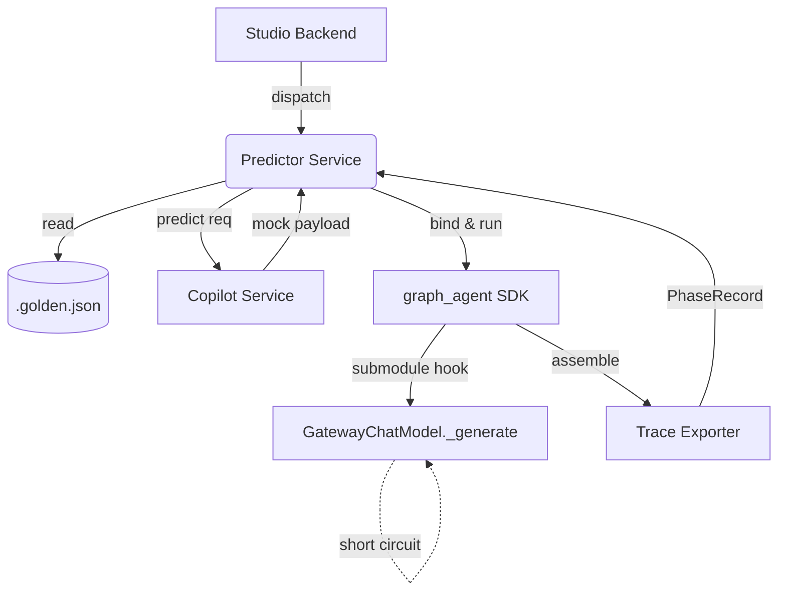

# Predict V2 Design — 高保真业务流推演沙盒

> 本文档为 Predict V2 的技术设计文档，上承 `requirements.md` (Req 1.1-6.2) 和 `research.md`。

## 1. 架构总览 (Architecture Overview)

### 系统组件交互图



### 核心数据流 (Happy Path)
1. **入参**：PM 在 UI 触发预测，Studio Backend 根据用户选择构造 `mock_llm` 参数（`None`, `dict`, 或 `Path`）。
2. **拦截点**：流程深入到 `graph_agent` 内部，当执行到 LLMPhase 时，`GatewayChatModel._generate` 钩子拦截真实的外部 HTTP 请求。
3. **填充策略**：拦截层根据 P0(Golden) > P1(Copilot) > P2(Heuristic Stub) 优先级链条直接返回构造好的 `ChatResult` Mock 数据，确保流程贯通。
4. **Trace Export**：执行完毕后，Trace Exporter 收集带有 `mocked_source` 标记的运行时快照返回给 Predictor Service，最终展示或交由 Copilot 分析。

### ABI 隔离边界声明
严格遵守 13-export ABI 锁定原则。拦截与注入逻辑**不使用**全局 Monkey-patch 污染 `GatewayChatModel` 类本身，也不在 `graph_agent` 的顶层 `__init__.py` 暴露新的类或方法。所有底层拦截机制均在私有子模块（如 `graph_agent.core._predict_internal`）中闭门实现，由内部 Resolver 动态返回带有覆写 `_generate` 方法的子类实例。

---

## 2. 组件分解 (Component Breakdown)

### Predictor Service
*   **职责**：作为 Studio 后端的独立逻辑层，负责预测任务的编排、参数的解析与注入，以及最终结果快照的汇总封装。
*   **关键签名**：
    *   `def dispatch_predict_job(skill_id: str, mock_param: Any) -> PredictResult:`
    *   `def resolve_fill_strategy(mock_param: Any) -> MockStrategy:`
    *   `def assemble_trace(raw_result: dict, path_diff: PathDiff) -> PredictResult:`
*   **依赖**：单向调用 `graph_agent` SDK 内部子模块，并消费 `Trace Exporter` 产生的数据。

### LLM Interception Layer
*   **职责**：驻留在 SDK `_predict_internal` 私有模块中，拦截底层模型调用并注入准备好的 Mock 数据。
*   **实现选择**：选用**动态 Subclass 机制**（覆写 `_generate` 和 `_agenerate`），而非 Monkey-patch 全局类。理由：Monkey-patch 易造成全局污染，影响同一进程内的真实推理任务，Subclass 机制可保证仅当前 Predict Graph 实例被拦截。
*   **关键签名**：
    *   `class PredictGatewayChatModel(GatewayChatModel): def _generate(...) -> ChatResult:`

### Mock Strategy Factory
*   **职责**：解析多态的 `mock_llm` 入参，并基于工厂模式实例化为具体的执行策略。
*   **关键签名**：
    *   `def MockStrategy.from_param(param: MockLLMParam) -> BaseMockStrategy:`
*   **依赖**：依赖 Pydantic 的 TypeAdapter 对外层传入的 Union 类型进行严格校验。

### Path Diff Engine
*   **职责**：计算并比对 Backtest 模式下的预期路由路径与实际执行路径的差异。
*   **关键签名**：
    *   `def compute_diff(expected_path: List[str], actual_path: List[str]) -> PathDiff:`
*   **实现基础**：基于 `difflib.SequenceMatcher` 包装。

### Hash Engine
*   **职责**：提供对 Prompt 模板和 Schema 的确定性哈希运算，用于 Golden Case 的失效预警。
*   **关键签名**：
    *   `def prompt_hash(text: str) -> str:` (包含空白符 Normalization)
    *   `def schema_hash(schema: dict) -> str:` (包含 Canonical JSON sort_keys)

### Trace Exporter
*   **职责**：将原始的图执行结果切片转化为扁平化、高保真的业务诊断记录。
*   **关键签名**：
    *   `def assemble_phase_record(raw_phase_event: dict) -> PhaseRecord:`
*   **逻辑**：根据拦截层注入的标记，正确填充 `mocked_source` 字段。

---

## 3. 数据模型 (Data Models)

```python
from typing import Dict, List, Literal, Optional, Union
from pydantic import BaseModel, Field, TypeAdapter
from pathlib import Path

class GoldenCase(BaseModel):
    inputs: dict
    metadata: dict = Field(..., description="Contains phase_name, prompt_hash, and io_outputs_schema_hash")
    expected_traces: Dict[str, dict] = Field(..., description="Mapping of phase_name to expected_output payload")

class PhaseRecord(BaseModel):
    phase_name: str
    type: Literal["logic", "llm"]
    inputs: dict
    outputs: dict
    mocked_source: Optional[Literal["golden_case", "copilot", "heuristic_stub", "manual"]] = None

# HeuristicStub 不是固定 Pydantic 模型, 是 _generate_heuristic_stub() 动态根据 io.outputs schema 生成的 dict.
# 示例形态: {"text": "<mock_data>", "category": "<mock_category_option_1>", "count": 0}
HeuristicStub = dict  # type alias for clarity

class PathDiff(BaseModel):
    expected_path: List[str]
    actual_path: List[str]
    missing: List[str] = Field(default_factory=list)
    extra: List[str] = Field(default_factory=list)
    order_mismatch: bool = False

class PredictResult(BaseModel):
    status: Literal["success", "failed"]
    phases: List[PhaseRecord]
    path_diff: Optional[PathDiff] = None

# Union dispatcher
MockLLMParam = TypeAdapter(Union[None, dict, Path, List[GoldenCase]])
# 解析规则:
# None -> 触发 P2 启发式存根
# dict -> 单 Phase 手动 Mock 注入 (Manual / Copilot P1 桥接)
# Path -> 加载单 GoldenCase 触发 P0
# List[GoldenCase] -> 批量 CI 回测 P0
```

---

## 4. 关键 API (Key APIs)

### `run_skill(mock_llm=...)` 行为契约
SDK 顶层 `run_skill` 函数的 `mock_llm` 参数扩展：
*   **`None` (Default)**：不再挂起，触发 **P2 启发式存根**，确保 Graph 完整跑通下游 Logic。
*   **`dict`**：解析为临时覆盖，常用于 P1 Copilot 预测结果注入或 UI 单步调试。
*   **`Path` / `List[GoldenCase]`**：解析为磁盘文件加载，进入严谨的 **P0 Backtest 模式**。

### Diagnostic Export API
为 Copilot 提供的标准化接口：
*   **选型推荐**：**In-process 函数调用**。
*   **理由**：Predictor Service 和 Copilot Service 都在 Studio Backend 同一个单体进程内，直接通过 Python module import 传递 Pydantic 模型（如 `PredictResult`）能最大化性能，避免序列化/反序列化和额外 IPC 开销。无需架设独立 HTTP Endpoint。
*   **Schema 契约**：接口输入为 Skill ID 与上下文，返回结构同 `PredictResult`。

### 内部接入 API (解决 Q2 方案 C)
Studio 后端不直接碰触 `StateGraph` 的私有变量，而是通过内部约定的绑定方法：
`from graph_agent.core._predict_internal import bind_predictor`
在 Predict 流程启动前，调用 `bind_predictor(skill_instance, mock_strategy)`，SDK 内部子模块负责将对应的拦截类装配到图节点的执行上下文中。

---

## 5. 拦截 + 填充策略实现 (Interception & Fill Strategy)

### _generate 拦截器设计
在 `_predict_internal` 模块中创建 `PredictGatewayChatModel(GatewayChatModel)` 子类，重写 `_generate`。

```python
# P0/P1/P2 决策树伪代码
def _generate(self, messages, stop=None, run_manager=None, **kwargs):
    # 1. P0: 检查是否存在 Golden Case 记录
    if self.mock_strategy.has_golden_case(self.phase_name):
        return _build_chat_result(
            self.mock_strategy.get_golden_output(self.phase_name), 
            source="golden_case"
        )
    
    # 2. P1: 检查字典覆盖 (含 Copilot 预测结果)
    if self.mock_strategy.has_manual_override(self.phase_name):
        return _build_chat_result(
            self.mock_strategy.get_manual_override(self.phase_name), 
            source="copilot" # or manual based on config
        )
        
    # 3. P2: 保底生成 Heuristic Stub
    stub_payload = _generate_heuristic_stub(self.phase_schema)
    return _build_chat_result(stub_payload, source="heuristic_stub")
```

### HeuristicStub 生成规则
动态解析 `io.outputs` Schema 并填充最小合法假数据：
*   `string` -> `"<mock_data>"` 或 `"<mock_{field_name}>"`
*   `integer` / `float` -> `0` / `0.0`
*   `boolean` -> `True`
*   `list` / `array` -> `[]`
*   `dict` / `object` -> 递归解析嵌套字段
*   `enum` -> 取枚举定义中的第一个可用值

### Streaming 适配思路
重写 `_agenerate` / `_astream`。对于流式请求，拦截器不返回单纯的 `ChatResult`，而是构造一个 Fake `AsyncIterator`，在其第一次被迭代时 yield 出包含完整假数据的单个 `ChatGenerationChunk`，随后抛出 `StopAsyncIteration` 结束流。

---

## 6. 回测 + 验证机制 (Backtest & Verification)

### Golden Case 加载流程
1. 读取 `.golden.json` 到 `GoldenCase` 模型。
2. 调用 Hash Engine 获取当前代码的 `prompt_hash` 和 `io_outputs_schema_hash`。
3. 对比 JSON metadata 中的对应 hash 值。
4. **决策**：如果不匹配，打印 Warning 级日志，并可在 UI 界面标记“用例已过时，推荐重新捕获”。默认不强行 abort，尽量完成本次测试运行以提供最大信息量。

### Path Diff 触发 FAILED
Graph 运行结束后，获取 `actual_path`（实际执行的 Phase 序列）并与 Golden Case 绑定的 `expected_path` 执行 LCS 对比。
如果引擎检测到任何 `missing` (缺失节点)、`extra` (非预期节点) 或 `order_mismatch` (顺序颠倒)，立即将 `PredictResult.status` 置为 `"failed"`，向前端暴露 Diff 数据供 PM 审查路由分发逻辑。

### P2 启发式存根专用路由循环上限
鉴于 P2 生成的假数据（特别是固定值的 Enum）极易导致路由决策卡死在单一分支，引入专用常数限制（如 `MAX_PHASE_REVISITS = 10`）。
执行引擎监控单一 `phase_name` 的访问频次，一旦超限立刻抛出 `PredictDeadlockError`，中断运行并输出当前陷入死循环的 `actual_path` 轨迹。

---

## 7. 可观测性 + 集成 (Observability & Integration)

### TracingCallback 注入点
在现有的 Callback 链条中注册 `PredictTracingCallback`。
*   `on_chain_start`：在 Root 节点强行写入 `is_predict: true` 标识。
*   `on_phase_end`：提取拦截器暂存的 source 信息，将 `mocked_source` (如 `heuristic_stub`) 回写到当前 Phase 的 Trace Metadata 中。

### 零成本计量实现
在 `_build_chat_result` 内部，强制覆写 `ChatResult` 的 LLMOutput 字段，设置 `usage = TokenUsage(input=0, output=0, total_cost=0)`，彻底避免测试运行产生计费面板脏数据。

### Copilot 接入契约
*   **主动与被动**：Predict 模块不主动调用 Copilot。
*   **P1 预测注入**：Studio Backend 在组装 Predict Job 之前，主动调用 Copilot 生成合理输出，再将结果通过 `mock_llm=dict` 的形式注入 Predict 流程（作为 P1 优先级）。
*   **结果消费**：Predict 运行结束后返回的 `PredictResult` (包裹了 `PhaseRecord` 列表) 将作为标准数据切片，供 Copilot 摄入进行全流程分析和建议。

---

## 8. 实施风险 + Open Issues

### Q2 拍板：强烈推荐方案 C (SDK 内部封装)
| 方案 | 优 | 劣 |
| :--- | :--- | :--- |
| (a) Studio 独立微服务 | 架构解耦极度清晰 | 需重写 RPC 接口序列化状态，开发成本极高 |
| (b) SDK 参数透传 | 实现简单 | 13-export ABI 被污染，底层需全量感知 predict 状态 |
| **(c) SDK 内部封装** | **13-export 维持纯净，无需网络开销** | 需维护私有 `_predict_internal` 模块以约束边界 |
**结论**：方案 C 利用 Python 内部模块特性完美平衡了 API 洁癖和集成成本，为最优解。

### 已知 Risks 与缓解方案
*   **ChatResult 元字段缺失**：框架可能强依赖 `id` 或 `usage` 字段。**缓解**：在 `_build_chat_result` 中硬编码填充标准格式的 `mock_id_xxx` 和当前的时间戳，并注入 Zero Usage。
*   **Streaming Iterator 兼容**：上游代码期待一块块获取 token。**缓解**：实现专门的 Fake AsyncIterator 返回完整单块数据（见 §5）。
*   **Pydantic Path 解析异常**：非标准输入导致堆栈报错晦涩。**缓解**：在工厂方法 `MockStrategy.from_param` 内增加 `try/except ValidationError` 并转化为用户友好的提示。
*   **Hash Normalization 掩盖业务语义**：去空格操作可能破坏特定的 Markdown 格式要求。**缓解**：制定研发规范文档，要求 Predict 用户尽量不编写“空格敏感”的业务逻辑判断。
*   **Diagnostic JSON 体积膨胀**：超大文本导致 Copilot 上下文溢出。**缓解**：Trace Exporter 实现截断机制，当 PhaseRecord.inputs/outputs 大于 N KB 时自动执行文本 Truncate 并打上 `truncated: bool` 标识。
*   **合法循环 vs 死锁误判**：合理的多次循环被强杀。**缓解**：`MAX_PHASE_REVISITS` 设为全局配置变量可供微调，且该防护仅在 P2 模式生效，Backtest (P0) 模式下不启动该上限监控。

### V2 启动门禁 Checklist (Req 6.1)
1.  [ ] **Tauri Sidecar 稳定**：核心 Python 进程能不借助外力实现自举与重启。
2.  [ ] **Input Playground 重构闭环**：新版测试输入组件上线，能稳定支持复杂结构输入。
3.  [ ] **Monorepo 拆分完成**：SDK 与 Studio 的代码库物理隔离完成，13-export 契约已建立并执行。
*(只有以上三项全部划勾，本规范定义的 Predict V2 开发方可启动)*