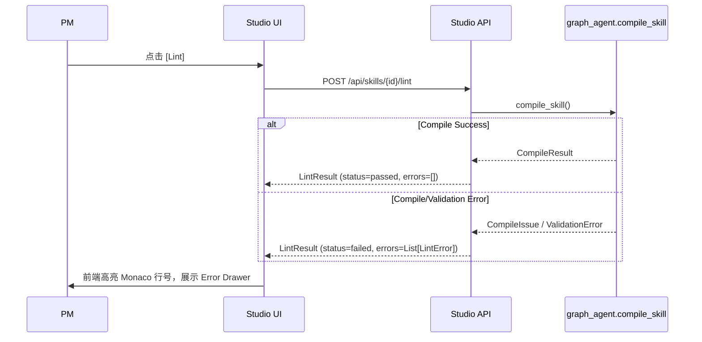
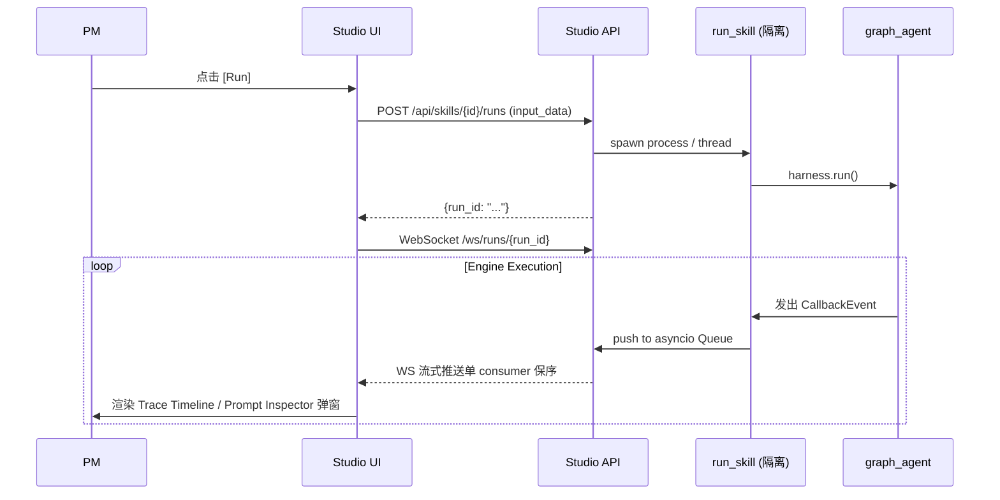
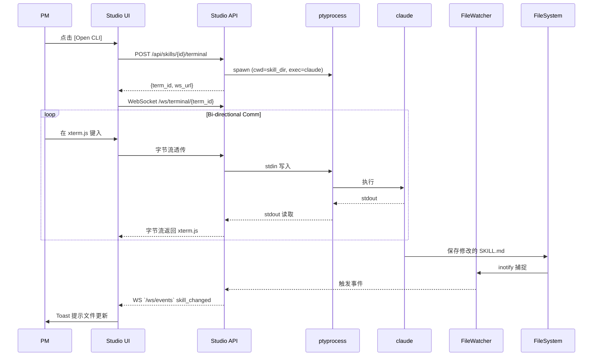
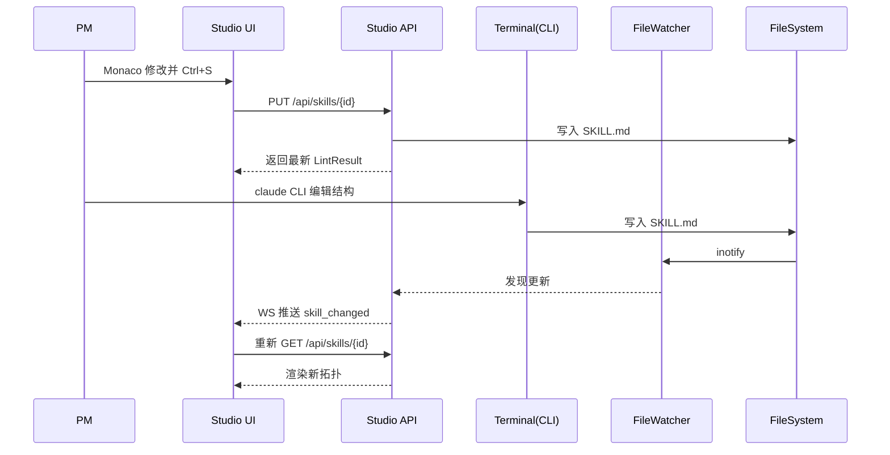
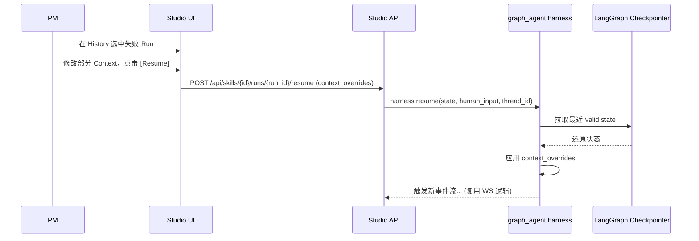

# Design Document

## 1. Overview & Goals / Non-Goals

本文档描述 Studio 下一个 MVP 阶段的架构与 API 接口设计。基于当前 `graph_agent` 的进展和 `mvp0` 现状，我们将**完全重写后端 (FastAPI)**，**深度重构前端 (React 19)**，并确立满足未来迭代的 Pydantic 数据契约与通信协议。

**Goals**:
- 规范化 API，消除前端正则解析债。
- 提供稳定的 WebSocket 流式反馈及终端交互能力。
- 设计覆盖 MVP1~MVP3 的全集 Pydantic 模型和错误码标准。

**Non-Goals**:
- 不实现真实的断点续跑和人工介入（仅定义接口，返回 501）。
- 不包含多租户鉴权体系和用户级文件隔离（P1.5）。
- 不提供画图节点的增删改拖拽（只读模式）。

## 2. Existing Architecture Analysis (mvp0 处置方案)

- **前端 (`studio-frontend/src/App.tsx`)**: 
  - **现状**: 界面底座（Tailwind、Lucide、ReactFlow）很完善，但数据层是“硬正则解析 Markdown”。
  - **处置**: **Refactor (重构)**。保留 UI 骨架，彻底剔除正则逻辑，对接 `GET /api/skills/{id}` 获取 `SkillManifest` JSON，动态渲染。保留 Monaco 编辑器，对接 `PUT` 接口保存。
- **后端 (`studio-backend/main.py`)**:
  - **现状**: 145 行的纯 Mock stub。
  - **处置**: **Rewrite (重写)**。引入工程化的 FastAPI 路由结构，集成真实的 `graph_agent` API，对接 `TraceCallback` 和真实的 subprocess `run_skill`。
- **graph_agent 引擎 & Phase 0**:
  - 已 merge: `SkillManifest` (Pydantic v2), `serialize_skill()` AST, `CallbackEvent` union。可以直接作为后端核心依赖消费。

## 3. Architecture Pattern

采用 **Ports & Adapters (Hexagonal)** 模式。
Studio Backend 作为 Adapter，不侵入 Engine 内部逻辑，严格消费以下暴露的 Port：
- `graph_agent.core.manifest.SkillManifest` (Pydantic model)
- `graph_agent.callbacks.events.CallbackEvent` (Discriminated Union)
- `graph_agent.api.run_skill` / `compile_skill` / `load_workflow_from_md`

### Data Flow Diagram
```mermaid
flowchart TD
    subgraph Browser
        UI[React SPA]
        RF[ReactFlow Graph]
        Monaco[Monaco Editor]
        XTerm[Terminal CLI]
    end
    
    subgraph Studio Backend (FastAPI)
        API[REST Routers]
        WS_Run[Run WS Manager]
        WS_Term[PTY Terminal Manager]
        FW[FileWatcher]
    end
    
    subgraph Engine (graph_agent)
        Runner[run_skill Subprocess]
        Compiler[compile_skill]
        Parser[Manifest Parser]
    end

    UI -- GET /api/skills/{id} --> API
    API -- Parse SKILL.md --> Parser
    Parser -- SkillManifest --> API
    API -- JSON --> RF
    
    Monaco -- PUT (Save) --> API
    API -- Trigger --> Compiler
    
    UI -- POST /run --> API
    API -- Spawn --> Runner
    Runner -- CallbackEvent 流 --> WS_Run
    WS_Run -- WS JSONL --> UI
    
    XTerm -- WS Byte Stream --> WS_Term
    WS_Term -- PTY / claude CLI --> FileSystem
    FileSystem -- Change Event --> FW
    FW -- WS Event --> UI
```

## 4. API Surface Specification (核心)

### 4.1 REST Endpoints 全表

| Method | Path | Request Pydantic | Response Pydantic | Error Codes | MVP Phase |
|---|---|---|---|---|---|
| GET | `/api/skills` | - | `list[SkillSummary]` | 500 | MVP1 |
| POST | `/api/skills` | `CreateSkillReq` | `SkillSummary` | 400, 500 | MVP1 |
| GET | `/api/skills/{id}` | - | `SkillDetail` | 404, 500 | MVP1 |
| PUT | `/api/skills/{id}` | `UpdateSkillReq` | `SkillDetail` | 400, 404, 422 | MVP1 |
| POST | `/api/skills/{id}/lint` | - | `LintResult` | 404 | MVP1 |
| POST | `/api/skills/{id}/runs` | `RunRequest` | `RunMetadata` | 400, 404, 500 | MVP1 |
| GET | `/api/skills/{id}/runs` | - | `list[RunMetadata]` | 404 | MVP1 |
| GET | `/api/skills/{id}/runs/{run_id}` | - | `RunDetail` | 404 | MVP1 |
| POST | `/api/skills/{id}/runs/{run_id}/resume`| `ResumeReq` | `RunMetadata` | 400, 404 | **MVP2** |
| POST | `/api/skills/{id}/terminal` | - | `TerminalSession` | 500 | MVP1 |
| GET | `/api/skills/{id}/test_inputs` | - | `list[TestInputMetadata]` | 404 | **MVP2** |
| POST | `/api/skills/{id}/test_inputs` | `multipart/form-data` | `TestInputMetadata` | 400 | **MVP2** |
| GET | `/api/skills/{id}/golden` | - | `list[GoldenBaseline]` | 404 | **MVP2** |
| POST | `/api/skills/{id}/golden` | `SetGoldenReq` | `GoldenBaseline` | 404 | **MVP2** |
| POST | `/api/skills/{id}/runs/{run_id}/compare` | - | `CompareResult` | 404 | **MVP2** |
| POST | `/api/skills/{id}/copilot/dispatch` | `CopilotDispatchReq` | `CopilotResponse` | 400, 500 | **MVP3** |
| GET | `/api/skills/{id}/runs/{run_id}/audit` | - | `AuditResult` | 404 | **MVP3** |

*Auth Note*: 从 P1.5 开始，所有接口要求 Header `X-Studio-User-ID`。

### 4.2 WebSocket Channels 全表

| Channel | Direction | Message Type / Payload Schema | Description |
|---|---|---|---|
| `/ws/runs/{run_id}` | Server -> Client | `CallbackEvent` (graph_agent engine 提供) | 引擎的执行事件流 |
| `/ws/runs/{run_id}` | Server -> Client | `{"type": "ask_human_input", "question": str}` | Agent Loop 暂停，请求人为输入 |
| `/ws/runs/{run_id}` | Client -> Server | `{"type": "human_input_response", "payload": dict}` | 用户通过 UI 提供的问答回复 |
| `/ws/terminal/{term_id}` | Bi-directional | Raw Binary/Text (bytes) | XTerm <-> PTY 字节透传 |
| `/ws/events` | Server -> Client | `{"type": "skill_changed", "skill_id": str}` | FileWatcher 发现文件变更通知 |

### 4.3 Data Contracts (Pydantic Models)

复用的 Engine 模型：`SkillManifest`, `PhaseConfig`, `CallbackEvent` (均直接使用 `graph_agent` 的 Pydantic v2 模型)。

Studio 专属 API 模型（包含字段及复用说明）：

```python
from pydantic import BaseModel
from typing import Any, Literal, Optional
from datetime import datetime

# Graph Agent 模型引用占位
# from graph_agent.core.manifest import SkillManifest
# from graph_agent.callbacks.events import CallbackEvent

class ErrorResponse(BaseModel):
    error_code: str
    http_status: int
    message: str
    details: dict[str, Any] | None = None
    retry_strategy: Literal["idempotent", "not_retryable", "backoff"]

class LintError(BaseModel):
    line: int | None = None
    column: int | None = None
    error_code: str
    severity: Literal["error", "warning"]
    message: str
    phase_name: str | None = None

class LintResult(BaseModel):
    status: Literal["passed", "failed"]
    errors: list[LintError]
    phases_summary: list[dict[str, Any]] | None = None  # name, tier, has_validator

class SkillSummary(BaseModel):
    id: str
    name: str
    description: str
    phase_count: int
    has_golden: bool
    last_run_at: datetime | None = None

class RunMetadata(BaseModel):
    run_id: str
    status: Literal["running", "success", "failed"]
    started_at: datetime
    metrics: "TokensMetrics | None" = None

class SkillDetail(BaseModel):
    manifest: "SkillManifest" # 直接复用 graph_agent.core.manifest.SkillManifest
    file_paths: dict[str, str] # SKILL.md 路径等
    has_golden: bool
    latest_run_metadata: RunMetadata | None = None

class CreateSkillReq(BaseModel):
    template_id: str | None = None
    description: str | None = None # 用于未来 Copilot 生成

class UpdateSkillReq(BaseModel):
    content: str # 完整的 SKILL.md 内容

class RunRequest(BaseModel):
    input_data: dict[str, Any] | None = None
    golden_id: str | None = None
    paste_json: str | None = None

class RunDetail(BaseModel):
    metadata: RunMetadata
    events: list["CallbackEvent"] # 复用 graph_agent.callbacks.events.CallbackEvent
    final_context: dict[str, Any] | None = None
    artifacts: list[str] | None = None

class ResumeReq(BaseModel):
    context_overrides: dict[str, Any] | None = None
    human_input: str | None = None

class TerminalSession(BaseModel):
    term_id: str
    ws_url: str
    cwd: str
    ttl_seconds: int

class TestInputMetadata(BaseModel):
    id: str
    name: str
    created_at: datetime
    size_bytes: int
    content_preview: str

class GoldenBaseline(BaseModel):
    id: str
    linked_input_id: str
    created_at: datetime
    locked: bool
    content_path: str

class SetGoldenReq(BaseModel):
    run_id: str
    lock: bool

class TokensMetrics(BaseModel):
    input_tokens: int
    output_tokens: int
    total_tokens: int
    cost_estimate: float | None = None

class CompareResult(BaseModel):
    differences: list[dict[str, Any]]
    score: float

class CopilotDispatchReq(BaseModel):
    target: Literal["gemini", "claude_code"]
    context: dict[str, Any]

class CopilotResponse(BaseModel):
    response_text: str

class AuditResult(BaseModel):
    drift_score: float
    violations: list[str]
```

### 4.4 System Flows

**Flow 1: Lint Flow**


**Flow 2: Run Flow**


**Flow 3: Open CLI Flow**


**Flow 4: Dual-Track Edit Flow**


**Flow 5: Resume Flow**


### 4.5 Error Code Standard

| Error Code | HTTP Status | When Raised | Retry Strategy |
|---|---|---|---|
| `SKILL_NOT_FOUND` | 404 | 请求不存在的 skill_id | `not_retryable` |
| `MANIFEST_VALIDATION_FAILED` | 422 | Pydantic `SkillManifest.model_validate()` 失败 | `not_retryable` (需修改文件) |
| `COMPILE_FAILED` | 200 (LintResult 中) | `compile_skill()` 业务规则失败，非系统错误 | `not_retryable` |
| `RUN_SPAWN_FAILED` | 500 | `run_skill` subprocess 或线程池拉起失败 | `idempotent` (可重试) |
| `TERMINAL_SPAWN_FAILED` | 500 | `ptyprocess` 无法初始化 CLI | `idempotent` |
| `WEBSOCKET_DISCONNECTED` | N/A (WS断开) | 客户端或服务端连接意外中断 | `backoff` (自动重连) |
| `LLM_FALLBACK_EXHAUSTED` | 502 | 所有配置的 provider 全部 down | `backoff` |
| `RESUME_CHECKPOINT_NOT_FOUND` | 404 | 提供 `run_id` 对应的 `thread_id` 在 DB 无记录 | `not_retryable` |

## 5. Technology Stack
- **Frontend**: React 19.2, Vite 8, ReactFlow 11.11, Monaco Editor 4.7, xterm.js 5.3, Tailwind 4.2.
- **Backend**: FastAPI 0.115, Uvicorn, Python 3.12.
- **Tools/Libs**: `ptyprocess` (Terminal proxy), `watchdog` (FileWatcher), `simpleeval` (When 表达式安全求值), `ruamel.yaml` (YAML round-trip).

## 6. Migration Strategy
mvp0 到新 MVP 的过渡策略：
1. **Frontend Refactor**: 
   - 彻底删除 `CustomNodes.tsx` 和其他地方的正则匹配 `SKILL.md` 逻辑。
   - 引入 SWR，基于 `/api/skills/{id}` 的 `SkillManifest` JSON 重写 ReactFlow 节点生成逻辑。
2. **Backend Rewrite**: 
   - 弃用现有的 `main.py` mock stub。
   - 按照标准分层（Routers, Services, Models）重写，直接 import `graph_agent` 的 `compile_skill` 等公开方法。
3. **SKILL.md 兼容性**: 无需专门 migration，`graph_agent` 核心引擎已处理了向上兼容，所有有效的业务 skill 都能被 `SkillManifest` 直接解析。

## 7. Future Considerations
后续功能的 API 扩展设计：
- **P1.5 用户隔离**: 在请求头引入 `X-Studio-User-ID`。不修改接口路径，后端通过依赖注入将其解析为文件系统工作区前缀 `workspaces/<uid>/skills/`。
- **MVP2 Golden Baseline & History**: 使用预留的 `/api/skills/{id}/golden` 获取基准数据。增加 `POST /api/skills/{id}/runs/{run_id}/compare` 接口实现输出与基准的差分比对。
- **MVP3 CCB Multi-Copilot**: 新增 `POST /api/skills/{id}/copilot/dispatch`，请求体包含 `{target: "gemini" | "claude_code", context: dict}`，让后端的 Terminal Manager 将意图分发给相应的 Copilot 引擎。
- **MVP3 Intent Drift Detection**: 新增 `GET /api/skills/{id}/runs/{run_id}/audit`，返回 `AuditResult`，包含根据 `plan_checklist` 和实际 `trace` 计算出的偏离度及详细指标。

## 8. 文件系统布局 + Storage Architecture

Studio 利用引擎内置的 `StorageManager` 体系和严格的目录约定来保证产物一致性，同时支持 P1.5 的多用户隔离。

```text
graph-agent-harness/
├── skills/                     # [层: Engine] 公共模板库 (PM read-only) [进 git]
│   ├── text-segmentation/
│   │   ├── SKILL.md
│   │   ├── script/...
│   │   ├── references/...
│   │   └── data/...           
│   └── ...
├── workspaces/                 # [层: Studio] 私人工作空间 (PM read-write) [gitignore]
│   └── <user_id>/              # (P1.5 引入, 默认为 'default')
│       ├── skills/             # PM fork 的私人 skill
│       │   └── my-product-spec/
│       │       ├── SKILL.md
│       │       ├── script/
│       │       ├── test_inputs/    # 测试素材 (PM 上传, 永久)
│       │       │   ├── iphone15.json
│       │       │   └── iphone15.meta.json
│       │       ├── golden/         # Golden baseline (打磨好的理想输出, 永久)
│       │       │   ├── <input_name>/
│       │       │   │   ├── baseline.json
│       │       │   │   └── _meta.json
│       │       ├── runs/           # 历次运行产物 (按 run_id 归档, 受 TTL/数量 自动清理)
│       │       │   ├── 2026-04-30T01-23-45_abc123/
│       │       │   │   ├── final_state.json
│       │       │   │   ├── tracing.jsonl
│       │       │   │   ├── metrics.json
│       │       │   │   ├── artifacts/      # phase 产出文件
│       │       │   │   └── checkpoints.db  # LangGraph SQLite
│       │       │   ├── 2026-04-30T...golden/  # .golden 后缀锁定，免疫清理
│       │       │   └── ...
│       │       └── .studio_state/  # Studio UI 偏好 / 临时 cache
│       └── settings.json       # PM 个人配置 (API keys 等)
└── .kiro/specs/studio-mvp1/    # 本 spec
```

## 9. PM 完整 Skill Lifecycle 操作流程

| Lifecycle 阶段 | 用户行为 | API Call | 文件系统 |
|---|---|---|---|
| **新建 (从 0)** | PM 在 Studio 点 [+ 新建] → 跟 Copilot 对话 | `POST /api/skills` (CreateSkillReq) | 后端写 `workspaces/<uid>/skills/<new_id>/SKILL.md` (基于模板) |
| **Fork (从模板)** | PM 在公共模板上点 [Fork] | `POST /api/skills` (含 fork_from: <template_id>) | 后端 cp -r `skills/<template_id>/` → `workspaces/<uid>/skills/<new_id>/` |
| **导入 (从外部)** | PM 上传 .zip / 拖拽目录 | `POST /api/skills/import` (multipart/form-data) | 后端解压到 `workspaces/<uid>/skills/<imported_id>/`, validate SKILL.md, 不通过则 422 |
| **打开 / 浏览** | PM 点列表里某个 skill | `GET /api/skills/{id}` | 读 `SKILL.md`, parse → `SkillManifest` |
| **编辑 (Track A)** | PM 在 Monaco 改 prompt + Ctrl+S | `PUT /api/skills/{id}` | 后端写 `SKILL.md`, 自动 lint |
| **编辑 (Track B)** | PM 在 Open CLI 里跟 Claude Code 对话 | (无 API call, 直接文件 IO) | Claude Code 写 `SKILL.md`, FileWatcher 推 `skill_changed` WS event |
| **上传测试素材** | PM 拖拽 JSON 文件到测试面板 | `POST /api/skills/{id}/test_inputs` (multipart) | 后端写 `workspaces/<uid>/skills/<id>/test_inputs/<name>.json` |
| **Run** | PM 选输入 + 点 [Run] | `POST /api/skills/{id}/runs` (RunRequest) | 后端 spawn subprocess, 创建 `runs/<run_id>/`, 实时写 `tracing.jsonl` |
| **Run 中暂停/Resume**| PM History 选失败 run + 点 [Resume] | `POST /api/skills/{id}/runs/{run_id}/resume` | 后端 Checkpointer 拉 state 续跑, append 同一 `runs/<run_id>/` |
| **锁定 Golden** | PM History 选满意 run + 点 [锁定 Golden] | `POST /api/skills/{id}/golden` (SetGoldenReq) | 后端 mv `runs/<run_id>/` → `runs/<run_id>.golden/`, cp 至 `golden/` |
| **跑回归对比** | PM 点 [对比] | `POST /api/skills/{id}/runs/{run_id}/compare` | 后端读 `golden/` + `runs/<run_id>/` 进行 diff |
| **分享 / 导出** | PM 点 [Export as ZIP] | `GET /api/skills/{id}/export` | 后端 tar.gz 整个 skill 目录 (含 test_inputs / golden, 不含 runs), 流式下载 |

## 10. Skill 版本管理策略

**核心决策**: **不在 Studio 里造内置版本管理**，而是利用底层机制的三维组合：SKILL.md 友好的文本格式 + `runs/` 自动历史 + `.golden` 强锁定。

1. **历次 Run history**: `runs/` 目录天然按 `run_id` 字典排序 (自带 timestamp)。引擎的 `StorageManager` 会自动清理老旧目录，仅保留最近 N 个，但带有 `.golden` 后缀的免疫清理。
2. **SKILL.md 编辑历史**: 鼓励 PM 把 `workspaces/<uid>/skills/<id>/` 当做标准的 Git Repo。Studio 将提供轻量的 `[Init Git]` 按钮，且在每次 Monaco 保存 (`PUT /api/skills/{id}`) 时触发自动提交 (`git commit -m "Studio edit at <ts>"`), 留下追溯源头。更复杂的回退则退让给命令行处理。
3. **Skill 整体版本号**: `SKILL.md` frontmatter 提供 `version: "x.y.z"` 字段供业务自身进行 semver 标记。
4. **跨 PM Fork 衍生关系**: 从公共库 fork 的技能将把 `fork_from: <source_skill_id>` 记入自身的 frontmatter，支持未来提供 `[跟踪 upstream]` 更新的 UI 提示。

## 11. 测试产出物 + 输入输出文件 schema

**Test Input 文件 schema**:
- 内容采用 PM 自选格式 (JSON / YAML / Markdown)，对应后缀名。
- **校验**: 上传阶段，基于 `SKILL.md` 中定义的 `io.inputs` 提取的 Pydantic 模型，对 input 数据调用 `model_validate()`。不通过产生 422 及结构化错误细节。
- **元数据**: 伴生一个 `<input_name>.meta.json` 记录提交时间、摘要与用户引用信息。

**Run 产出物 schema (`runs/<run_id>/`)**:
- `final_state.json`: Pydantic 导出的完整 `WorkflowState`，包含 `data` (BusinessData) 和 `flow` (FrameworkState)。
- `tracing.jsonl`: 引擎的 `CallbackEvent.model_dump_json()` 流水账。
- `metrics.json`: `{total_input_tokens, total_output_tokens, duration_seconds, status, retry_counts, validation_warnings, io_errors}`
- `artifacts/`: 依据 `io.outputs` 生成的纯业务产物。
- `checkpoints.db`: LangGraph 断点存储。

**Golden Baseline schema (`golden/<input_name>/baseline.json`)**:
- 内容 Schema 完全对齐 `final_state.json`，是经过 PM 与 Copilot 调优的“理想化预期输出”。
- 伴生元数据存放在 `golden/<input_name>/_meta.json`。

## 12. 输入输出 schema 校验流水线

为保证整个运行流的确定性，应用四个阶段的严密 Schema 校验策略：

1. **Upload Time**: 上传 `test_inputs` 时，API `POST /test_inputs` 会直接比对 `io.inputs` Pydantic 定义，拦截残缺或类型错误的数据并直接返回 HTTP 422。
2. **Run Time (前置)**: 发起 `RunRequest` 时，再次执行 input 数据的 Schema 校验（防止测试用例上次通过但今天 SKILL 契约已经被修改而变得不兼容）。失败则引发 422，标明字段不匹配。
3. **Run Time (后置)**: Run 执行末尾，`IOManager` 根据 `io.outputs` 的声明校验业务侧产出的 Schema。若数据缺失或类型异常，触发 `CallbackEvent` 异常警告甚至回拨给 Agent Loop 请求修复。
4. **Golden 锁定时**: 提取 `runs/` 中的产出并将其提升为 Baseline 前，验证其内容符合当前的 `io.outputs` Schema。若此时 Schema 恰好改变，UI 层给予用户“当前 Baseline 不兼容最新结构”的警告提示。
