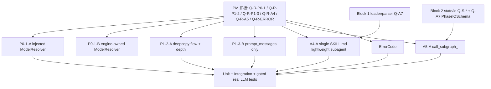

# Engine MVP0 — execution-runtime Tasks

## §0. 任务依赖关系

## §1. 已 ship task

### Task SHIP-0: Block 3 尚无已 ship runtime task
- **File**: `.kiro/specs/engine-mvp0-execution-runtime/design.md:1`
- **变更**: 记录当前 Block 3 仍处 tasks 拆分阶段；P0-1/P1-2/P1-3/A4/A5/ErrorCode 未在本文件标记为 shipped。
- **测试**: 无。
- **标记**: [NEW] documentation-only。
- **依赖**: 无。

## §2. PM 拍板待办 (blocking, 必须 PM 答复才能进 task)

- **Q-R-P0-1** (ModelResolver 职责边界)
  - 当前推荐: 候选 A，Studio Backend/外层注入 resolver，Engine 保持轻量。
  - PM 拍板影响: 决定 §3 是改 `run_skill()` 入参，还是把 `graph_agent.models.resolver.ModelResolver` 下沉为 V2.1 默认路径。
  - 设计出处: `.kiro/specs/engine-mvp0-execution-runtime/design.md:25`。
- **Q-R-P1-2** (child flow 隔离策略)
  - 当前推荐: 候选 A，`copy.deepcopy(parent_flow)` 后写入 `subagent_depth + 1`。
  - PM 拍板影响: 决定 §4 是否继承 parent flow，还是只传 `subagent_depth`。
  - 设计出处: `.kiro/specs/engine-mvp0-execution-runtime/design.md:66`。
- **Q-R-P1-3** (exit_contract 历史净化策略)
  - 当前推荐: 候选 B，每轮只构造临时 `prompt_messages`，不把 exit contract 写回 `messages`。
  - PM 拍板影响: 决定 §5 是 prompt-only，还是 marker strip。
  - 设计出处: `.kiro/specs/engine-mvp0-execution-runtime/design.md:84`。
- **Q-R-A4** (轻量 subagent 表达方式)
  - 当前推荐: 候选 A，单个 `SKILL.md` 文件由 loader/runtime 包装为虚拟单节点 graph。
  - PM 拍板影响: 决定 §6 是 path 自动识别，还是新增 `SubagentSpec.lightweight` schema 字段。
  - 设计出处: `.kiro/specs/engine-mvp0-execution-runtime/design.md:101`。
- **Q-R-A5** (`call_subgraph` 动态能力边界)
  - 当前推荐: 候选 A，预注册 `call_subgraph_<name>` 工具族。
  - PM 拍板影响: 决定 §7 是静态安全注入，还是开放通用 `call_subgraph(path, inputs)`。
  - 设计出处: `.kiro/specs/engine-mvp0-execution-runtime/design.md:117`。
- **Q-R-ERROR** (ErrorCode 传递模型)
  - 当前推荐: 候选 A，扩展 `GraphAgentError` 基类，附 `code` / `metadata`，不切换公开执行结果模型。
  - PM 拍板影响: 决定 §8 是 exception-first，还是全面改 `WorkflowResult(error_code=...)`。
  - 设计出处: `.kiro/specs/engine-mvp0-execution-runtime/design.md:131`。

## §3. P0-1 ModelResolver task (按 PM 拍板候选展开)

### Task P0-1-A-1: run_skill / _run_v21_skill_dict 增加 model_resolver 入参 (推荐路径, blocked by Q-R-P0-1)
- **File**: `packages/graph-agent/src/graph_agent/core/runner.py:161`, `packages/graph-agent/src/graph_agent/core/runner.py:451`
- **变更**: 为 V2.1 运行入口增加可选 `model_resolver` / resolver callable；保留 `mock_llm` 优先级，未传 mock 时按 phase `llm_role` 或默认 role 解析 chat model。
- **测试**: `packages/graph-agent/tests/core/test_runner_v21_model_resolver.py:+约80` 覆盖 mock 优先、resolver 被调用、resolver 缺失时结构化错误。
- **标记**: [BREAKING]
- **依赖**: blocked by PM 拍板 Q-R-P0-1；依赖 Q-R-ERROR 明确错误载体。

### Task P0-1-A-2: assemble_graph 支持按 phase 获取模型 (推荐路径, blocked by Q-R-P0-1)
- **File**: `packages/graph-agent/src/graph_agent/core/graph_assembler.py:55`, `packages/graph-agent/src/graph_agent/core/graph_assembler.py:177`
- **变更**: `assemble_graph()` 从单一 `chat_model` 扩展为可选 resolver/context；`_build_skill_node()` 在 `SkillNodeAST` 执行前解析模型，避免全图只能用一个模型。
- **测试**: `packages/graph-agent/tests/core/test_v21_graph_assembly.py:+约80` 覆盖两个 SKILL phase 解析不同 role、单 phase mock 兼容。
- **标记**: [BREAKING]
- **依赖**: blocked by PM 拍板 Q-R-P0-1；依赖 P0-1-A-1。

### Task P0-1-A-3: 无模型错误改为 ModelNotFoundError (推荐路径, blocked by Q-R-P0-1 + Q-R-ERROR)
- **File**: `packages/graph-agent/src/graph_agent/core/graph_assembler.py:233`, `packages/graph-agent/src/graph_agent/core/exceptions.py:13`
- **变更**: 替换裸 `RuntimeError("[F-v21-graph] SKILL phase requires chat_model")`，新增 `ModelNotFoundError(code="MODEL_NOT_FOUND")` 或等价 ErrorCode 子类。
- **测试**: `packages/graph-agent/tests/core/test_v21_graph_assembly.py:+约40` 断言异常类型、`code`、`metadata.phase_id`。
- **标记**: [BREAKING]
- **依赖**: blocked by PM 拍板 Q-R-P0-1 和 Q-R-ERROR。

### Task P0-1-B-1: [如果 PM 选 candidate B] Engine 内置默认 ModelResolver
- **File**: `packages/graph-agent/src/graph_agent/models/resolver.py:43`, `packages/graph-agent/src/graph_agent/core/runner.py:467`
- **变更**: V2.1 runner 默认实例化 `graph_agent.models.resolver.ModelResolver`，读取 `config/llm_roles.yaml`，未传 `mock_llm` 时自动进入 gateway chat model。
- **测试**: `packages/graph-agent/tests/models/test_resolver.py:82` 附近补 V2.1 runner 集成，mock `get_role_config()` 验证 resolver 路径。
- **标记**: [BREAKING]
- **依赖**: blocked by PM 拍板 Q-R-P0-1；依赖 Q-R-ERROR。

### Task P0-1-C-1: [如果 PM 选 candidate C] 明确 mock_llm-only policy
- **File**: `packages/graph-agent/src/graph_agent/core/runner.py:467`, `.kiro/specs/engine-mvp0-execution-runtime/design.md:41`
- **变更**: 保持运行时不解析真实模型，只把无 `mock_llm` 的错误升级为结构化 ErrorCode，并在文档和测试中固定短期约束。
- **测试**: `packages/graph-agent/tests/core/test_v21_graph_assembly.py:+约30` 覆盖未传 `chat_model` 的结构化错误。
- **标记**: [NEW]
- **依赖**: blocked by PM 拍板 Q-R-P0-1 和 Q-R-ERROR。

## §4. P1-2 child flow / subagent_depth task

### Task P1-2-A-1: subagent child flow deepcopy + depth 写入 (推荐路径, blocked by Q-R-P1-2)
- **File**: `packages/graph-agent/src/graph_agent/core/graph_assembler.py:392`, `packages/graph-agent/src/graph_agent/core/graph_assembler.py:482`
- **变更**: 在 `_invoke_subagent_once_t23()` 中 `copy.deepcopy(parent_state["flow"])`，写入 `_subagent_runnable_config()` 计算出的 `subagent_depth`，并作为 child state flow 传入。
- **测试**: `packages/graph-agent/tests/integration/test_v21_subagent_executor.py:153` 附近新增 child graph 修改 nested flow 不污染 parent、child state 内能读到 `subagent_depth == 1`。
- **标记**: [BREAKING]
- **依赖**: blocked by PM 拍板 Q-R-P1-2。

### Task P1-2-A-2: SUBGRAPH node flow 使用同一隔离 helper (推荐路径, blocked by Q-R-P1-2)
- **File**: `packages/graph-agent/src/graph_agent/core/graph_assembler.py:155`
- **变更**: 抽出 `_child_flow(parent_flow, depth)` helper，`SUBGRAPH` node 和 subagent 工具共用，避免 `state.get("flow", {})` 共享引用。
- **测试**: `packages/graph-agent/tests/core/test_v21_graph_assembly.py:209` 附近新增 SUBGRAPH 子图修改 flow 不污染父图原始 flow。
- **标记**: [BREAKING]
- **依赖**: blocked by PM 拍板 Q-R-P1-2；建议等待 Block 2 Q-S-A3-A6 对 SUBGRAPH 隔离边界拍板。

### Task P1-2-B-1: [如果 PM 选 candidate B] 只传 subagent_depth 不继承 parent flow
- **File**: `packages/graph-agent/src/graph_agent/core/graph_assembler.py:400`
- **变更**: child state flow 初始化为 `{"subagent_depth": depth + 1}`，不继承 parent trace/retry 等字段。
- **测试**: `packages/graph-agent/tests/integration/test_v21_subagent_executor.py:+约40` 断言 parent flow 字段不会出现在 child graph。
- **标记**: [BREAKING]
- **依赖**: blocked by PM 拍板 Q-R-P1-2。

## §5. P1-3 ExitContractRegistry task

### Task P1-3-B-1: prompt_messages-only 注入 exit_contract (推荐路径, blocked by Q-R-P1-3)
- **File**: `packages/graph-agent/src/graph_agent/core/graph_assembler.py:243`
- **变更**: 每轮构造 `prompt_messages = inject_exit_contract(base_messages, ...)`，模型响应后只把原始历史、response、ToolMessage 写回，不把临时 exit contract SystemMessage 合入 state。
- **测试**: `packages/graph-agent/tests/core/test_v21_graph_assembly.py:124` 附近新增两轮 ReAct 后 `result["messages"]` 不包含重复 exit_contract。
- **标记**: [BREAKING]
- **依赖**: blocked by PM 拍板 Q-R-P1-3。

### Task P1-3-B-2: 新增 ExitContractRegistry / helper 封装临时消息生命周期
- **File**: `packages/graph-agent/src/graph_agent/runtime/exit_contract.py`, `packages/graph-agent/src/graph_agent/core/graph_assembler.py:244`
- **变更**: 在现有 `inject_exit_contract()` 外增加 registry/helper，集中处理临时消息构造和过滤，避免 graph_assembler 内散落判断。
- **测试**: `packages/graph-agent/tests/runtime/test_exit_contract.py:+约60` 覆盖单轮、多轮、空 contract、已有 SystemMessage 的顺序。
- **标记**: [NEW]
- **依赖**: blocked by PM 拍板 Q-R-P1-3；依赖 P1-3-B-1。

### Task P1-3-A-1: [如果 PM 选 candidate A] marker SystemMessage + strip 后写回
- **File**: `packages/graph-agent/src/graph_agent/runtime/exit_contract.py`, `packages/graph-agent/src/graph_agent/core/graph_assembler.py:246`
- **变更**: 为临时 contract message 加 marker metadata；写回 `messages` 前剥离 marker message。
- **测试**: `packages/graph-agent/tests/runtime/test_exit_contract.py:+约50` 覆盖 marker strip 不误删普通 SystemMessage。
- **标记**: [BREAKING]
- **依赖**: blocked by PM 拍板 Q-R-P1-3。

## §6. A4 轻量 subagent task

### Task A4-A-1: _resolve_subagent_root 支持单 SKILL.md path (推荐路径, blocked by Q-R-A4)
- **File**: `packages/graph-agent/src/graph_agent/core/loader.py:447`
- **变更**: 当 `phase_config.subagents[].path` 指向相对 `.md` 文件时允许通过校验；保留必须在 skill root 内的路径约束。
- **测试**: `packages/graph-agent/tests/core/test_v21_loader.py:+约60` 覆盖单文件 subagent 被接受、绝对路径/越界路径仍 fatal。
- **标记**: [BREAKING]
- **依赖**: blocked by PM 拍板 Q-R-A4；依赖 Block 1 loader/parser 变更窗口。

### Task A4-A-2: 单文件 SKILL.md 虚拟编译为单节点 CompiledSkill (推荐路径, blocked by Q-R-A4)
- **File**: `packages/graph-agent/src/graph_agent/core/loader.py:340`, `packages/graph-agent/src/graph_agent/core/loader.py:382`
- **变更**: 为轻量 subagent 创建虚拟 `CompiledSkill`，补齐 manifest、io refs、phase document、tool metadata，使 `_subagent_runtime_map()` 可直接 assemble。
- **测试**: `packages/graph-agent/tests/core/test_v21_loader.py:+约100` 验证 `CompiledSubagent.root/path/expected_schema` 和注入工具 schema。
- **标记**: [BREAKING]
- **依赖**: blocked by PM 拍板 Q-R-A4；依赖 A4-A-1。

### Task A4-A-3: runtime 支持 lightweight subagent root/file 分支 (推荐路径, blocked by Q-R-A4)
- **File**: `packages/graph-agent/src/graph_agent/core/graph_assembler.py:374`
- **变更**: `_subagent_runtime_map()` 能根据 loader 输出区分目录型 subagent 与虚拟单文件 subagent，避免硬编码 `subagent.root / "GRAPH.md"` 假设。
- **测试**: `packages/graph-agent/tests/integration/test_v21_subagent_executor.py:+约80` 新增轻量 subagent e2e。
- **标记**: [BREAKING]
- **依赖**: blocked by PM 拍板 Q-R-A4；依赖 A4-A-2。

### Task A4-B-1: [如果 PM 选 candidate B] SubagentSpec 增加 lightweight 字段
- **File**: `packages/graph-agent/src/graph_agent/core/manifest.py:35`, `packages/graph-agent/src/graph_agent/core/loader.py:1057`
- **变更**: `SubagentSpec` 增加 `lightweight: bool = False` 或 mode discriminator；loader 根据字段选择解析路径。
- **测试**: `packages/graph-agent/tests/core/test_manifest.py:+约40` 和 golden AST schema 更新。
- **标记**: [BREAKING]
- **依赖**: blocked by PM 拍板 Q-R-A4。

## §7. A5 call_subgraph task

### Task A5-A-1: phase_config 支持 subgraphs 预注册 (推荐路径, blocked by Q-R-A5)
- **File**: `packages/graph-agent/src/graph_agent/core/manifest.py:83`, `packages/graph-agent/src/graph_agent/core/loader.py:1057`
- **变更**: 新增 `SubgraphToolSpec` / `SkillNodeAST.subgraphs`；`_normalise_phase_config()` 接受 `subgraphs` 并保留到 AST。
- **测试**: `packages/graph-agent/tests/core/test_manifest.py:+约50`, `packages/graph-agent/tests/core/test_v21_loader.py:+约60` 覆盖 schema 和 frontmatter 解析。
- **标记**: [BREAKING]
- **依赖**: blocked by PM 拍板 Q-R-A5；blocked by Block 2 Q-S-A3-A6 / Q-S-StateMapper。

### Task A5-A-2: 注入 call_subgraph_<name> tool 族 (推荐路径, blocked by Q-R-A5)
- **File**: `packages/graph-agent/src/graph_agent/core/graph_assembler.py:184`, `packages/graph-agent/src/graph_agent/core/loader.py:387`
- **变更**: 类似 `call_subagent_<name>`，为预注册 subgraph 构造 ToolDef 和 runtime map；工具只接受 explicit inputs，不接受任意 path。
- **测试**: `packages/graph-agent/tests/core/test_v21_graph_assembly.py:+约80` 断言 `chat.bound_tools` 包含 `call_subgraph_<name>`，未知 name 不注入。
- **标记**: [BREAKING]
- **依赖**: blocked by PM 拍板 Q-R-A5；依赖 A5-A-1 和 Block 2 strong sandbox。

### Task A5-A-3: call_subgraph 执行隔离与结果 delta 回传 (推荐路径, blocked by Q-R-A5)
- **File**: `packages/graph-agent/src/graph_agent/core/graph_assembler.py:392`, `packages/graph-agent/src/graph_agent/core/graph_assembler.py:141`
- **变更**: 复用 StateMapper / child flow helper，child graph 只接 explicit inputs，结果只回传声明 outputs / delta。
- **测试**: `packages/graph-agent/tests/integration/test_v21_call_subgraph.py:+约140` 覆盖成功、输入缺失、输出越权、depth limit。
- **标记**: [BREAKING]
- **依赖**: blocked by PM 拍板 Q-R-A5；blocked by Block 2 Q-S-A2 / Q-S-A3-A6 / Q-S-StateMapper。

### Task A5-B-1: [如果 PM 选 candidate B] 通用 call_subgraph(path, inputs) 工具
- **File**: `packages/graph-agent/src/graph_agent/core/graph_assembler.py:226`
- **变更**: 注入单一通用工具，校验 path 在 allowlist/root 内，运行时动态 compile + invoke。
- **测试**: `packages/graph-agent/tests/integration/test_v21_call_subgraph.py:+约120` 覆盖 path 越界、不存在 path、schema mismatch。
- **标记**: [BREAKING]
- **依赖**: blocked by PM 拍板 Q-R-A5；blocked by Block 2 strong sandbox。

## §8. ErrorCode task

### Task ERR-A-1: GraphAgentError 增加 code / metadata (推荐路径, blocked by Q-R-ERROR)
- **File**: `packages/graph-agent/src/graph_agent/core/exceptions.py:13`
- **变更**: 基类 `__init__` 增加 `code: str | None`、`metadata: dict[str, Any] | None`，保留现有 `context` 兼容。
- **测试**: `packages/graph-agent/tests/core/test_exceptions.py:+约40` 覆盖默认 code、metadata 序列化、str(exc) 兼容。
- **标记**: [NEW]
- **依赖**: blocked by PM 拍板 Q-R-ERROR。

### Task ERR-A-2: runtime fatal helper 输出标准 ErrorCode (推荐路径, blocked by Q-R-ERROR)
- **File**: `packages/graph-agent/src/graph_agent/core/graph_assembler.py:557`, `packages/graph-agent/src/graph_agent/core/subagents.py`
- **变更**: `_graph_fatal()`、subagent depth/validation、unknown tool、invalid tool args 等改为带 `code` 的异常。
- **测试**: `packages/graph-agent/tests/core/test_v21_graph_assembly.py:248`, `packages/graph-agent/tests/integration/test_v21_subagent_executor.py:139` 补 code 断言。
- **标记**: [NEW]
- **依赖**: blocked by PM 拍板 Q-R-ERROR；依赖 ERR-A-1。

### Task ERR-A-3: WorkflowResult 暴露 error_code / error_metadata (推荐路径, blocked by Q-R-ERROR)
- **File**: `packages/graph-agent/src/graph_agent/core/runner.py:195`, `packages/graph-agent/src/graph_agent/core/result.py`
- **变更**: `run_skill()` 捕获 `GraphAgentError` 时把 `exc.code` / metadata 映射到结果；旧 `error: str` 保留。
- **测试**: `packages/graph-agent/tests/core/test_runner_silent_failures.py:+约60` 覆盖 error_code 透出和旧字段兼容。
- **标记**: [BREAKING]
- **依赖**: blocked by PM 拍板 Q-R-ERROR。

### Task ERR-B-1: [如果 PM 选 candidate B] 全面切到 WorkflowResult(error_code=...)
- **File**: `packages/graph-agent/src/graph_agent/core/runner.py:161`, `packages/graph-agent/src/graph_agent/core/result.py`
- **变更**: execution runtime 内部不再把预期 runtime failure 作为异常冒泡，改为 Result 控制流。
- **测试**: 全量更新 runtime/core tests，跑 `pytest packages/graph-agent/tests/ -x`。
- **标记**: [BREAKING]
- **依赖**: blocked by PM 拍板 Q-R-ERROR。

## §9. 测试 task

### Task TEST-U-1: ModelResolver runtime unit tests
- **File**: `packages/graph-agent/tests/core/test_runner_v21_model_resolver.py:+约120`
- **变更**: 覆盖 `mock_llm` 优先、resolver 注入、resolver 抛 `MODEL_NOT_FOUND`、phase role 传递。
- **测试**: `pytest packages/graph-agent/tests/core/test_runner_v21_model_resolver.py -x`
- **标记**: [NEW]
- **依赖**: P0-1-A 或 P0-1-B；blocked by Q-R-P0-1。

### Task TEST-U-2: child flow isolation unit tests
- **File**: `packages/graph-agent/tests/integration/test_v21_subagent_executor.py:153`
- **变更**: 新增 recording child graph，断言 child flow deep copy、`subagent_depth` 写入、parent nested flow 不被反向污染。
- **测试**: `pytest packages/graph-agent/tests/integration/test_v21_subagent_executor.py -x`
- **标记**: [NEW]
- **依赖**: P1-2-A 或 P1-2-B；blocked by Q-R-P1-2。

### Task TEST-U-3: exit_contract history pollution unit tests
- **File**: `packages/graph-agent/tests/core/test_v21_graph_assembly.py:124`
- **变更**: 构造多轮 tool call fake model，断言发送给模型每轮有 contract，但最终 state messages 不重复堆积。
- **测试**: `pytest packages/graph-agent/tests/core/test_v21_graph_assembly.py -x`
- **标记**: [NEW]
- **依赖**: P1-3-A 或 P1-3-B；blocked by Q-R-P1-3。

### Task TEST-U-4: lightweight subagent loader tests
- **File**: `packages/graph-agent/tests/core/test_v21_loader.py:+约120`
- **变更**: 覆盖单文件 subagent root、虚拟 graph metadata、路径安全、schema 错误。
- **测试**: `pytest packages/graph-agent/tests/core/test_v21_loader.py -x`
- **标记**: [NEW]
- **依赖**: A4-A 或 A4-B；blocked by Q-R-A4。

### Task TEST-U-5: call_subgraph tool injection tests
- **File**: `packages/graph-agent/tests/core/test_v21_graph_assembly.py:+约100`
- **变更**: 覆盖 `call_subgraph_<name>` 注入、tool args schema、未知工具 fatal code。
- **测试**: `pytest packages/graph-agent/tests/core/test_v21_graph_assembly.py -x`
- **标记**: [NEW]
- **依赖**: A5-A 或 A5-B；blocked by Q-R-A5。

### Task TEST-U-6: ErrorCode exception unit tests
- **File**: `packages/graph-agent/tests/core/test_exceptions.py:+约80`
- **变更**: 覆盖 GraphAgentError code/metadata、特定子类默认 code、serialization-friendly metadata。
- **测试**: `pytest packages/graph-agent/tests/core/test_exceptions.py -x`
- **标记**: [NEW]
- **依赖**: ERR-A 或 ERR-B；blocked by Q-R-ERROR。

### Task TEST-I-1: execution runtime integrated mock suite
- **File**: `packages/graph-agent/tests/integration/test_v21_execution_runtime.py:+约180`
- **变更**: 组合 ModelResolver fake、subagent、exit_contract、ErrorCode，跑 mock-only V2.1 graph。
- **测试**: `pytest packages/graph-agent/tests/integration/test_v21_execution_runtime.py -x`
- **标记**: [NEW]
- **依赖**: P0-1 + P1-2 + P1-3 + ERR；blocked by Q-R-P0-1 / Q-R-P1-2 / Q-R-P1-3 / Q-R-ERROR。

### Task TEST-E-1: gated real LLM ModelResolver smoke
- **File**: `packages/graph-agent/tests/integration/test_v21_model_resolver_real_llm.py:+约120`
- **变更**: 参考 `packages/graph-agent/tests/integration/test_mvp1_smoke.py:23` 的 env-key gating，只有存在 provider key 时跑真实 LLM smoke。
- **测试**: `pytest packages/graph-agent/tests/integration/test_v21_model_resolver_real_llm.py -x`；无 key 时 skip。
- **标记**: [NEW]
- **依赖**: P0-1；blocked by Q-R-P0-1。

## §10. 立即可做 task (不替 PM 拍板)

### Task PREP-1: 增加当前 child flow 共享行为的 xfail 锁定测试
- **File**: `packages/graph-agent/tests/integration/test_v21_subagent_executor.py:153`
- **变更**: 先写 xfail/expected-fail 测试证明 child graph 收到 parent flow 引用且缺少 child state depth；不改生产代码。
- **测试**: `pytest packages/graph-agent/tests/integration/test_v21_subagent_executor.py -x`
- **标记**: [NEW] 可立即做。
- **依赖**: 无，不 blocked by Q-R-*；只锁定现状。

### Task PREP-2: 增加当前 exit_contract 堆积行为的 xfail 锁定测试
- **File**: `packages/graph-agent/tests/core/test_v21_graph_assembly.py:124`
- **变更**: 先写多轮 ReAct xfail，记录 `messages = [*prompt_messages, response]` 当前会把 contract 重复写回。
- **测试**: `pytest packages/graph-agent/tests/core/test_v21_graph_assembly.py -x`
- **标记**: [NEW] 可立即做。
- **依赖**: 无，不 blocked by Q-R-*；只锁定现状。

### Task PREP-3: ErrorCode code-name inventory
- **File**: `packages/graph-agent/src/graph_agent/core/graph_assembler.py:233`, `packages/graph-agent/src/graph_agent/core/graph_assembler.py:557`, `packages/graph-agent/src/graph_agent/core/exceptions.py:13`
- **变更**: 只做文档/测试 fixture inventory，列出现有 `[F-v21-*]`、RuntimeError、GraphAgentFatalError 对应目标 code，不改公开 API。
- **测试**: 无；作为后续 ERR-A/ERR-B 输入。
- **标记**: [NEW] 可立即做。
- **依赖**: 无，不 blocked by Q-R-*。

## §11. Pre-existing / 跨 block blocker

### Task PRE-1: Block 1 loader/parser 决策未落地前限制 A4
- **File**: `packages/graph-agent/src/graph_agent/core/loader.py:447`
- **变更**: A4 轻量 subagent 触及 loader 对 phase/subagent root 的硬约束，需等 Block 1 对 parser/loader schema 变更窗口拍板后实施。
- **测试**: 无。
- **标记**: [BLOCKED]
- **依赖**: blocked by Block 1 Q-A7 / loader 变更节奏。

### Task PRE-2: Block 2 state/io sandbox 未落地前限制 A5
- **File**: `.kiro/specs/engine-mvp0-state-io-contract/tasks.md:167`
- **变更**: `call_subgraph` 需要 explicit input/output sandbox；没有 Block 2 A2/A3/A6/StateMapper 时不得开放通用调图能力。
- **测试**: 无。
- **标记**: [BLOCKED]
- **依赖**: blocked by Block 2 Q-S-A2、Q-S-A3-A6、Q-S-StateMapper、Q-A7。

### Task PRE-3: test_compiler_line_locations.py Python 3.12 pre-existing fail
- **File**: `packages/graph-agent/tests/core/test_compiler_line_locations.py:51`
- **变更**: 不属于本 block；全量 `pytest packages/graph-agent/tests/ -x` 当前会提前失败，后续 PR 需标 pre-existing 或等 PM triage。
- **测试**: `pytest packages/graph-agent/tests/ -x`
- **标记**: [BUG-pre-existing]
- **依赖**: PM triage。

## §12. Block 3 总体实施顺序

1. PM 先拍 Q-R-P0-1、Q-R-P1-2、Q-R-P1-3、Q-R-A4、Q-R-A5、Q-R-ERROR；同时确认 Block 1/2 依赖状态。
2. 先做 ERR-A-1/2/3，给 P0-1/P1-2/P1-3 的错误路径提供统一载体。
3. 做 P1-2 和 P1-3 热修复；优先 mock-only tests。
4. 做 P0-1 ModelResolver 接入；补 gated real LLM smoke。
5. 等 Block 1 loader 方案稳定后做 A4 轻量 subagent。
6. 等 Block 2 state/io sandbox 稳定后做 A5 call_subgraph。
7. 跑 targeted tests：`test_v21_graph_assembly.py`、`test_v21_subagent_executor.py`、`test_runner_v21_model_resolver.py`、`test_exceptions.py`。
8. 跑 `pytest packages/graph-agent/tests/ -x`；若仍撞 PRE-3，按 PM triage 或在 PR 中明确 pre-existing blocker。
9. commit + PR；PR 描述必须列 PM 拍板路径、Block 1/2 依赖状态、real LLM gating 结果和 pre-existing failure。
