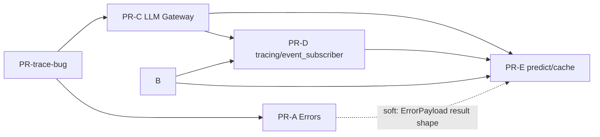

# Round 31 Tasks (拆 6 PR, SOP-08 9 步)

## §0 元规则

**Baseline:** 本任务拆分以 `decisions.md` 为唯一权威源, 以 `design.md` v6 + sweep patch 后内容为字段级设计基线。

**执行方式:** 每个 PR 自驱按 SOP-08 执行:

1. Spec lock: 引用 `decisions.md`、`design.md`、本 `tasks.md` 对应 PR section。
2. 分歧辩论: a1 / a2 / a3 收敛该 PR 的实现边界与风险。
3. Tests-first: a1 写 red tests, a2 audit tests, a3 audit tests。
4. Src 实施: a1 写最小实现让 tests 变绿。
5. Src 偏移 audit: a2 audit src 偏移, a3 audit src。
6. Docs 同步: a2 主笔 MVP0 / logic-explained docs, a1 audit, a3 audit。
7. PR report: a1 主笔 logic-explained 风格 report, a2 honesty audit, a3 audit。
8. Forward PM: 中间 PR 不需要 PM ack; 按 PM 5-28 §1.5 直接推进。
9. Mid-stream merge: CI 绿后主控 merge 进 `stage/engine-v030`。

**Round-level 收口:** 6 个 PR 全部 merge 后, 跑 round-31 e2e, 更新 golden, 打 tag, 最终由 PM 拍 squash 进 `main`。

**共同 cutover 纪律:**

- 每个 PR 必须 tests-first, 旧 API 假设 tests 直接删除或重写, 不维护双栈。
- Studio backend import / catch / field 读写必须随对应 PR 同步 cutover。
- e2e 范围按 `decisions.md §9`: engine + Gateway scope, mock app 端; 不跑 Studio backend/frontend/Tauri。
- 真砍项必须能指向 `decisions.md §16`; 未列入 §16 的用户可见能力删除必须停止。
- 不新增 compatibility proxy; 不做 SDK/Gateway 双栈过渡。

## §1 PR-trace-bug — 修 V0.3 trace bug

### scope

修 V0.3 主线 `_run_v030_skill_dict()` 不自动 attach trace writer 的独立 bug。这个 PR 只保证不传任何 callback 时也能自动写 trace, 但不复活 public `trace_dir` API。

### refs

- decisions: `decisions.md §8` 阻塞点 3; `§2` tracing 默认自动落; `§3` tracing + eventstream 同源出口。
- design: `design.md §4` Observability; `§6 BREAKING 2/3` 的最终方向。

### 影响点 (file:line)

- `packages/graph-agent/src/graph_agent/core/runner.py:217` `_run_v030_skill_dict()` 入口。
- `packages/graph-agent/src/graph_agent/core/runner.py:269` 当前只在已有 `TracingCallback` 时保存 trace。
- `packages/graph-agent/src/graph_agent/callbacks/tracing.py:58` `TracingCallback` 当前 class。
- `packages/graph-agent/src/graph_agent/callbacks/tracing.py:457` 当前保存 trace 日志点。
- `packages/graph-agent/tests/e2e/test_pr2_v030_observability_trace_red.py:258` 当前 V0.3 trace red 覆盖点。

### tests 设计 (red lights)

- 新增/重写 V0.3 e2e: 调 `_run_v030_skill_dict()` 不传 callback, 仍在 run-scoped 目录写 `trace.jsonl`。
- 覆盖 trace 文件一行一个 `CallbackEvent` JSON payload, 可 replay。
- 覆盖不接受/不需要 public `trace_dir`; 若使用临时目录, 通过未来 `workspace_dir` 或当前内部 run dir fixture 注入。
- 保留现有显式 tracing callback 行为的最小兼容断言, 但不把它列入 public setup API。

### src tasks

- 在 V0.3 run path 内部创建默认 trace writer。
- 让 trace writer 接到同一事件源, 不引入第二套 event emission。
- 不改 Studio `run_manager.py` 的 callback class cutover; 那属于 PR-D。
- 不改 public API catalog; 只修 bug。

### 风险 + cutover discipline

- 风险: 先修 trace bug 可能与后续 PR-D 重构重复。控制方式: 只写最小内部 attach, 后续 PR-D 再统一迁到 `event_subscriber`。
- SOP-05: 不做双栈 public API; 不恢复 `trace_dir`。

### 依赖

- 无。建议第一批先做, 用来验证 round-31 PR 流程。

### 体量估

- 小: 约 50 行 src + tests。

## §2 PR-A — Errors 24->5 + ErrorPayload 升级

### scope

Exception public catalog 从约 24 个公开 class 浓缩为 5 个 public class: `GraphAgentError`、`GraphCompileError`、`GraphExecutionError`、`ModelProviderError`、`ResourceNotFoundError`。约 22 个 leaf class 从 SDK public `graph_agent.__init__` de-export; 子颗粒度转到 `ErrorPayload.code` + `ERROR_REGISTRY`。

### refs

- decisions: `decisions.md §13` round-31 演进版; `§16.2` Exception API 浓缩; `§11` 旧 tests 砍 + 写新 tests。
- design: `design.md §3` `RunResult.error`; `§5` Errors; `§6 BREAKING 7`。

### 影响点 (file:line)

- `packages/graph-agent/src/graph_agent/core/exceptions.py:21` `ErrorPayload`。
- `packages/graph-agent/src/graph_agent/core/exceptions.py:82` `GraphAgentError` root。
- `packages/graph-agent/src/graph_agent/core/result.py:46` `WorkflowResult`。
- `packages/graph-agent/src/graph_agent/core/result.py:57` 当前 `error: str | None`。
- `packages/graph-agent/src/graph_agent/__init__.py:37-39` 当前导出 `GraphAgentError` / `SkillCompilationError` / `SkillLoadError`。
- `packages/graph-agent/src/graph_agent/__init__.py:68-70` 当前 `__all__` 错误导出。
- `packages/graph-agent/src/graph_agent/core/skill_resolver_protocol.py:15` `SkillResolutionError`。
- `packages/graph-agent-gateway/src/graph_agent_gateway/exceptions.py:13` `GatewayError` 当前继承 `ExecutionError`。
- `apps/studio/backend/app/services/skills.py:20` 当前 import leaf errors。
- `apps/studio/backend/app/services/skills.py:304` / `:327` / `:1152` 当前 catch tuple。

### tests 设计 (red lights)

- Public API contract: `graph_agent.__all__` 只导出 5 个 public error class, 不导出 leaf errors。
- Inheritance: leaf classes 内部仍存在时, 必须挂到 4 family class 下。
- `WorkflowResult.error` 接受/序列化 `ErrorPayload`, 并保留 `code` / `level` / `stage` / `field_path` / `doc_link`。
- Studio services tests: catch tuple 改 family 后仍返回同等 HTTP error shape。
- Gateway tests: `GatewayError` / provider 子类归 `ModelProviderError` family。
- 旧 `pytest.raises(SkillLoadError)` / `pytest.raises(SkillCompilationError)` 等 public contract tests 删除或改为 family + `ErrorPayload.code`。

### src tasks

- 新增 `GraphCompileError` / `GraphExecutionError` / `ModelProviderError` / `ResourceNotFoundError`。
- 调整约 22 个 leaf class 继承关系, internal raise 路径尽量不动。
- `graph_agent.__init__` de-export leaf errors, add 4 family exports。
- `WorkflowResult.error` / future `RunResult.error` 升级为 `ErrorPayload | None` 或等价字段组。
- Studio catch/import 从 leaf tuple 改 family tuple。
- Gateway `GatewayError` 改继承 `ModelProviderError`。
- 将 tests 断言从 leaf class 转向 family + `ErrorPayload.code`。

### docs/report tasks

- Docs 同步必须解释: "砍 API symbol OK, 能力去向是 error_code + registry"。
- PR report 必须列出每个 de-export leaf 的去向。

### 风险 + cutover discipline

- 风险: leaf class de-export 会触发大量 tests churn。控制方式: 同 PR 内完成 tests cutover, 不留 deprecated alias public。
- 风险: run-result error 若仍是 string, leaf 颗粒度去向断。该 PR 必须一起改 `WorkflowResult.error`。

### 依赖

- 独立于 PR-trace-bug。可第二个做。

### 体量估

- 中: 约 300 行 src + tests + Studio cutover。

## §3 PR-B — workspace_dir 必传 + Engine 子目录规范

### scope

将 `workspace_dir: Path` 作为 Engine 写文件的必传根路径。Engine 只负责规范子目录: `runs/`、`golden/`、`test_inputs/`; 不写 workspace root 之外; 顶层 `.workspace/predict/` 废除。

### refs

- decisions: `decisions.md §5` Q5 workspace 路径; `§9` e2e scope; `§16.1` trace 路径自定义真砍。
- design: `design.md §2` verbs 签名; `§6 BREAKING 2`; `§6 BREAKING 6`; `§7` workspace 文件夹结构规范。

### 影响点 (file:line)

- `packages/graph-agent/src/graph_agent/core/runner.py:59` 当前 `run_skill` 签名。
- `packages/graph-agent/src/graph_agent/core/runner.py:221-275` V0.3 run path 仍透传 `trace_dir` / `callbacks`。
- `apps/studio/backend/app/services/run_manager.py:230` 当前构造 callback/trace_dir。
- `apps/studio/backend/app/services/skills.py:746` `predict_dir_for()`。
- `apps/studio/backend/app/services/skills.py:964` / `:996` / `:1036` 当前 response 仍暴露 `predict_dir`。
- `apps/studio/backend/app/services/predictor.py:33` 当前 import `predict_dir_for`。
- `apps/studio/backend/app/services/predictor.py:115` 当前读取 predict root。
- `apps/studio/backend/app/services/git_local.py:21-26` `STUDIO_GITIGNORE` template。

### tests 设计 (red lights)

- `run_skill` / `predict_skill` / `evaluate_golden_baseline` 缺 `workspace_dir` 必须 fail。
- 相对路径或非法路径 fail; 绝对路径通过。
- run 与 predict 都写 `<workspace_dir>/runs/<run_id>/`。
- 顶层 `<workspace_dir>/predict/` 不再创建。
- Studio backend 不再返回 `file_paths.predict_dir`。
- `.gitignore` template 移除 `!/.workspace/predict/` 例外。

### src tasks

- 调整 public verbs 签名与调用链, 强制 `workspace_dir`。
- 添加 workspace root 校验与子目录创建。
- `RunResult.source` 区分 run/predict, 不靠目录区分。
- 清理 `predict_dir_for()` 和相关 response 字段。
- Studio backend 调 SDK 时传 root 绝对路径。

### 风险 + cutover discipline

- 风险: Studio 现有 API/测试依赖 `predict_dir`。控制方式: 同 PR 删除旧字段或改为 run-scoped artifacts。
- 不做 `.workspace/predict/latest_predict.json` 迁移; 部署后重新生成。

### 依赖

- 可独立于 PR-A。与 PR-D/PR-E 共享 workspace path 目标, 但不依赖它们完成。

### 体量估

- 中: 约 200 行 src + tests + Studio backend cutover。

## §4 PR-C — LLM 配置一刀切搬 Gateway

### scope

将 yaml 加载、验证、熔断、热加载、provider/role/model/fallback 解析整体从 SDK 搬到 Gateway。SDK 不再拥有 LLM 配置; 只接收 Gateway 提供的 `model_resolver` protocol。

### refs

- decisions: `decisions.md §1` Q3 LLM 配置归 Gateway; `§6` 阻塞点 1 一刀切; `§12` Gateway 不管业务。
- design: `design.md §3` Gateway-owned nouns; `§6 BREAKING 1`; `§6 BREAKING 8`。

### 影响点 (file:line)

- `packages/graph-agent/src/graph_agent/config/llm_config.py:40-753` SDK 老 LLM config。
- `packages/graph-agent/src/graph_agent/models/llm_client_manager.py:24` SDK provider runtime。
- `packages/graph-agent-gateway/src/graph_agent_gateway/llm_config.py:10-122` Gateway schema。
- `packages/graph-agent-gateway/src/graph_agent_gateway/resolver.py:151-188` Gateway resolver 依赖 schema 字段。
- `apps/studio/backend/app/services/copilot.py:36` 当前 Studio import SDK config。
- `apps/studio/backend/tests/routers/test_copilot_ws_endpoint.py:22` 当前测试 import。

### tests 设计 (red lights)

- SDK public/API contract 不再暴露 `configure_llm_environment`, `LLMEnvironment`, `ChatResponse`, `ChatStream`。
- SDK package 不再 import / own provider runtime config。
- Gateway config loader/validator/resolver 覆盖 roles/model/provider/fallback。
- Studio imports 全部从 SDK config rename 到 Gateway 入口。
- Gateway 不 import Studio; callable 注入仍是唯一跨边界方式。

### src tasks

- 搬迁 SDK LLM config 到 Gateway, 不做 SDK compatibility proxy。
- 删除 SDK 老 provider/runtime code 或降为非 public internal only, 按 decisions §6 一刀切。
- Gateway 主导 Resolver Schema 契约, 不用 SDK dataclass 机械覆盖。
- 更新 `ModelResolverProtocol` 注入路径。
- Studio Copilot / Settings / tests import cutover。

### 风险 + cutover discipline

- 风险: 大面积 import rename。控制方式: 一个 cutover PR 内完成, 不允许双栈。
- 风险: Gateway schema 与 Studio 输入不兼容。控制方式: Gateway public noun 保护 `model_dump()` / `temperature` / `max_tokens` 依赖, 向上透明兼容 Studio 输入。

### 依赖

- 无代码依赖, 但 PR-D/PR-E 依赖它形成 Gateway/model_resolver 框架。

### 体量估

- 大: 约 500 行 src + Gateway code + Studio cutover + tests。

## §5 PR-D — tracing 默认自动落 + eventstream 同源出口 + event_subscriber callable

### scope

完成 tracing/eventstream public API cutover: SDK 默认写 `<workspace_dir>/runs/<run_id>/trace.jsonl`; public API 只接受 `event_subscriber(event: CallbackEvent)`; callback class inheritance 从 public surface 真砍。

`trace_dir` 已在 PR-B 从 `run_skill` / `predict_skill` 签名移除; 本 PR 只清 `TracingCallback(trace_dir=)` callback 类路径。

### refs

- decisions: `decisions.md §2` tracing 默认自动落; `§3` tracing + eventstream 同源出口; `§16.1` trace 路径自定义; `§16.3` Callback class 继承。
- design: `design.md §4`; `§6 BREAKING 2`; `§6 BREAKING 3`; `§6 BREAKING 4`。

### 影响点 (file:line)

- `packages/graph-agent/src/graph_agent/callbacks/events.py:450` callback event payload。
- `packages/graph-agent/src/graph_agent/callbacks/base.py:139` callback base class current surface。
- `packages/graph-agent/src/graph_agent/callbacks/tracing.py:58` `TracingCallback`。
- `packages/graph-agent/src/graph_agent/callbacks/__init__.py:10` callback exports。
- `packages/graph-agent/src/graph_agent/__init__.py:34` / `:67` current `TracingCallback` public export.
- `packages/graph-agent/src/graph_agent/core/runner.py:59-73` current callback/trace args.
- `apps/studio/backend/app/services/run_manager.py:230` current `StudioQueueCallback` + `TracingCallback(trace_dir=run_dir)`。

### tests 设计 (red lights)

- Public API contract: no public `Callback` / `AgentCallback` / `EventStreamCallback` setup API; no public `TracingCallback(trace_dir=...)` setup path。
- `run_skill` / `predict_skill` with `event_subscriber` emits same payload that trace file writes.
- No subscriber: trace still writes automatically.
- Subscriber failure behavior defined and tested: either captured warning or fail-fast per existing error policy.
- Studio queue adapter is function/callable, not class inheritance.

### src tasks

- Introduce event source fanout: write trace + optional subscriber from same `CallbackEvent` stream.
- Make `TracingCallback` internal trace writer only; de-export or delete if unused.
- Replace callback class inheritance with callable adapter.
- Update runner signatures and Studio `run_manager.py` wiring.
- Remove old tests that instantiate tracing callback as public API.

### 风险 + cutover discipline

- 风险: Event payload drift between WebSocket and trace. Control: one payload type, trace replay test。
- 风险: PR-trace-bug overlap. Control: preserve its bug fix, then replace internal attach with final event fanout。

### 依赖

- Depends on PR-C for stable Gateway/model_resolver context if runner signature is touched broadly.
- Benefits from PR-B workspace_dir path contract.

### 体量估

- 大: 约 400 行 src + tests + Studio adapter。

## §6 PR-E — predict + cache 链式失效 + Gateway copilot callable bridge

### scope

完成 predict 业务闭环: SDK owns graph run, predict cache, ABC 选择, 链式失效, golden 锁定和结构性大调整警告; Gateway 只提供 predict chat model / callable bridge; Studio owns Copilot callable 与 UI/golden CRUD 编排。

### refs

- decisions: `decisions.md §4` predict 定位; `§7` predict cache 在 SDK; `§10` golden 锁定与结构调整警告; `§12` Gateway 不管业务; `§14` copilot 接口在 Studio。
- design: `design.md §2.5` 协作链; `§3` `PhaseRecord` / `PathDiff`; `§3.5` Predict cache 行为; `§5.5` Golden 警告; `§6 BREAKING 4/5/6`。

### 影响点 (file:line)

- `packages/graph-agent/src/graph_agent/core/_predict_internal/models.py:24` `PhaseRecord`。
- `packages/graph-agent/src/graph_agent/core/_predict_internal/models.py:37` `PathDiff`。
- `packages/graph-agent/src/graph_agent/core/_predict_internal/models.py:47` existing predict model area。
- `packages/graph-agent/src/graph_agent/core/_predict_internal/strategy.py:14-194` current predict strategy/cache-like logic。
- `packages/graph-agent/src/graph_agent/core/_predict_internal/interception.py:11` SDK imports Gateway `GatewayChatModel` today。
- `packages/graph-agent/src/graph_agent/core/_predict_internal/interception.py:42-54` callable bridge area。
- `packages/graph-agent-gateway/src/graph_agent_gateway/resolver.py:74` Gateway reverse imports SDK `PredictGatewayChatModel` today。
- `packages/graph-agent-gateway/src/graph_agent_gateway/predict_interception.py:15` Gateway-side `PredictGatewayChatModel` exists.
- `apps/studio/backend/app/services/predictor.py:65-90` current predict orchestration。
- `apps/studio/backend/app/services/predictor.py:138-160` current diagnostics/warning shape。
- `apps/studio/backend/app/services/golden_diff.py:34-64` golden diff service。
- `apps/studio/backend/app/models/golden.py:10-20` golden model。

### tests 设计 (red lights)

- `predict_skill(...)->RunResult(source="predict")` writes run-scoped artifacts。
- cache key = `(skill_id, phase_id, prompt_hash, input_hash)`; `input_hash` only uses declared `io.inputs` fields。
- Upstream output change naturally invalidates downstream via `input_hash` change。
- Golden entries are locked targets, not overwritten by ordinary cache miss。
- Structural mismatch signals: role/model compatibility, IO contract/shape, golden path mismatch before target。
- Structural warning appears on `RunResult.path_diff.structural_mismatch` and/or `RunResult.warnings`。
- Gateway does not persist cache, judge golden, choose ABC, or import Studio。
- Studio injects Copilot callable; Gateway predict chat model calls it only through callable signature。

### src tasks

- Promote `PhaseRecord` / `PathDiff` to public nouns per design while keeping cache nouns internal。
- Implement SDK-owned cache table and key calculation。
- Ensure `input_hash` only hashes fields declared in phase `io.inputs`, not full blackboard state。
- Add chain invalidation through output-to-input dependency changes。
- Add golden lock semantics and structural mismatch detection。
- Move predict gateway chat model ownership to Gateway, remove reverse import loops。
- Wire Studio Copilot callable into Gateway via `model_resolver`, no Gateway -> Studio import。
- Remove `.workspace/predict/latest_predict.json` path assumptions if not already removed by PR-B。

### docs/report tasks

- Explain predict -> copilot -> golden -> run -> diff -> copilot iteration chain in user language。
- Document which cache pieces are internal and which fields are public `RunResult` output。

### 风险 + cutover discipline

- 风险: Cache invalidation correctness. Control: table-driven tests with A -> B -> C chain。
- 风险: Golden misuse as ordinary cache. Control: tests prove golden is never auto-overwritten。
- Risk: Gateway/SDK import cycle. Control: Gateway owns predict chat model, SDK consumes protocol only。

### 依赖

- Depends on PR-C Gateway framework。
- Depends on PR-D event outlet for predict trace/timeline consistency。
- Benefits from PR-B workspace_dir and PR-A ErrorPayload result shape。

### 体量估

- 大: 约 600 行 src + Gateway callable bridge + tests + Studio copilot wire。

## §7 顺序 + 依赖图

建议推进顺序: PR-trace-bug -> PR-A -> PR-C -> PR-B -> PR-D -> PR-E。

可并行原则:

- PR-trace-bug 与 PR-A 可并行, 但 trace-bug 建议先跑通 SOP-08 流程。
- PR-B 可在 PR-C 之前或之后做; 它与 PR-A 无硬依赖。
- PR-D 依赖 PR-C, 并最好在 PR-B 之后做。
- PR-E 依赖 PR-C + PR-D, 且应最后做。

## §8 共通 cutover discipline (SOP-05 + SOP-08)

- Tests-first: 每 PR 先提交 red tests 设计, audit 后再写 src。
- No dual-stack: 不保留 SDK 老 `llm_config` / Gateway 新 config 双栈; 不做 SDK -> Gateway compatibility proxy。
- No public legacy callbacks: callback class inheritance 不再是 public setup API。
- No public cache nouns: predict cache / ABC / chain invalidation 是 SDK internal implementation。
- Error cutover: 具体 error leaf class 从 SDK public catalog de-export; tests 改 family + `ErrorPayload.code`。
- Workspace cutover: 所有 artifacts 进入 `<workspace_dir>/runs/<run_id>/`, `<workspace_dir>/golden/`, `<workspace_dir>/test_inputs/`。
- Studio sync: Studio backend import / catch / field names 在对应 PR 内同步修改。
- Gateway boundary: Gateway 不 import Studio, 不拥有 cache/golden/ABC/skill workspace 业务决策。
- Report style: PR report 用 logic-explained 风格, 把字段级变化翻译成用户/维护者能理解的能力迁移, 不堆代码术语。
