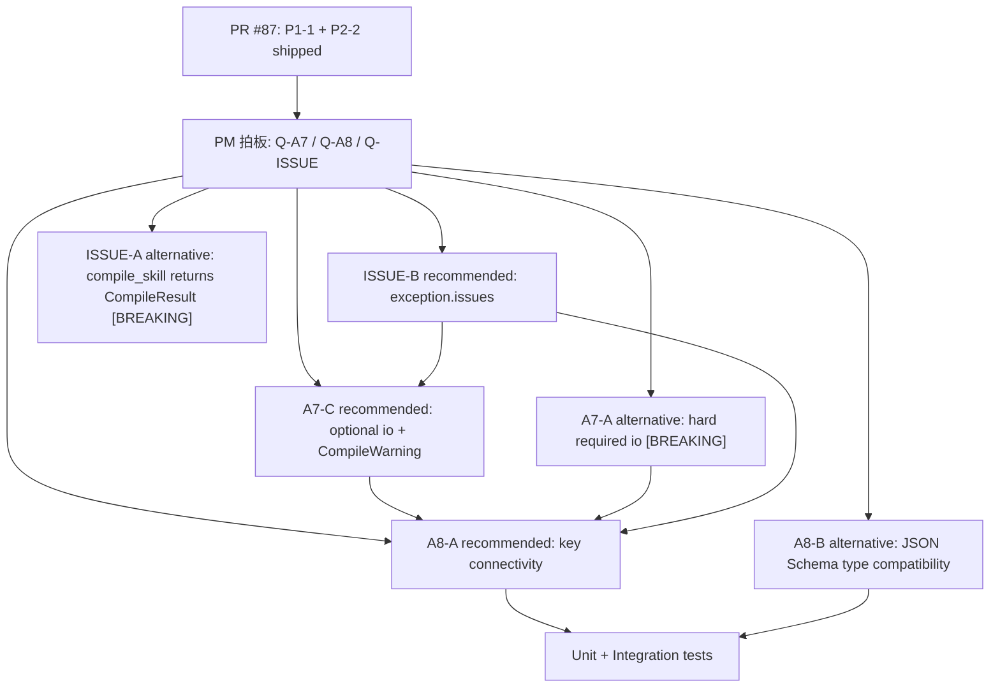

# Engine MVP0 — skill-compilation Tasks

## §0. 任务依赖关系

## §1. 已 ship task (P1-1 + P2-2)

### Task SHIP-1: P1-1 cache snapshot 恢复 subagents_by_phase / phase_tokens
- **Status**: done, shipped in PR #87.
- **范围**: `packages/graph-agent/src/graph_agent/core/cache.py` 已支持保存/恢复 `subagents_by_phase` 和 `phase_tokens`；设计文档将其标记为已完成，见 `.kiro/specs/engine-mvp0-skill-compilation/design.md:45`。
- **测试**: `packages/graph-agent/tests/core/test_v21_cache.py:93`、`packages/graph-agent/tests/core/test_v21_cache.py:107` 覆盖 cache hit 后 subagent 和 token 恢复。

### Task SHIP-2: P2-2 cache 写失败降级为 warning
- **Status**: done, shipped in PR #87.
- **范围**: `save_to_cache()` 写盘 `OSError` 不再中断编译；设计文档将其标记为已完成，见 `.kiro/specs/engine-mvp0-skill-compilation/design.md:50`。
- **测试**: `packages/graph-agent/tests/core/test_v21_cache.py:122` 覆盖写失败 warning + 仍返回 `CompiledSkill`，`packages/graph-agent/tests/core/test_v21_cache.py:141` 覆盖读失败 fallback。

## §2. PM 拍板待办 (blocking, 必须 PM 答复才能进 task)

- **Q-A7** (A7 io frontmatter 走 [BREAKING] vs [NEW] vs [BREAKING/Soft])
  - 当前推荐: 候选 C 中间路径，`PhaseIOSchema | None` + `CompileWarning`，不破现有 fixture。
  - PM 拍板影响: 决定 task §3 从 A7-C、A7-A 还是 A7-B 起步。
  - 设计出处: `.kiro/specs/engine-mvp0-skill-compilation/design.md:78`。
- **Q-A8** (A8 数据流静态校验深度)
  - 当前推荐: 候选 A 轻量 Key 连通性检查。
  - PM 拍板影响: 决定 §4 是先做 key visibility，还是进入 JSON Schema type compatibility。
  - 设计出处: `.kiro/specs/engine-mvp0-skill-compilation/design.md:97`。
- **Q-ISSUE** (结构化 CompileIssue 传递方式)
  - 当前推荐: 候选 B，保持 `compile_skill() -> CompiledSkill`，在异常对象上附 `issues`。
  - PM 拍板影响: 决定 §5 是否避免 breaking 签名变更。
  - 设计出处: `.kiro/specs/engine-mvp0-skill-compilation/design.md:117`。

## §3. A7 实施 task (按 PM 拍板候选展开)

### Task A7-C-1: 加 PhaseIOSchema 模型 (候选 C 推荐路径, blocked by Q-A7)
- **File**: `packages/graph-agent/src/graph_agent/core/manifest.py:59`
- **变更**: 新增 `PhaseIOSchema(BaseModel)`，包含 `inputs: dict[str, Any] = Field(default_factory=dict)`、`outputs: dict[str, Any] = Field(default_factory=dict)`，`extra="forbid"`。
- **测试**: `packages/graph-agent/tests/core/test_manifest.py:+约20` 新增 `test_phase_io_schema_defaults_and_forbids_extra`。
- **标记**: [NEW]
- **依赖**: blocked by PM 拍板 Q-A7；建议同时等 Q-ISSUE，方便 warning 结构化。

### Task A7-C-2: SkillNodeAST / LogicNodeAST 加可选 io 字段 (候选 C 推荐路径, blocked by Q-A7)
- **File**: `packages/graph-agent/src/graph_agent/core/manifest.py:69`, `packages/graph-agent/src/graph_agent/core/manifest.py:83`
- **变更**: `LogicNodeAST.io: PhaseIOSchema | None = None`，`SkillNodeAST.io: PhaseIOSchema | None = None`；`SubgraphNodeAST` 暂不加，避免和 state/subgraph mapping 设计混淆。
- **测试**: `packages/graph-agent/tests/core/test_manifest.py:+约30` 验证 logic/skill 带 io 可 parse，不带 io 仍兼容。
- **标记**: [NEW] / [BREAKING/Soft]
- **依赖**: blocked by PM 拍板 Q-A7。

### Task A7-C-3: loader 解析阶段接入 io frontmatter (候选 C 推荐路径, blocked by Q-A7)
- **File**: `packages/graph-agent/src/graph_agent/core/loader.py:160`
- **变更**: 在 `_build_phase_document()` 现有 frontmatter -> AST 路径中保留 `io` 字段，让 Pydantic AST 消费；确保 `raw["phases"]` 中也保留 frontmatter 原始 `io`。
- **测试**: `packages/graph-agent/tests/core/test_v21_loader.py:124` 附近新增 `test_skill_phase_frontmatter_io_round_trips_into_ast`、`test_logic_phase_frontmatter_io_round_trips_into_ast`。
- **标记**: [NEW]
- **依赖**: blocked by PM 拍板 Q-A7；依赖 A7-C-1/A7-C-2。

### Task A7-C-4: 缺 io 时发 CompileWarning (候选 C 推荐路径, blocked by Q-A7 + Q-ISSUE)
- **File**: `packages/graph-agent/src/graph_agent/core/loader.py:165`
- **变更**: 新增 `_warn_missing_phase_io()`，对 `LogicNodeAST` / `SkillNodeAST` 的 `io is None` 产生 CompileWarning；候选 C 下不 raise，不破现有 fixture。
- **测试**: `packages/graph-agent/tests/core/test_v21_loader.py:+约40` 新增 `test_missing_phase_io_emits_compile_warning_without_failing`。
- **标记**: [BREAKING/Soft]
- **依赖**: blocked by PM 拍板 Q-A7 和 Q-ISSUE。

### Task A7-A-1: [如果 PM 选 candidate A] 强制 io: PhaseIOSchema = Field(...)
- **File**: `packages/graph-agent/src/graph_agent/core/manifest.py:69`, `packages/graph-agent/src/graph_agent/core/manifest.py:83`
- **变更**: `LogicNodeAST.io` / `SkillNodeAST.io` 改为 required；缺失直接触发 compile fatal。
- **测试**: `packages/graph-agent/tests/core/test_v21_loader.py:+约30` 新增缺 io fatal；现有所有无 io fixture 必先迁移。
- **标记**: [BREAKING]
- **依赖**: blocked by PM 拍板 Q-A7。

### Task A7-A-2: [如果 PM 选 candidate A] 全量迁移现有 v2.1 fixture frontmatter
- **File**:
  - `packages/graph-agent/tests/fixtures/fake_canvas_fanout/phases/prepare/LOGIC.md:2`
  - `packages/graph-agent/tests/fixtures/fake_canvas_fanout/phases/branch_a/LOGIC.md:2`
  - `packages/graph-agent/tests/fixtures/fake_canvas_fanout/phases/branch_b/LOGIC.md:2`
  - `packages/graph-agent/tests/fixtures/fake_canvas_fanout/phases/assemble/LOGIC.md:2`
  - `packages/graph-agent/tests/fixtures/canvas_serializer/with_comments_v21/phases/prepare/LOGIC.md:2`
  - `packages/graph-agent/tests/fixtures/canvas_serializer/with_comments_v21/phases/branch/LOGIC.md:2`
  - `packages/graph-agent/tests/fixtures/canvas_serializer/with_comments_v21/phases/assemble/LOGIC.md:2`
  - `packages/graph-agent/tests/fixtures/subagent_minimal/phases/main/SKILL.md:2`
  - `packages/graph-agent/tests/fixtures/subagent_minimal/phases/main/subskills/echo_expert/phases/echo/SKILL.md:2`
- **变更**: 为每个 `LOGIC.md` / `SKILL.md` 增加最小 `io: {inputs: {}, outputs: {}}` 或真实 key 声明。
- **测试**: 跑 `pytest packages/graph-agent/tests/core/test_v21_loader.py packages/graph-agent/tests/core/test_v21_graph_assembly_fanout.py packages/graph-agent/tests/integration/test_v21_subagent_executor.py -x`。
- **标记**: [BREAKING]
- **依赖**: blocked by PM 拍板 Q-A7；依赖 A7-A-1。

### Task A7-B-1: [如果 PM 选 candidate B] 只加可选 io, 不发 warning
- **File**: `packages/graph-agent/src/graph_agent/core/manifest.py:59`, `packages/graph-agent/src/graph_agent/core/manifest.py:69`, `packages/graph-agent/src/graph_agent/core/manifest.py:83`
- **变更**: 只实现 `PhaseIOSchema` + optional `io`，不增加 warning/fatal。
- **测试**: 同 A7-C-1/A7-C-2 的正向 parse tests。
- **标记**: [NEW]
- **依赖**: blocked by PM 拍板 Q-A7。

## §4. A8 实施 task (按 PM 拍板候选展开)

### Task A8-A-1: 新增 phase io key extractor (候选 A 推荐路径, blocked by Q-A8)
- **File**: `packages/graph-agent/src/graph_agent/core/loader.py:903`
- **变更**: 新增 helper，从 `PhaseIOSchema.inputs/outputs` 提取 `properties` 或简化 dict keys；复用现有 `_extract_output_schema_keys()` 的边界处理。
- **测试**: `packages/graph-agent/tests/core/test_v21_loader.py:+约30` 新增 `test_phase_io_key_extractor_accepts_properties_and_plain_dict`。
- **标记**: [NEW]
- **依赖**: blocked by PM 拍板 Q-A8；依赖 A7-C 或 A7-A 的 `io` 字段。

### Task A8-A-2: 新增 _validate_phase_io_dataflow key 连通性检查 (候选 A 推荐路径, blocked by Q-A8)
- **File**: `packages/graph-agent/src/graph_agent/core/loader.py:168`
- **变更**: 在 phase_docs 构建后、action/tool discovery 前调用 `_validate_phase_io_dataflow(manifest, phase_docs, root_input_keys)`；按 `depends_on` 累积可见 keys，校验每个 phase required inputs 可由 root inputs 或 upstream outputs 满足。
- **测试**: `packages/graph-agent/tests/core/test_v21_loader.py:+约80` 新增 missing upstream input、root input satisfies phase input、upstream output satisfies downstream input。
- **标记**: [NEW]
- **依赖**: blocked by PM 拍板 Q-A8；依赖 A8-A-1。

### Task A8-A-3: A8 错误接入 CompileIssue (候选 A 推荐路径, blocked by Q-A8 + Q-ISSUE)
- **File**: `packages/graph-agent/src/graph_agent/core/loader.py:730`
- **变更**: dataflow missing key 通过结构化 issue 输出，字段至少包含 `code="F-v21-io-dataflow"`, `phase_id`, `field_name`, `path`, `line`。
- **测试**: `packages/graph-agent/tests/core/test_v21_loader.py:+约30` 捕获异常并断言 `issues[0]`。
- **标记**: [NEW]
- **依赖**: blocked by PM 拍板 Q-A8 和 Q-ISSUE。

### Task A8-B-1: [如果 PM 选 candidate B] JSON Schema type compatibility 校验
- **File**: `packages/graph-agent/src/graph_agent/core/loader.py:+约120`
- **变更**: 在 A8-A key 连通性基础上，比较 upstream output schema type 与 downstream input schema type；不兼容时产生 issue。
- **测试**: `packages/graph-agent/tests/core/test_v21_loader.py:+约60` 增加 string->integer mismatch、integer->number compatible/不兼容边界。
- **标记**: [NEW]
- **依赖**: blocked by PM 拍板 Q-A8；依赖 A8-A-1/A8-A-2。

## §5. CompileIssue 实施 task (按 PM 拍板候选展开)

### Task ISSUE-B-1: 新增结构化 CompileIssue 数据模型 (候选 B 推荐路径, blocked by Q-ISSUE)
- **File**: `packages/graph-agent/src/graph_agent/core/compiler.py:13` 或新文件 `packages/graph-agent/src/graph_agent/core/compile_issues.py:+约60`
- **变更**: 扩展/迁移现有 `CompileIssue`，字段包含 `code`, `severity`, `message`, `path`, `line`, `phase_id`, `field_name`；保留 `CompileResult` import 兼容。
- **测试**: `packages/graph-agent/tests/unit/core/test_compiler.py:+约20` 新增 issue model serialization test。
- **标记**: [NEW]
- **依赖**: blocked by PM 拍板 Q-ISSUE。

### Task ISSUE-B-2: SkillCompileError / SkillLoadError 支持 issues 属性 (候选 B 推荐路径, blocked by Q-ISSUE)
- **File**: `packages/graph-agent/src/graph_agent/core/exceptions.py:70`
- **变更**: 让 loader-time exception 可携带 `issues: list[CompileIssue]`，不改变 `compile_skill()` 公开签名。
- **测试**: `packages/graph-agent/tests/unit/core/test_compiler.py:+约30` 捕获异常并断言 `.issues` 存在。
- **标记**: [NEW]
- **依赖**: blocked by PM 拍板 Q-ISSUE；依赖 ISSUE-B-1。

### Task ISSUE-B-3: 改造 loader fatal helper 附带 issues (候选 B 推荐路径, blocked by Q-ISSUE)
- **File**: `packages/graph-agent/src/graph_agent/core/loader.py:730`, `packages/graph-agent/src/graph_agent/core/loader.py:874`, `packages/graph-agent/src/graph_agent/core/loader.py:964`
- **变更**: `_graph_fatal` / `_io_fatal` / `_actions_fatal` / A7/A8 新 helper 在抛错时构建结构化 issue。
- **测试**: `packages/graph-agent/tests/core/test_compiler_line_locations.py:13` 附近新增 graph/io/action issue path/line/code 断言。
- **标记**: [NEW]
- **依赖**: blocked by PM 拍板 Q-ISSUE；依赖 ISSUE-B-1/ISSUE-B-2。

### Task ISSUE-A-1: [如果 PM 选 candidate A] compile_skill 返回 CompileResult
- **File**: `packages/graph-agent/src/graph_agent/core/compiler.py:40`
- **变更**: 将公开签名改为 `compile_skill(...) -> tuple[CompiledSkill | None, CompileResult]`。
- **测试**: 全部调用 `compile_skill()` 的 tests 需要同步改造。
- **标记**: [BREAKING]
- **依赖**: blocked by PM 拍板 Q-ISSUE。

### Task ISSUE-A-2: [如果 PM 选 candidate A] 更新 runner / assembler / tests 调用方
- **File**: `packages/graph-agent/src/graph_agent/core/compiler.py:60`，以及所有 `compile_skill(...)` 调用点。
- **变更**: 所有调用方拆包处理 `(compiled, result)`，错误和 warning 从 `CompileResult` 读取。
- **测试**: `pytest packages/graph-agent/tests/ -x`。
- **标记**: [BREAKING]
- **依赖**: blocked by PM 拍板 Q-ISSUE；依赖 ISSUE-A-1。

## §6. 测试 task

### Unit test

### Task TEST-U-1: A7 PhaseIOSchema / AST unit tests
- **File**: `packages/graph-agent/tests/core/test_manifest.py:+约60`
- **Cases**: `PhaseIOSchema` 默认值、extra forbid、LogicNodeAST 带 io、SkillNodeAST 带 io、不带 io 兼容或 fatal（按 Q-A7）。
- **依赖**: A7-C 或 A7-A。
- **标记**: [NEW]

### Task TEST-U-2: A8 key extractor / dataflow unit tests
- **File**: `packages/graph-agent/tests/core/test_v21_loader.py:+约110`
- **Cases**: root input satisfies phase input；upstream output satisfies downstream input；missing upstream required input emits `F-v21-io-dataflow`。
- **依赖**: A8-A。
- **标记**: [NEW]

### Task TEST-U-3: CompileIssue exception attribute tests
- **File**: `packages/graph-agent/tests/unit/core/test_compiler.py:+约50`
- **Cases**: exception `.issues` list exists；issue has code/severity/path/line/phase_id；string message remains backward compatible。
- **依赖**: ISSUE-B。
- **标记**: [NEW]

### Integration test

### Task TEST-I-1: A7/A8 fixture-level compile integration
- **File**: `packages/graph-agent/tests/core/test_v21_loader.py:+约80`
- **Cases**: minimal two-phase skill with declared io compiles；missing downstream input fails; candidate C missing io only warns and still compiles。
- **依赖**: A7 + A8 + ISSUE。
- **标记**: [NEW]

### Task TEST-I-2: A8 graph fixture dataflow integration
- **File**: `packages/graph-agent/tests/core/test_v21_graph_assembly_fanout.py:+约40`
- **Cases**: `fake_canvas_fanout` with declared per-phase io passes key connectivity; mutated branch output missing assemble input fails at compile-time。
- **依赖**: A8-A；candidate A7-A 还依赖 fixture migration。
- **标记**: [NEW]

### E2E test (真 LLM 依赖)

### Task TEST-E-1: skill-compilation E2E policy
- **File**: 无需新增真 LLM e2e。
- **说明**: A7/A8/CompileIssue 都是编译期能力，不依赖 LLM。全部可用 unit/integration/mock fixture 覆盖。
- **依赖**: 无。
- **标记**: [NEW] mock-friendly。

## §7. nice-to-have task (a2 review 建议)

### Task NTH-1: test_v21_cache.py:143 fallback test 加 mocker.spy(SkillLoader, "compile_skill")
- **File**: `packages/graph-agent/tests/core/test_v21_cache.py:141`
- **变更**: 在 `test_cache_read_failure_falls_back_to_compile` 增加 spy，断言 fallback 真走冷编译。
- **依赖**: 无，可立即做。
- **标记**: [NEW] nice-to-have。

## §8. Pre-existing test fix task

### Task PRE-1: test_compiler_line_locations.py::test_locate_line_returns_one_indexed_line Python 3.12 fail
- **File**: `packages/graph-agent/tests/core/test_compiler_line_locations.py:51`，可能触及 `packages/graph-agent/src/graph_agent/core/parser.py`
- **变更**: 修复 `parse_markdown_parts()` / line-location 机制，使 `locate_line_for_pydantic_loc(frontmatter, ("name",))` 返回 1-indexed line；或由 PM 决定 deselect/改测试。
- **依赖**: PM triage；该问题已在 PR #87 / Task #14 flag，属于 pre-existing。
- **标记**: [BUG-pre-existing] blocked by PM 拍板。

## §9. Block 1 总体实施顺序

1. PM 先拍 Q-A7、Q-A8、Q-ISSUE，明确是否接受推荐路径：A7-C、A8-A、ISSUE-B。
2. 若 PM 接受推荐路径，先做 ISSUE-B-1/2/3，为 A7 warning 和 A8 error 提供结构化载体。
3. 做 A7-C-1/2/3/4，保证现有 fixture 不破但缺 io 有 CompileWarning。
4. 做 A8-A-1/2/3，只做轻量 key 连通性检查，不做 JSON Schema 类型推导。
5. 补 TEST-U / TEST-I，跑 `pytest packages/graph-agent/tests/core/test_v21_loader.py packages/graph-agent/tests/core/test_manifest.py packages/graph-agent/tests/unit/core/test_compiler.py -x`。
6. 跑 `pytest packages/graph-agent/tests/ -x`；若撞 PRE-1，按 PM triage 处理或在 PR 中明确标 pre-existing blocker。
7. commit + PR；PR 描述中列出 PM 拍板路径、A7/A8/ISSUE 实际候选、测试结果和任何 skipped/pre-existing failure。
