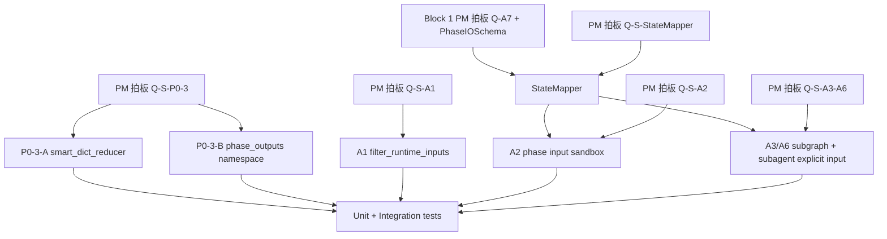

# Engine MVP0 — state-and-io-contract Tasks

## §0. 任务依赖关系

## §1. 已知现状 task 基线

### Task BASE-1: 记录现有 V2.1 state 主路径
- **Status**: reference only, no code change.
- **事实**: `BlackboardState.data` 当前用 `shallow_dict_merge`，见 `packages/graph-agent/src/graph_agent/runtime/state.py:13` 和 `packages/graph-agent/src/graph_agent/runtime/state.py:38`。
- **事实**: V2.1 runner 入口直接把 `**inputs` 变成 `dict(inputs)`，见 `packages/graph-agent/src/graph_agent/core/runner.py:471`。
- **事实**: LOGIC / SUBGRAPH / subagent 仍读写全量或继承父级 data，见 `packages/graph-agent/src/graph_agent/core/graph_assembler.py:127`、`:155`、`:398`。
- **标记**: [REFERENCE]

## §2. PM 拍板待办 (blocking, 必须 PM 答复才能进 task)

- **Q-S-P0-3** (Reducer 冲突语义)
  - 当前推荐: 候选 C，短期 `smart_dict_reducer` + 长期 `phase_outputs` 命名空间。
  - PM 拍板影响: 决定 §3 是否只替换 reducer，还是同时引入输出命名空间。
  - 设计出处: `.kiro/specs/engine-mvp0-state-io-contract/design.md:45`。
- **Q-S-A1** (Runtime Input Funnel 严格度)
  - 当前推荐: 候选 A，基于 jsonschema strict 的 `filter_runtime_inputs()`。
  - PM 拍板影响: 决定 §4 是 strict reject/drop unknown，还是复用 legacy IOManager。
  - 设计出处: `.kiro/specs/engine-mvp0-state-io-contract/design.md:61`。
- **Q-S-A2** (phase-level IO 沙箱策略)
  - 当前推荐: 候选 C，结合 pending-questions §3 mapper 思想；默认沙箱，显式 mapping 优先。
  - PM 拍板影响: 决定 §5 是强沙箱、warning-only，还是 mapper 调和路径。
  - 设计出处: `.kiro/specs/engine-mvp0-state-io-contract/design.md:81`。
- **Q-S-A3-A6** (子图 / subagent 黑板隔离策略)
  - 当前推荐: 候选 C + A，切断隐式继承，只允许 explicit input / mapping。
  - PM 拍板影响: 决定 §6 是否改 `SUBGRAPH` 和 subagent child state 初始化。
  - 设计出处: `.kiro/specs/engine-mvp0-state-io-contract/design.md:100`。
- **Q-S-StateMapper** (状态分发实现形态)
  - 当前推荐: 候选 A，独立 `StateMapper` 类。
  - PM 拍板影响: 决定 §7 是独立类还是 graph_assembler wrapper 内联闭包。
  - 设计出处: `.kiro/specs/engine-mvp0-state-io-contract/design.md:113`。
- **Q-A7 (Block 1)** (PhaseIOSchema 是否落地)
  - 当前推荐: Block 1 A7-C，`PhaseIOSchema | None` + CompileWarning。
  - PM 拍板影响: A2/A3/A6/StateMapper 均依赖 PhaseIOSchema 作为输入输出边界依据。
  - Block 1 任务出处: `.kiro/specs/engine-mvp0-skill-compilation/tasks.md:52`。

## §3. P0-3 smart_dict_reducer / phase_outputs task

### Task P0-3-C-1: 新增 smart_dict_reducer 并保留旧行为测试对照 (推荐路径, blocked by Q-S-P0-3)
- **File**: `packages/graph-agent/src/graph_agent/runtime/state.py:13`
- **变更**: 新增 `smart_dict_reducer(left, right)`，顺序覆盖采用 `dict.update` 语义；并行冲突仍保留 fatal 语义。短期可让 `shallow_dict_merge` 代理到新函数或保留旧名作兼容导出。
- **测试**: `packages/graph-agent/tests/runtime/test_state_reducer.py:8` 附近新增顺序覆盖允许、disjoint merge 保持、None 边界保持。
- **标记**: [BREAKING/Soft]
- **依赖**: blocked by PM 拍板 Q-S-P0-3。

### Task P0-3-C-2: BlackboardState.data reducer 切到 smart_dict_reducer (推荐路径, blocked by Q-S-P0-3)
- **File**: `packages/graph-agent/src/graph_agent/runtime/state.py:38`
- **变更**: `BlackboardState.data` 的 `Annotated` reducer 从 `shallow_dict_merge` 切到 `smart_dict_reducer`；`__all__` 同步导出新函数。
- **测试**: `packages/graph-agent/tests/core/test_v21_graph_assembly.py:187` 保持并行同 key fatal；新增顺序 LOGIC phase 覆盖已有 key 成功。
- **标记**: [BREAKING]
- **依赖**: blocked by PM 拍板 Q-S-P0-3；依赖 P0-3-C-1。

### Task P0-3-C-3: 引入 phase_outputs 命名空间骨架 (推荐路径第二阶段, blocked by Q-S-P0-3 + Q-S-A2)
- **File**: `packages/graph-agent/src/graph_agent/runtime/state.py:35`
- **变更**: 在 state data 约定中保留 `data["phase_outputs"]` 命名空间；先不强制所有节点写入，只为 A2/StateMapper 做承载。
- **测试**: `packages/graph-agent/tests/runtime/test_state_reducer.py:+约20` 验证 `phase_outputs` 不与顶层业务 key 混合冲突。
- **标记**: [NEW] / [BREAKING/Soft]
- **依赖**: blocked by PM 拍板 Q-S-P0-3 和 Q-S-A2。

### Task P0-3-A-1: [如果 PM 只选 candidate A] 只替换 reducer 不引入 phase_outputs
- **File**: `packages/graph-agent/src/graph_agent/runtime/state.py:13`
- **变更**: 只完成 smart reducer，暂不改变 state shape。
- **测试**: 同 P0-3-C-1/P0-3-C-2。
- **标记**: [BREAKING/Soft]
- **依赖**: blocked by PM 拍板 Q-S-P0-3。

### Task P0-3-B-1: [如果 PM 选 candidate B] 所有节点输出写入 phase_outputs
- **File**: `packages/graph-agent/src/graph_agent/core/graph_assembler.py:127`, `packages/graph-agent/src/graph_agent/core/graph_assembler.py:155`, `packages/graph-agent/src/graph_agent/core/graph_assembler.py:275`
- **变更**: LOGIC/SUBGRAPH/SKILL 输出不再直接写顶层 `data`，统一写入 `data["phase_outputs"][phase_id]`。
- **测试**: 现有 `packages/graph-agent/tests/core/test_v21_graph_assembly.py:163`、`:209` 预期需要重写。
- **标记**: [BREAKING]
- **依赖**: blocked by PM 拍板 Q-S-P0-3 和 Q-S-A2。

## §4. A1 Runtime Input Funnel task

### Task A1-A-1: 新增 filter_runtime_inputs() helper (推荐路径, blocked by Q-S-A1)
- **File**: `packages/graph-agent/src/graph_agent/core/runner.py:+约80` 或新模块 `packages/graph-agent/src/graph_agent/runtime/input_funnel.py:+约120`
- **变更**: 基于 compiled raw root input schema 过滤/校验 runtime kwargs；支持 required、default、基础类型校验，unknown 字段按 PM 拍板 strict reject 或 drop。
- **测试**: 新增 `packages/graph-agent/tests/runtime/test_input_funnel.py` 或放入现有 runtime 测试目录，覆盖 unknown、missing required、default、类型错误、合法输入。
- **标记**: [NEW] / [BREAKING]
- **依赖**: blocked by PM 拍板 Q-S-A1。

### Task A1-A-2: V2.1 runner 接入 input funnel (推荐路径, blocked by Q-S-A1)
- **File**: `packages/graph-agent/src/graph_agent/core/runner.py:468`, `packages/graph-agent/src/graph_agent/core/runner.py:471`
- **变更**: `_run_v21_skill_dict()` 在 `compile_skill(skill_root)` 后读取 compiled root input schema，用 `filter_runtime_inputs(inputs, schema)` 替代 `"data": dict(inputs)`。
- **测试**: `packages/graph-agent/tests/core/test_predict_runner_binding.py:35` 附近或新增 runner test，断言 extra input 被处理、required missing 结构化失败、合法 inputs 进入 `result["context"]`。
- **标记**: [BREAKING]
- **依赖**: blocked by PM 拍板 Q-S-A1；建议等待 Block 1 Q-ISSUE 结构化错误路径。

### Task A1-B-1: [如果 PM 选 candidate B] 复用 legacy IOManager.load_inputs
- **File**: `packages/graph-agent/src/graph_agent/core/runner.py:471`
- **变更**: 将 legacy IOManager 接入 V2.1 runner。
- **测试**: 复用 `packages/graph-agent/tests/core/test_io_manager.py:25` 的行为并补 V2.1 runner integration。
- **标记**: [BREAKING] [NOT-RECOMMENDED]
- **依赖**: blocked by PM 拍板 Q-S-A1。

## §5. StateMapper task

### Task SM-A-1: 新增独立 StateMapper 类 (推荐路径, blocked by Q-S-StateMapper + Q-A7 Block 1)
- **File**: 新文件 `packages/graph-agent/src/graph_agent/runtime/state_mapper.py:+约160`
- **变更**: 实现 `build_phase_input(data, phase_io, *, upstream_phase_ids=None)`, `wrap_phase_output(phase_id, output)`, `build_child_input(parent_data, mapping, explicit_input)` 等纯函数式方法。
- **测试**: 新增 `packages/graph-agent/tests/runtime/test_state_mapper.py`，覆盖 root inputs、phase_outputs、missing key、explicit mapping、deepcopy 不污染 parent。
- **标记**: [NEW]
- **依赖**: blocked by PM 拍板 Q-S-StateMapper；blocked by Q-A7 (Block 1 PhaseIOSchema)。

### Task SM-A-2: StateMapper deepcopy / JSON-like 数据边界
- **File**: `packages/graph-agent/src/graph_agent/runtime/state_mapper.py:+约60`
- **变更**: 构造 phase_input / child_input / child_flow 时 deep copy JSON-like dict/list；对不可复制或非 JSON-like 对象按 structured error 处理或保留引用策略由 PM 后续决定。
- **测试**: `packages/graph-agent/tests/runtime/test_state_mapper.py:+约40` 验证 nested list/dict 修改不污染 parent。
- **标记**: [NEW]
- **依赖**: blocked by PM 拍板 Q-S-StateMapper；blocked by Q-A7 (Block 1)。

### Task SM-B-1: [如果 PM 选 candidate B] 在 graph_assembler wrapper 内联 mapper 逻辑
- **File**: `packages/graph-agent/src/graph_agent/core/graph_assembler.py:98`
- **变更**: 不新增 StateMapper 类，直接在 `_node_for_phase()` / phase node builder 周围闭包中做切片和包装。
- **测试**: 以 A2/A3/A6 integration tests 为主。
- **标记**: [NEW] [NOT-RECOMMENDED]
- **依赖**: blocked by PM 拍板 Q-S-StateMapper；blocked by Q-A7 (Block 1)。

## §6. A2 phase-level IO 沙箱 task

### Task A2-C-1: LOGIC node 使用 StateMapper 构造 phase_input (推荐路径, blocked by Q-S-A2 + Q-A7 Block 1)
- **File**: `packages/graph-agent/src/graph_agent/core/graph_assembler.py:127`
- **变更**: LOGIC node 不再用全量 `state.get("data", {})` 构造 `Context`，改由 StateMapper 根据 phase `io.inputs` 构造 `phase_input`；action 输出通过 mapper 包装为 phase output。
- **测试**: `packages/graph-agent/tests/core/test_v21_graph_assembly.py:+约80` 新增未声明字段不可读、声明字段可读、输出写入 phase_outputs。
- **标记**: [BREAKING]
- **依赖**: blocked by PM 拍板 Q-S-A2；blocked by Q-A7 (Block 1 PhaseIOSchema)；依赖 SM-A-1。

### Task A2-C-2: SKILL node prompt/input 使用 phase_input (推荐路径, blocked by Q-S-A2 + Q-A7 Block 1)
- **File**: `packages/graph-agent/src/graph_agent/core/graph_assembler.py:177`
- **变更**: SKILL phase 只获得声明输入对应的数据切片；finish_task 成功后输出写入 phase output namespace 或按 mapper wrap。
- **测试**: `packages/graph-agent/tests/core/test_v21_graph_assembly.py:+约60` 使用 FakeToolChatModel 断言 prompt/messages 不包含未声明 parent-only key，finish_task output 进入期望命名空间。
- **标记**: [BREAKING]
- **依赖**: blocked by PM 拍板 Q-S-A2；blocked by Q-A7 (Block 1)；依赖 SM-A-1。

### Task A2-B-1: [如果 PM 选 warning-only] 全量透传 + trace warning
- **File**: `packages/graph-agent/src/graph_agent/core/graph_assembler.py:127`, tracing callback 接入点待定
- **变更**: 不阻断全量 data，只在访问未声明 key 时产生 warning/trace。
- **测试**: 需要 tracing mock，断言 warning 事件。
- **标记**: [NEW] [NOT-RECOMMENDED]
- **依赖**: blocked by PM 拍板 Q-S-A2；blocked by Q-A7 (Block 1)。

## §7. A3 + A6 子图隔离 task

### Task A3A6-C-1: SUBGRAPH child state 改为 explicit input only (推荐路径, blocked by Q-S-A3-A6 + Q-A7 Block 1)
- **File**: `packages/graph-agent/src/graph_agent/core/graph_assembler.py:155`
- **变更**: `_subgraph_node()` 不再把 `before_data` 原样传给 child；改由 StateMapper/mapping 构造 child data，并 deep copy child flow。
- **测试**: `packages/graph-agent/tests/core/test_v21_graph_assembly.py:209` 附近新增 child 不能读 parent-only key、显式 mapping 后可读、child flow mutation 不污染 parent。
- **标记**: [BREAKING]
- **依赖**: blocked by PM 拍板 Q-S-A3-A6；blocked by Q-A7 (Block 1)；依赖 SM-A-1。

### Task A3A6-C-2: subagent child data 改为 explicit input only (推荐路径, blocked by Q-S-A3-A6 + Q-A7 Block 1)
- **File**: `packages/graph-agent/src/graph_agent/core/graph_assembler.py:392`
- **变更**: `_invoke_subagent_once_t23()` 将 `child_data = {**before_data, **input_data}` 改为 explicit input only；返回 data 仅作为 tool result，不自动合回 parent data。
- **测试**: `packages/graph-agent/tests/core/test_v21_subagent_executor.py:141` 当前断言 child data 包含 parent，需要改成隔离断言；`packages/graph-agent/tests/integration/test_v21_subagent_executor.py:87` 保持 fanout e2e。
- **标记**: [BREAKING]
- **依赖**: blocked by PM 拍板 Q-S-A3-A6；blocked by Q-A7 (Block 1)；依赖 SM-A-1。

### Task A3A6-C-3: child flow deep copy + subagent_depth 写入 child state (blocked by Q-S-A3-A6)
- **File**: `packages/graph-agent/src/graph_agent/core/graph_assembler.py:400`, `packages/graph-agent/src/graph_agent/core/graph_assembler.py:482`
- **变更**: child graph 的 `flow` 使用 deep copy，显式写入 `subagent_depth = depth + 1`，不只放在 RunnableConfig metadata。
- **测试**: `packages/graph-agent/tests/core/test_v21_subagent_executor.py:194` 附近加 child state flow depth 断言；`packages/graph-agent/tests/integration/test_v21_subagent_executor.py:139` 保持 max depth 行为。
- **标记**: [BUG] [NEW]
- **依赖**: blocked by PM 拍板 Q-S-A3-A6。

### Task A3A6-B-1: [如果 PM 只隔离 subagent] SUBGRAPH 保留全量 data
- **File**: `packages/graph-agent/src/graph_agent/core/graph_assembler.py:392`
- **变更**: 只改 subagent child data，不改 `_subgraph_node()`。
- **测试**: 只改 subagent executor tests。
- **标记**: [BREAKING/Partial] [NOT-RECOMMENDED]
- **依赖**: blocked by PM 拍板 Q-S-A3-A6。

## §8. 测试 task

### Unit test

### Task TEST-U-1: reducer 单元测试
- **File**: `packages/graph-agent/tests/runtime/test_state_reducer.py:8`
- **Cases**: disjoint merge、None 边界、顺序覆盖允许、并行冲突保留 fatal。
- **依赖**: P0-3-C-1。
- **标记**: [NEW]

### Task TEST-U-2: input funnel 单元测试
- **File**: `packages/graph-agent/tests/runtime/test_input_funnel.py:+约120`
- **Cases**: unknown field、required missing、default fill、type mismatch、valid input。
- **依赖**: A1-A-1。
- **标记**: [NEW]

### Task TEST-U-3: StateMapper 单元测试
- **File**: `packages/graph-agent/tests/runtime/test_state_mapper.py:+约160`
- **Cases**: build_phase_input、wrap_phase_output、explicit mapping、missing key、deepcopy isolation。
- **依赖**: SM-A-1/SM-A-2。
- **标记**: [NEW]

### Integration test

### Task TEST-I-1: LOGIC 顺序覆盖 vs fan-in 冲突
- **File**: `packages/graph-agent/tests/core/test_v21_graph_assembly.py:163`
- **Cases**: 顺序 LOGIC 更新已有 key 成功；并行分支同 key 仍失败。
- **依赖**: P0-3-C。
- **标记**: [NEW]

### Task TEST-I-2: phase sandbox integration
- **File**: `packages/graph-agent/tests/core/test_v21_graph_assembly.py:+约120`
- **Cases**: LOGIC/SKILL 只能看到声明 input；未声明 parent-only key 不可读；输出包装到 phase_outputs。
- **依赖**: A2-C + StateMapper + Q-A7 (Block 1)。
- **标记**: [NEW]

### Task TEST-I-3: SUBGRAPH / subagent isolation integration
- **File**: `packages/graph-agent/tests/core/test_v21_graph_assembly.py:209`, `packages/graph-agent/tests/core/test_v21_subagent_executor.py:141`, `packages/graph-agent/tests/integration/test_v21_subagent_executor.py:87`
- **Cases**: child data 不含 parent-only key；explicit input 可达；child flow mutation 不污染 parent；subagent fanout 仍保序。
- **依赖**: A3A6-C + StateMapper + Q-A7 (Block 1)。
- **标记**: [NEW]

### E2E test (真 LLM 依赖)

### Task TEST-E-1: state-and-io-contract E2E policy
- **File**: 无需新增真 LLM e2e。
- **说明**: P0-3/A1/A2/A3/A6/StateMapper 都是 runtime state contract，可用 unit/integration/FakeToolChatModel 覆盖；无需真实 LLM key。
- **依赖**: 无。
- **标记**: [NEW] mock-friendly。

## §9. 立即可做 task (不替 PM 拍板)

### Task PREP-1: 增加现状锁定测试 - 顺序覆盖当前会失败
- **File**: `packages/graph-agent/tests/core/test_v21_graph_assembly.py:+约40`
- **变更**: 新增 xfail 或显式当前行为测试，描述顺序 LOGIC 更新已有 key 目前触发 `[F-v21-state-conflict]`，为 P0-3 修复前后对照提供物料。
- **依赖**: 无，不 blocked by Q-S-*；只锁定现状，不改变实现。
- **标记**: [NEW] 可立即做。

### Task PREP-2: BlackboardState 兼容性空占位实验测试
- **File**: `packages/graph-agent/tests/runtime/test_state_reducer.py:+约20`
- **变更**: 增加 `inputs` / `phase_outputs` 作为普通 data 子 key 的兼容性测试，不改变 `BlackboardState` 字段。
- **依赖**: 无，不 blocked by Q-S-*；只做测试物料准备。
- **标记**: [NEW] 可立即做。

## §10. Pre-existing / cross-block blocker

### Task PRE-1: Block 1 A7 PhaseIOSchema 未拍板前禁止推进 A2/A3/A6 强沙箱
- **File**: `.kiro/specs/engine-mvp0-skill-compilation/tasks.md:52`
- **变更**: 无代码；这是跨 block blocker。A2/A3/A6/StateMapper 必须等 Q-A7 确认并至少落地 optional `PhaseIOSchema`。
- **依赖**: blocked by Q-A7 (Block 1)。
- **标记**: [CROSS-BLOCK-BLOCKER]

### Task PRE-2: test_compiler_line_locations.py Python 3.12 pre-existing fail
- **File**: `packages/graph-agent/tests/core/test_compiler_line_locations.py:51`
- **变更**: 不属于本 block；全量 `pytest -x` 当前会在此处提前失败，后续 PR 需在报告中标 pre-existing 或等待 PM triage。
- **依赖**: PM triage。
- **标记**: [BUG-pre-existing]

## §11. Block 2 总体实施顺序

1. PM 先拍 Q-S-P0-3、Q-S-A1、Q-S-A2、Q-S-A3-A6、Q-S-StateMapper，同时确认 Block 1 Q-A7 是否落地 PhaseIOSchema。
2. 若接受推荐路径，先做 P0-3-C-1/2，解除顺序覆盖误伤，同时保留并行 fan-in fatal。
3. 做 A1-A-1/2，把 runtime input funnel 接入 V2.1 runner。
4. 等 Block 1 A7 完成后，做 SM-A-1/2。
5. 做 A2-C-1/2，把 LOGIC/SKILL 的执行输入切到 StateMapper phase_input。
6. 做 A3A6-C-1/2/3，切断 SUBGRAPH 和 subagent 的 parent data 隐式继承，并修 child flow depth。
7. 补 TEST-U / TEST-I，跑 `pytest packages/graph-agent/tests/runtime packages/graph-agent/tests/core/test_v21_graph_assembly.py packages/graph-agent/tests/core/test_v21_subagent_executor.py packages/graph-agent/tests/integration/test_v21_subagent_executor.py -x`。
8. 跑 `pytest packages/graph-agent/tests/ -x`；若仍撞 PRE-2，按 PM triage 或在 PR 中明确 pre-existing blocker。
9. commit + PR；PR 描述必须列 PM 拍板路径、跨 Block 1 A7 依赖状态、测试结果和任何 pre-existing failure。
