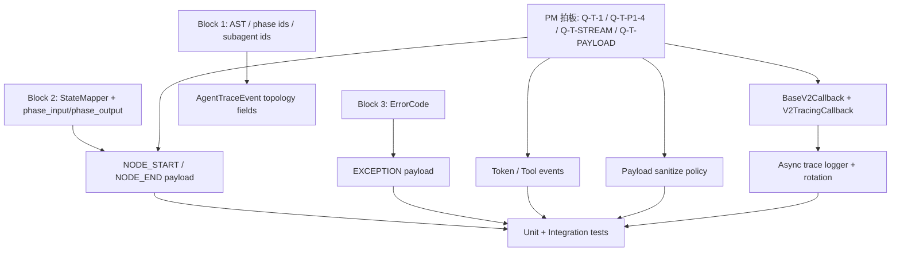

# Engine MVP0 — tracing-and-observability Tasks

## §0. 任务依赖关系

## §1. 已 ship task

### Task SHIP-0: Block 4 尚无已 ship tracing task
- **File**: `.kiro/specs/engine-mvp0-tracing-observability/design.md:1`
- **变更**: 记录当前 Block 4 仍处 tasks 拆分阶段；V2TracingCallback / TraceEventKind / AgentTraceEvent / async logger / rotation 尚未 shipped。
- **测试**: 无。
- **标记**: [NEW] documentation-only。
- **依赖**: 无。

## §2. PM 拍板待办 (blocking, 必须 PM 答复才能进 task)

- **Q-T-1** (V2TracingCallback 接口形态)
  - 当前推荐: 候选 C，抽 `BaseV2Callback`，让 `V2TracingCallback` 与 `PredictTracingCallback` 共享事件和 sanitize 底座。
  - PM 拍板影响: 决定 §3 是抽基类、纯手工插桩类，还是 LangChain `BaseCallbackHandler` 继承路线。
  - 设计出处: `.kiro/specs/engine-mvp0-tracing-observability/design.md:21`。
- **Q-T-P1-4** (V2.1 callback 接回入口)
  - 当前推荐: 候选 A，基于 node wrapper 显式投递，等待 Block 2 StateMapper 供给精确 phase input/output。
  - PM 拍板影响: 决定 §6 是改 `graph_assembler.py` wrapper，还是走 LangGraph Runnable callback tree。
  - 研究出处: `.kiro/specs/engine-mvp0-tracing-observability/research.md:63`。
- **Q-T-STREAM** (流式 token 是否落盘)
  - 当前推荐: token 在线推送但默认不写 trace.jsonl；tool call 必须落盘。
  - PM 拍板影响: 决定 §8 token event 进入 async logger 的 drop/store 策略。
  - 设计出处: `.kiro/specs/engine-mvp0-tracing-observability/design.md:64`。
- **Q-T-PAYLOAD** (payload 截断与防爆)
  - 当前推荐: 候选 A，复用/迁移 Predict exporter `_sanitize_mapping`，MVP0 不做 blob sidecar。
  - PM 拍板影响: 决定 §5 是粗截断，还是设计多级引用落盘。
  - 研究出处: `.kiro/specs/engine-mvp0-tracing-observability/research.md:58`。

## §3. V2TracingCallback / callback 接口 task

### Task CB-C-1: 抽 BaseV2Callback 公共基类 (推荐路径, blocked by Q-T-1)
- **File**: `packages/graph-agent/src/graph_agent/callbacks/tracing.py:58`, `packages/graph-agent/src/graph_agent/core/_predict_internal/tracing.py:76`
- **变更**: 新增 `BaseV2Callback`，承载 `emit_agent_trace_event()`、payload sanitize、run_id 管理和 common lifecycle；`TracingCallback` 旧行为保持兼容。
- **测试**: `packages/graph-agent/tests/callbacks/test_v2_tracing_callback.py:+约80` 覆盖基类不写旧 trace、事件序列化稳定。
- **标记**: [NEW]
- **依赖**: blocked by PM 拍板 Q-T-1；建议等待 Q-T-PAYLOAD。

### Task CB-C-2: 新增公开 V2TracingCallback (推荐路径, blocked by Q-T-1)
- **File**: `packages/graph-agent/src/graph_agent/callbacks/tracing.py:58`, `packages/graph-agent/src/graph_agent/callbacks/__init__.py:5`
- **变更**: 新增 `V2TracingCallback(BaseV2Callback)`，输出 `AgentTraceEvent` 到 async logger / event bus；导出公共 API。
- **测试**: `packages/graph-agent/tests/callbacks/test_v2_tracing_callback.py:+约100` 覆盖初始化、trace_dir、emit、flush/close。
- **标记**: [NEW]
- **依赖**: blocked by PM 拍板 Q-T-1；依赖 CB-C-1。

### Task CB-C-3: PredictTracingCallback 迁到 BaseV2Callback 共享 sanitize (推荐路径, blocked by Q-T-1)
- **File**: `packages/graph-agent/src/graph_agent/core/_predict_internal/tracing.py:76`, `packages/graph-agent/src/graph_agent/core/_predict_internal/exporter.py:74`
- **变更**: `PredictTracingCallback` 保持私有 API，但复用 BaseV2Callback 的 sanitize 和 event emit，不重复维护输出策略。
- **测试**: `packages/graph-agent/tests/core/test_predict_trace_exporter.py:+约60` 或现有 predict tracing tests 补回归。
- **标记**: [NEW]
- **依赖**: blocked by PM 拍板 Q-T-1；依赖 CB-C-1。

### Task CB-A-1: [如果 PM 选 candidate A] 纯手工插桩 V2TracingCallback
- **File**: `packages/graph-agent/src/graph_agent/callbacks/tracing.py:+约160`, `packages/graph-agent/src/graph_agent/core/graph_assembler.py:127`
- **变更**: 不抽 Predict 基类，直接新增独立 callback 类，由 graph_assembler wrappers 调用。
- **测试**: `packages/graph-agent/tests/callbacks/test_v2_tracing_callback.py:+约80`
- **标记**: [NEW]
- **依赖**: blocked by PM 拍板 Q-T-1 和 Q-T-P1-4。

### Task CB-B-1: [如果 PM 选 candidate B] BaseCallbackHandler 路线
- **File**: `packages/graph-agent/src/graph_agent/core/callback_bridge.py:60`, `packages/graph-agent/src/graph_agent/callbacks/tracing.py:+约160`
- **变更**: 以 LangChain `BaseCallbackHandler` 为事件入口，扩展 bridge 捕获 node/tool/llm 生命周期。
- **测试**: `packages/graph-agent/tests/core/test_callback_bridge_integration.py:+约120`
- **标记**: [BREAKING]
- **依赖**: blocked by PM 拍板 Q-T-1 和 Q-T-P1-4。

## §4. TraceEventKind / AgentTraceEvent schema task

### Task EVT-1: 新增 TraceEventKind StrEnum (blocked by Q-T-1)
- **File**: `packages/graph-agent/src/graph_agent/callbacks/events.py:35`
- **变更**: 新增 `TraceEventKind`，锁定 `NODE_START`、`NODE_END`、`LLM_CALL_START`、`LLM_CALL_END`、`TOOL_CALL_START`、`TOOL_CALL_END`、`SUBAGENT_ENTER`、`SUBAGENT_EXIT`、`EXCEPTION`。
- **测试**: `packages/graph-agent/tests/callbacks/test_events.py:+约40` 覆盖枚举值不可漂移、JSON 值稳定。
- **标记**: [NEW]
- **依赖**: blocked by PM 拍板 Q-T-1。

### Task EVT-2: 新增 AgentTraceEvent schema (blocked by Q-T-1 + Q-T-PAYLOAD)
- **File**: `packages/graph-agent/src/graph_agent/callbacks/events.py:42`
- **变更**: 新增 `AgentTraceEvent` Pydantic model 或 TypedDict，字段包含 `schema_version`、`run_id`、`phase_id`、`event_type`、`timestamp_ms`、`payload`、`parent_run_id`、`subagent_depth`。
- **测试**: `packages/graph-agent/tests/callbacks/test_events.py:+约80` 覆盖序列化、extra forbid、payload sanitize 后可 JSON dump。
- **标记**: [NEW]
- **依赖**: blocked by PM 拍板 Q-T-1 和 Q-T-PAYLOAD；依赖 EVT-1。

### Task EVT-3: 旧 CallbackEvent 与 AgentTraceEvent 并存桥接 (blocked by Q-T-1)
- **File**: `packages/graph-agent/src/graph_agent/callbacks/tracing.py:113`, `packages/graph-agent/src/graph_agent/callbacks/events.py:396`
- **变更**: 保留现有 `CallbackEvent` union 和 `TracingCallback.on_event()`；新增 v2 event sink，避免 Studio 旧 typed trace 立即破裂。
- **测试**: `packages/graph-agent/tests/callbacks/test_tracing.py:+约80` 覆盖旧 `tracing.jsonl` 与新 `trace.jsonl` 可共存。
- **标记**: [NEW]
- **依赖**: blocked by PM 拍板 Q-T-1。

## §5. payload sanitize / 防爆 task

### Task PAYLOAD-A-1: 迁移 _sanitize_mapping 为公共 trace sanitizer (推荐路径, blocked by Q-T-PAYLOAD)
- **File**: `packages/graph-agent/src/graph_agent/core/_predict_internal/exporter.py:74`, `packages/graph-agent/src/graph_agent/callbacks/serialize.py:1`
- **变更**: 将 `_sanitize_mapping` 提升到 public callbacks/tracing sanitizer 模块；支持 dict/list/str 截断，过滤 usage/cost/潜在 secret key。
- **测试**: `packages/graph-agent/tests/callbacks/test_trace_sanitizer.py:+约100` 覆盖长文本、深层 dict/list、usage 字段过滤、非 dict payload。
- **标记**: [NEW]
- **依赖**: blocked by PM 拍板 Q-T-PAYLOAD。

### Task PAYLOAD-A-2: AgentTraceEvent emit 前统一 sanitize (推荐路径, blocked by Q-T-PAYLOAD)
- **File**: `packages/graph-agent/src/graph_agent/callbacks/tracing.py:101`
- **变更**: `V2TracingCallback.emit_agent_trace_event()` 写入前统一 sanitize payload；记录 `truncated` / `truncated_fields`。
- **测试**: `packages/graph-agent/tests/callbacks/test_v2_tracing_callback.py:+约60` 覆盖超长 payload 不进入原文落盘。
- **标记**: [BREAKING]
- **依赖**: blocked by PM 拍板 Q-T-PAYLOAD；依赖 PAYLOAD-A-1。

### Task PAYLOAD-B-1: [如果 PM 选 candidate B] blob sidecar 长报文引用
- **File**: `packages/graph-agent/src/graph_agent/callbacks/tracing.py:+约180`
- **变更**: 长 payload 写入 `trace_blobs/<event_id>.json`，AgentTraceEvent 只保留 blob ref / digest。
- **测试**: `packages/graph-agent/tests/callbacks/test_trace_blobs.py:+约100` 覆盖 blob 写入、ref、丢失 blob 降级。
- **标记**: [BREAKING]
- **依赖**: blocked by PM 拍板 Q-T-PAYLOAD。

## §6. P1-4 V2.1 callback 接回 / node lifecycle task

### Task P1-4-A-1: _run_v21_skill_dict 不再丢弃 callbacks (推荐路径, blocked by Q-T-P1-4)
- **File**: `packages/graph-agent/src/graph_agent/core/runner.py:451`, `packages/graph-agent/src/graph_agent/core/runner.py:462`
- **变更**: 删除 `del callbacks`，创建默认 `V2TracingCallback` 或接收外部 callbacks；把 callbacks 传入 `assemble_graph()` / `graph.invoke(config=...)`。
- **测试**: `packages/graph-agent/tests/core/test_runner_v21_tracing.py:+约80` 覆盖 callbacks 被调用、无 trace_dir 时不写盘、trace_dir 时返回真实 trace path。
- **标记**: [BREAKING]
- **依赖**: blocked by PM 拍板 Q-T-P1-4；依赖 CB-C-2。

### Task P1-4-A-2: assemble_graph 接收 callbacks / trace emitter (推荐路径, blocked by Q-T-P1-4)
- **File**: `packages/graph-agent/src/graph_agent/core/graph_assembler.py:55`, `packages/graph-agent/src/graph_agent/core/graph_assembler.py:72`
- **变更**: `assemble_graph()` 增加 callbacks/trace_emitter 参数；构建每个 phase node 时注入 phase_id、run_id、callback list。
- **测试**: `packages/graph-agent/tests/core/test_v21_graph_assembly.py:+约80` 覆盖 callback 事件序列。
- **标记**: [BREAKING]
- **依赖**: blocked by PM 拍板 Q-T-P1-4；依赖 P1-4-A-1。

### Task P1-4-A-3: LOGIC node 发 NODE_START / NODE_END (推荐路径, blocked by Q-T-P1-4)
- **File**: `packages/graph-agent/src/graph_agent/core/graph_assembler.py:127`
- **变更**: `_logic_node()` 执行前后发 `NODE_START`/`NODE_END`；payload 使用 Block 2 StateMapper 的 `phase_input` / `updates`，临时不可用时只发 sanitized delta。
- **测试**: `packages/graph-agent/tests/core/test_v21_graph_assembly.py:+约80` 覆盖 logic phase start/end 顺序和 payload。
- **标记**: [BREAKING]
- **依赖**: blocked by PM 拍板 Q-T-P1-4；blocked by Block 2 Q-S-StateMapper / Q-S-A2。

### Task P1-4-A-4: SUBGRAPH node 发 NODE_START / NODE_END + EXCEPTION (推荐路径, blocked by Q-T-P1-4)
- **File**: `packages/graph-agent/src/graph_agent/core/graph_assembler.py:155`
- **变更**: `_subgraph_node()` 包裹 try/except/finally，发 node lifecycle 和 exception event；child result delta sanitize 后写入。
- **测试**: `packages/graph-agent/tests/core/test_v21_graph_assembly.py:209` 附近新增 SUBGRAPH trace 和 child failure trace。
- **标记**: [BREAKING]
- **依赖**: blocked by PM 拍板 Q-T-P1-4；blocked by Block 2 Q-S-A3-A6 和 Block 3 Q-R-ERROR。

### Task P1-4-A-5: SKILL node 发 NODE / LLM call lifecycle (推荐路径, blocked by Q-T-P1-4)
- **File**: `packages/graph-agent/src/graph_agent/core/graph_assembler.py:229`, `packages/graph-agent/src/graph_agent/core/graph_assembler.py:243`
- **变更**: `_skill_node()` 发 `NODE_START`/`NODE_END`；`model.invoke(prompt_messages)` 前后发 `LLM_CALL_START`/`LLM_CALL_END`，payload 包含 sanitized prompt/response/usage。
- **测试**: `packages/graph-agent/tests/core/test_v21_graph_assembly.py:124` 附近新增 fake LLM trace 断言。
- **标记**: [BREAKING]
- **依赖**: blocked by PM 拍板 Q-T-P1-4；依赖 CB-C-2 和 PAYLOAD-A。

### Task P1-4-B-1: [如果 PM 选 Runnable callback tree] LangGraph config callbacks 接回
- **File**: `packages/graph-agent/src/graph_agent/core/runner.py:471`, `packages/graph-agent/src/graph_agent/core/graph_assembler.py:231`
- **变更**: 通过 `graph.invoke(..., config={"callbacks": [...]})` 走 LangGraph/Runnable 原生回调，不在 node wrapper 手工发事件。
- **测试**: `packages/graph-agent/tests/core/test_runner_v21_tracing.py:+约120`
- **标记**: [BREAKING]
- **依赖**: blocked by PM 拍板 Q-T-P1-4 和 Q-T-1。

## §7. Subagent / Tool / Exception event task

### Task SUB-1: subagent runtime 发 SUBAGENT_ENTER / SUBAGENT_EXIT (blocked by Q-T-P1-4)
- **File**: `packages/graph-agent/src/graph_agent/core/graph_assembler.py:392`, `packages/graph-agent/src/graph_agent/core/graph_assembler.py:482`
- **变更**: `_invoke_subagent_once_t23()` 和 `_subagent_runnable_config()` 发进入/退出事件，payload 包含 parent_run_id、child_run_id、subagent_name、subagent_depth。
- **测试**: `packages/graph-agent/tests/integration/test_v21_subagent_executor.py:+约100` 覆盖 fanout 三个 child 的 enter/exit 数量和 depth。
- **标记**: [BREAKING]
- **依赖**: blocked by PM 拍板 Q-T-P1-4；依赖 Block 3 P1-2 child flow depth。

### Task TOOL-1: tool.invoke 前后发 TOOL_CALL_START / TOOL_CALL_END (blocked by Q-T-P1-4)
- **File**: `packages/graph-agent/src/graph_agent/core/graph_assembler.py:250`, `packages/graph-agent/src/graph_agent/core/graph_assembler.py:267`
- **变更**: 包裹 business tools、critic tools、finish_task 和 subagent tools；记录 tool_name、args、result/duration/error。
- **测试**: `packages/graph-agent/tests/core/test_v21_graph_assembly.py:223` 附近覆盖 reviewer 和 finish_task tool events。
- **标记**: [BREAKING]
- **依赖**: blocked by PM 拍板 Q-T-P1-4；依赖 PAYLOAD-A。

### Task EXC-1: GraphAgentError 映射 EXCEPTION event (blocked by Q-T-P1-4)
- **File**: `packages/graph-agent/src/graph_agent/core/graph_assembler.py:233`, `packages/graph-agent/src/graph_agent/core/graph_assembler.py:557`
- **变更**: 在 node wrapper 捕获异常时发 `EXCEPTION`，payload 读取 Block 3 `error_code` / metadata / traceback，再重新抛出或按 runner 策略返回。
- **测试**: `packages/graph-agent/tests/core/test_v21_graph_assembly.py:+约80` 覆盖 unknown tool、missing chat_model、action fatal 的 exception event。
- **标记**: [BREAKING]
- **依赖**: blocked by PM 拍板 Q-T-P1-4；blocked by Block 3 Q-R-ERROR。

## §8. async logger / trace rotation / stream task

### Task LOG-A-1: 新增 AsyncTraceLogger 队列 + 后台线程 (blocked by Q-T-1)
- **File**: `packages/graph-agent/src/graph_agent/callbacks/tracing.py:+约220`
- **变更**: 实现 `queue.Queue` + `threading.Thread` 消费者，支持 `write(event)`、`flush()`、`close()`，关键事件不阻塞 graph.invoke。
- **测试**: `packages/graph-agent/tests/callbacks/test_async_trace_logger.py:+约120` 覆盖异步写入、flush、close idempotent。
- **标记**: [NEW]
- **依赖**: blocked by PM 拍板 Q-T-1。

### Task LOG-A-2: Backpressure 策略丢弃低价值 token (blocked by Q-T-STREAM)
- **File**: `packages/graph-agent/src/graph_agent/callbacks/tracing.py:+约80`
- **变更**: 队列满载时优先保留 `EXCEPTION`/`NODE_END`/`TOOL_CALL_END`，丢弃或合并 `TOKEN`/低价值 stream event，并计数上报。
- **测试**: `packages/graph-agent/tests/callbacks/test_async_trace_logger.py:+约80` 覆盖满队列时 token dropped、exception retained。
- **标记**: [NEW]
- **依赖**: blocked by PM 拍板 Q-T-STREAM；依赖 LOG-A-1。

### Task LOG-A-3: trace.jsonl 文件轮转与 gzip 归档 (blocked by Q-T-1)
- **File**: `packages/graph-agent/src/graph_agent/callbacks/tracing.py:78`
- **变更**: 固定写 `trace.jsonl`；超过阈值默认 50MB 时 rotate 为 `trace.<timestamp>.jsonl.gz`，新文件继续追加。
- **测试**: `packages/graph-agent/tests/callbacks/test_trace_rotation.py:+约120` 用小阈值覆盖 rotate、gzip 可读、事件无丢失。
- **标记**: [NEW]
- **依赖**: blocked by PM 拍板 Q-T-1；依赖 LOG-A-1。

### Task STREAM-B-1: token 在线推送但默认不落盘 (推荐路径, blocked by Q-T-STREAM)
- **File**: `packages/graph-agent/src/graph_agent/models/gateway_chat_model.py:207`, `packages/graph-agent/src/graph_agent/core/_predict_internal/interception.py:122`
- **变更**: 暴露 `on_llm_new_token`/token event 到 event bus；默认不写 trace.jsonl，仅在 PM 开启 full-store 模式时落盘。
- **测试**: `packages/graph-agent/tests/models/test_gateway_chat_model.py:+约80` 或 callback logger tests 覆盖 token emit/drop。
- **标记**: [NEW]
- **依赖**: blocked by PM 拍板 Q-T-STREAM；依赖 LOG-A-2。

### Task STREAM-A-1: [如果 PM 选 candidate A] token 全量落盘
- **File**: `packages/graph-agent/src/graph_agent/callbacks/tracing.py:+约80`
- **变更**: token event 进入 trace.jsonl 和轮转；backpressure 只在硬满载时丢弃。
- **测试**: `packages/graph-agent/tests/callbacks/test_async_trace_logger.py:+约60` 覆盖 token 写盘和轮转体积压力。
- **标记**: [BREAKING]
- **依赖**: blocked by PM 拍板 Q-T-STREAM；依赖 LOG-A-1/LOG-A-3。

## §9. 测试 task

### Task TEST-U-1: TraceEventKind / AgentTraceEvent unit tests (blocked by Q-T-1)
- **File**: `packages/graph-agent/tests/callbacks/test_events.py:+约120`
- **变更**: 覆盖 enum、schema、required fields、JSON serialization。
- **测试**: `pytest packages/graph-agent/tests/callbacks/test_events.py -x`
- **标记**: [NEW]
- **依赖**: blocked by PM 拍板 Q-T-1；依赖 EVT-1/EVT-2。

### Task TEST-U-2: sanitizer 防爆 unit tests (blocked by Q-T-PAYLOAD)
- **File**: `packages/graph-agent/tests/callbacks/test_trace_sanitizer.py:+约120`
- **变更**: 覆盖超长字符串、深层 dict/list、usage/cost 字段剔除、secret-like key 脱敏。
- **测试**: `pytest packages/graph-agent/tests/callbacks/test_trace_sanitizer.py -x`
- **标记**: [NEW]
- **依赖**: blocked by PM 拍板 Q-T-PAYLOAD；依赖 PAYLOAD-A。

### Task TEST-U-3: async logger / rotation unit tests (blocked by Q-T-1 + Q-T-STREAM)
- **File**: `packages/graph-agent/tests/callbacks/test_async_trace_logger.py:+约180`
- **变更**: 覆盖 queue write/flush/close、backpressure、rotation gzip。
- **测试**: `pytest packages/graph-agent/tests/callbacks/test_async_trace_logger.py -x`
- **标记**: [NEW]
- **依赖**: blocked by PM 拍板 Q-T-1 和 Q-T-STREAM；依赖 LOG-A。

### Task TEST-I-1: V2.1 logic/skill node lifecycle integration (blocked by Q-T-P1-4)
- **File**: `packages/graph-agent/tests/core/test_runner_v21_tracing.py:+约160`
- **变更**: 跑 mock-only V2.1 graph，断言 `NODE_START -> NODE_END`、`LLM_CALL_START -> TOOL_CALL -> LLM_CALL_END` 顺序。
- **测试**: `pytest packages/graph-agent/tests/core/test_runner_v21_tracing.py -x`
- **标记**: [NEW]
- **依赖**: blocked by PM 拍板 Q-T-P1-4；依赖 P1-4-A。

### Task TEST-I-2: subagent/tool/exception tracing integration (blocked by Q-T-P1-4)
- **File**: `packages/graph-agent/tests/integration/test_v21_subagent_executor.py:+约140`
- **变更**: 覆盖 `SUBAGENT_ENTER/EXIT`、tool event、child failure exception event。
- **测试**: `pytest packages/graph-agent/tests/integration/test_v21_subagent_executor.py -x`
- **标记**: [NEW]
- **依赖**: blocked by PM 拍板 Q-T-P1-4；依赖 SUB-1 / TOOL-1 / EXC-1。

### Task TEST-E-1: tracing-observability E2E policy (blocked by Q-T-P1-4)
- **File**: 无需新增真 LLM e2e。
- **变更**: Block 4 可全部 mock-only 覆盖；真实 LLM streaming 若未来需要，归入 Block 3 ModelResolver gated smoke。
- **测试**: mock-only targeted suite。
- **标记**: [NEW] mock-friendly。
- **依赖**: blocked by PM 拍板 Q-T-P1-4。

## §10. 立即可做 task (不替 PM 拍板)

### Task PREP-1: TraceEventKind / AgentTraceEvent schema 草案测试
- **File**: `packages/graph-agent/tests/callbacks/test_events.py:+约80`
- **变更**: 先写不接 runtime 的 schema-only tests，用 xfail 或 local fixture 锁定 9 个 event kind 名称。
- **测试**: `pytest packages/graph-agent/tests/callbacks/test_events.py -x`
- **标记**: [NEW] 可立即做。
- **依赖**: 无，不 blocked by Q-T-*；只锁定设计候选的最小形状。

### Task PREP-2: async logger 独立原型测试
- **File**: `packages/graph-agent/tests/callbacks/test_async_trace_logger.py:+约120`
- **变更**: 先写纯 Python queue/rotation fixture，不接 graph runtime，不改变生产路径。
- **测试**: `pytest packages/graph-agent/tests/callbacks/test_async_trace_logger.py -x`
- **标记**: [NEW] 可立即做。
- **依赖**: 无，不 blocked by Q-T-*；只准备测试物料。

### Task PREP-3: V2.1 callbacks 被丢弃的现状锁定测试
- **File**: `packages/graph-agent/tests/core/test_runner_v21_tracing.py:+约80`
- **变更**: 先写 xfail 证明 `_run_v21_skill_dict()` 当前 `del callbacks` 导致 V2.1 callback 不触发。
- **测试**: `pytest packages/graph-agent/tests/core/test_runner_v21_tracing.py -x`
- **标记**: [NEW] 可立即做。
- **依赖**: 无，不 blocked by Q-T-*；只锁定现状。

## §11. Pre-existing / 跨 block blocker

### Task PRE-1: Block 2 StateMapper 未落地前禁止推进 NODE_START/NODE_END payload
- **File**: `.kiro/specs/engine-mvp0-state-io-contract/tasks.md:121`, `packages/graph-agent/src/graph_agent/core/graph_assembler.py:127`
- **变更**: Block 4 node payload 必须来自 phase input/output slice；不得用全量 `state.data` 伪装节点输入输出。
- **测试**: 无。
- **标记**: [BLOCKED]
- **依赖**: blocked by Block 2 Q-S-StateMapper / Q-S-A2 / Q-S-A3-A6。

### Task PRE-2: Block 3 ErrorCode 未落地前 EXCEPTION payload 只能做兼容层
- **File**: `.kiro/specs/engine-mvp0-execution-runtime/tasks.md:206`, `packages/graph-agent/src/graph_agent/core/exceptions.py:13`
- **变更**: `EXCEPTION` 事件正式 payload 依赖 Block 3 `GraphAgentError.code/metadata`；未落地前只能从 `str(exc)` 兼容提取。
- **测试**: 无。
- **标记**: [BLOCKED]
- **依赖**: blocked by Block 3 Q-R-ERROR。

### Task PRE-3: test_compiler_line_locations.py Python 3.12 pre-existing fail
- **File**: `packages/graph-agent/tests/core/test_compiler_line_locations.py:51`
- **变更**: 不属于本 block；全量 `pytest packages/graph-agent/tests/ -x` 当前会提前失败，后续 PR 需标 pre-existing 或等 PM triage。
- **测试**: `pytest packages/graph-agent/tests/ -x`
- **标记**: [BUG-pre-existing]
- **依赖**: PM triage。

## §12. Block 4 总体实施顺序

1. PM 先拍 Q-T-1、Q-T-P1-4、Q-T-STREAM、Q-T-PAYLOAD，并确认 Block 2/3 依赖状态。
2. 先做 EVT-1/EVT-2 与 PAYLOAD-A，确定事件 schema 和防爆策略。
3. 做 CB-C-1/2/3，建立公开 V2TracingCallback 与 Predict 共享底座。
4. 做 LOG-A-1/2/3，完成 async logger、backpressure 和 rotation。
5. 等 Block 2 StateMapper 后做 P1-4-A-1~A-5 的 node lifecycle 接线。
6. 等 Block 3 ErrorCode 后做 EXC-1；同步补 SUB-1 / TOOL-1。
7. 按 Q-T-STREAM 做 STREAM-B 或 STREAM-A。
8. 跑 targeted tests：`test_events.py`、`test_v2_tracing_callback.py`、`test_async_trace_logger.py`、`test_runner_v21_tracing.py`、`test_v21_subagent_executor.py`。
9. 跑 `pytest packages/graph-agent/tests/ -x`；若仍撞 PRE-3，按 PM triage 或在 PR 中明确 pre-existing blocker。
10. commit + PR；PR 描述必须列 PM 拍板路径、Block 2/3 依赖状态、测试结果和任何 pre-existing failure。
