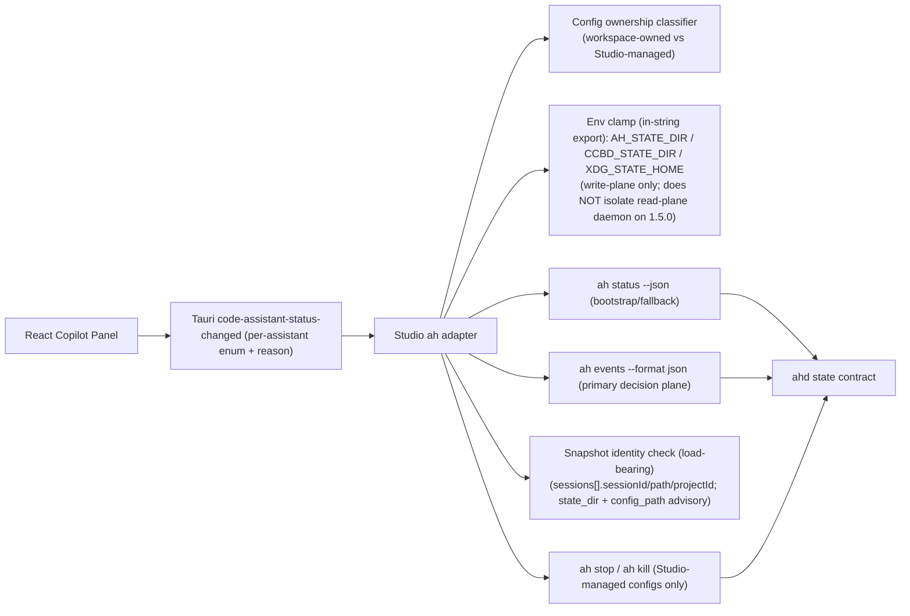
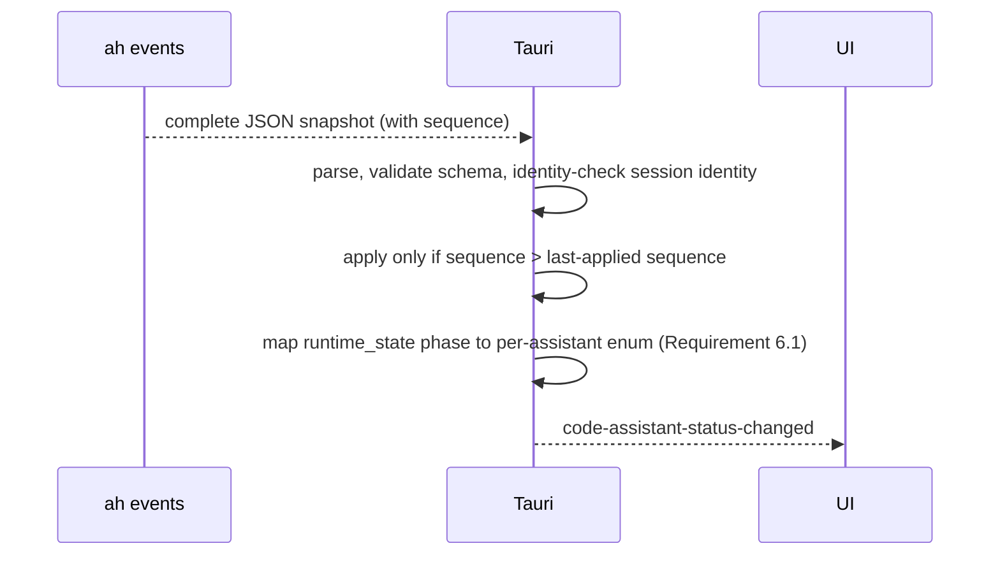
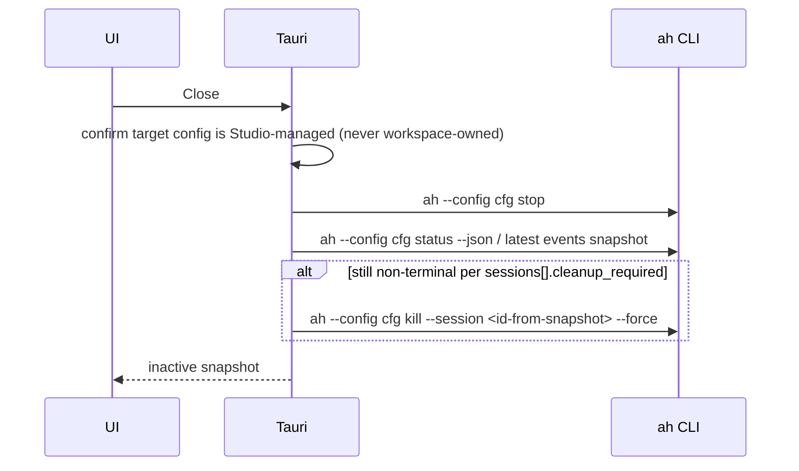

# Studio ah State Contract V1 Design

## Overview

This feature replaces Studio's local ah lifecycle guessing with ah v1.4.0+'s structured state contract. Tauri becomes a thin adapter around `ah events --format json` (primary decision plane) and `ah status --json` (bootstrap/fallback read); the frontend remains a projection of the server-authoritative status event.

The important behavior change is conceptual, in three parts:

1. `ahd alive && active=false` is not automatically an error. It can be the correct state after master exits, after a session closes, or while no selected config has an active runtime.
2. `runtime_state` is a **four-value phase**, not a boolean: `active`, `inactive`, `starting`, `degraded`. `starting` is hands-off (startup in progress); `degraded` must expose a working Open-with-cleanup path, never a fully dead button set. Cleanup is driven by ah's own per-session cleanup-eligibility fields, not by Studio re-deriving "non-terminal therefore kill".
3. Ownership is not just "which config", but **who owns the config**: a config Studio discovers by walking up the directory tree may belong to someone else's already-running ah session (including this very repository's own operator-managed fleet). Only Studio-generated temp configs are eligible for lifecycle mutation; every snapshot is identity-checked against the config Studio actually asked about before it is trusted.

Second-round hardening (2026-07-10, from d1-review NF1/NF2 + o1 坑洞 3.1/3.2/3.3/3.4/3.5, all re-verified by read-only 1.5.0 testing): the identity check is authoritative on session identity, not `config_path`（修订 2026-08-05，决议 D-D1：requester 侧判定锚只有 session 身份——`state_dir` 是 ah 内部从 config 路径派生的 hash，请求方无法独立形成期望值，不能充当校验条件；降为 advisory 诊断，与 `config_path` 同级。见 `decision-2026-08-05-identity-anchor-and-tmux-server-alive.md`） (which is `null` on a config-less daemon and echoed back to the requested path, so a `config_path` match proves nothing), and all path comparison is canonicalized across the Windows↔WSL boundary rather than raw-string-compared. The env clamp is injected into the bash command string (a login shell would otherwise re-source the user's profile over it) and — critically — does **not** isolate which daemon the read plane (`status`/`events`) talks to on 1.5.0, so the identity check, not the clamp, is the load-bearing isolation control. `sequence` arbitration is scoped to a single subscription stream / `session_id` lifetime, resetting unconditionally on a `reason:"initial"` baseline. The frontend payload carries a `readOnly` flag so a read-only assistant's Close renders as Detach and its inactive Open is disabled — otherwise the UI deadlocks on controls the backend rejects.

## Goals

- Use ah v1.4.0+ as the lifecycle authority.
- Remove `ah ps` text parsing and tmux liveness probing from normal status decisions.
- Make `active`, `inactive`, `starting`, `degraded`, and daemon-absent states explicit and testable — not just the terminal session statuses.
- Make the events stream the primary decision plane, with `status --json` as bootstrap/fallback input only, arbitrated by `sequence`.
- Draw an explicit ownership line between workspace-owned ah configs (read-only) and Studio-managed temp configs (full lifecycle), and clamp the environment Studio's ah invocations inherit.
- Keep React UI as a thin projection of Tauri status events, using a payload rich enough to represent all of the above truthfully.

## Non-Goals

- Do not implement native process supervision in Studio.
- Do not read or migrate ah sqlite.
- Do not add Studio-owned lifecycle states that duplicate ah's state machine.
- Do not clean non-Studio ah stacks, including workspace-owned configs Studio did not create.
- Do not allow more than one Studio-managed ahd per workspace at a time (unchanged product invariant; see Requirements 6.3).

## Architecture

### Existing Architecture Analysis

Current Studio status handling mixes multiple sources:

- `ah events --format json` feeds status events.
- A separate runtime inspection path calls `ah ps`, parses textual rows, and probes tmux sessions.
- Cleanup can fall through to direct tmux session killing.
- `find_ah_config` walks up from the workspace root with no ownership distinction, and prefers whatever it finds over the Studio temp config (lib.rs:203-218, lib.rs:828-833).
- ah invocations on Windows go through a `wsl.exe -e bash -lc` **login shell**, which inherits the user's WSL profile environment, including anything that pins `AH_STATE_DIR`/`CCBD_STATE_DIR`/`XDG_STATE_HOME` (lib.rs:858/879/927).
- The frontend event payload is `{claude: bool, codex: bool}` with an explicit claude-wins suppression of codex (lib.rs:63-73, lib.rs:1244-1246), even though the frontend already renders a dual-active state.

This creates a second, weaker lifecycle model inside Studio, plus two latent ownership-safety gaps and an expressiveness gap in the UI payload. The v1.4.0+ contract, applied with explicit ownership and phase handling, removes all of these.

### Architecture Pattern & Boundary Map



**Architecture Integration**:

- Selected pattern: external-contract adapter, with an explicit ownership boundary layer in front of it.
- Domain boundary: ah owns runtime lifecycle; Studio owns assistant registration, config generation, config ownership classification, UI projection, and user command orchestration.
- Existing patterns preserved: frontend consumes Tauri events and commands through `tauri.ts`.
- New component rationale: a typed runtime snapshot parser prevents string parsing drift; a config ownership classifier prevents lifecycle commands from ever reaching a config Studio did not create; the in-string env clamp prevents inherited login-shell state from cross-contaminating the state dirs Studio writes; and the snapshot identity check — not the env clamp — is the load-bearing control that keeps Studio from trusting another daemon's snapshot as its own, because on ah 1.5.0 the read plane ignores the clamp (Requirement 4.7a).
- Steering compliance: single source of truth, explicit boundary, fail fast at external contract boundary.

### Technology Stack

| Layer | Choice / Version | Role in Feature | Notes |
|-------|------------------|-----------------|-------|
| Frontend | React / Tauri invoke | Display per-assistant Open/Attach/Close/Starting/Degraded/Error projection | No lifecycle inference |
| Native Shell | Rust Tauri | ah adapter, ownership classifier, env clamp, event emission | Main change area |
| Runtime | ah >= 1.4.0 | Lifecycle authority | External contract |
| Events | JSONL snapshots | Live status updates, primary decision plane | Complete snapshots, not deltas; ordered by `sequence` |

## System Flows

### One-shot open decision

```mermaid
sequenceDiagram
  participant UI
  participant Tauri
  participant AH as ah CLI
  UI->>Tauri: Open assistant
  Tauri->>Tauri: version gate (cached, includes events-subscription check)
  Tauri->>Tauri: classify config ownership (workspace-owned vs Studio-managed)
  Tauri->>AH: ah --config cfg status --json (bootstrap read; ignored if events snapshot already available)
  Tauri->>AH: ensure events subscription running for cfg
  Tauri->>Tauri: identity-check latest events snapshot against cfg
  alt runtime_state=active
    Tauri-->>UI: attach existing runtime
  else runtime_state=inactive, all sessions terminal
    Tauri->>AH: ah --config cfg start --wait (Studio-managed config only)
    Tauri-->>UI: starting event
  else runtime_state=starting
    Tauri-->>UI: starting projection, hands-off, no action taken
  else runtime_state=degraded
    Tauri->>AH: cleanup via sessions[].safe_to_cleanup/cleanup_required, then start
    Tauri-->>UI: cleanup-then-starting projection
  else status --json errored and no events snapshot yet (daemon-absent bootstrap gap)
    Tauri->>AH: wait for/start events subscription to get structured daemon_absent snapshot
    Tauri-->>UI: treat as inactive, not error
  else unsupported schema, failed identity check, or genuine command error
    Tauri-->>UI: actionable error
  end
```

### Live status subscription (primary decision plane)



**订阅的所有权（决议 2026-08-03 D-C1/D-C2/D-C4）**：`ah events` 生产者由 Tauri 侧的
`CodeAssistantRuntimeState` 拥有，前端只是观察者。

- `watch_code_assistant_status(workspaceRoot)` 是**幂等的"确保存在"**：确保该 workspace
  的每个 spec 都有生产者，并停掉**其它** workspace 的生产者（Studio 同一时刻只显示一个
  工作区，用它给生产者数量定上界）。
- **没有反向的 unwatch 命令。** 前端订阅结束只撤销它自己建立的东西——一个本地监听器。
  视图的卸载不得销毁共享的数据源；生产者只在两处终止：`watch` 切到别的 workspace，
  以及 app 退出。
- 生产者启动时若该 config 还没有任何缓存帧，先做一次 `status --json` bootstrap 播种
  （即 Requirement 2.2 的 bootstrap 规则，同样适用于 UI 投影这条道，不只适用于生命周期
  判定），在首帧到达之前，投影结果是 `unknown` 而不是 `inactive`。

### Close cleanup



## Requirements Traceability

| Requirement | Summary | Components | Interfaces | Flows |
|-------------|---------|------------|------------|-------|
| 1.1-1.8 | ah version gate, single-sourced (single `ah version` command + trim), covers events subscription | Studio ah adapter | `ah version` | open, attach, cleanup, events subscription |
| 2.1-2.7 | events-primary status SSOT, status as bootstrap/fallback, stream-scoped sequence arbitration, session identity check | Runtime snapshot parser | `status --json`, `events --format json` | status, live events |
| 3.1-3.8 | runtime_state phase + active-state UI semantics, incl. starting/degraded | Tauri event projection, Copilot panel | `code-assistant-status-changed` | open decision |
| 4.1-4.8 (incl. 4.7a) | cleanup safety, config ownership classification, in-string env clamp + its scope limit, snapshot identity (load-bearing) | Cleanup orchestrator, config ownership classifier, env clamp | `ah stop`, `ah kill` | close cleanup |
| 5.1-5.14 | tests | fixtures and unit tests | mocked/recorded ah CLI output | all flows |
| 6.1-6.4 | per-assistant status payload (incl. `readOnly`) + read-only Detach control semantics | Tauri event projection, Copilot panel | `code-assistant-status-changed` | all flows |

## Components and Interfaces

### Tauri ah adapter

| Field | Detail |
|-------|--------|
| Intent | Execute ah commands and translate ah snapshots into Studio status events |
| Requirements | 1.1, 1.2, 1.5, 1.6, 1.7, 2.1, 2.2, 2.3, 4.1 |

**Responsibilities & Constraints**

- Run version gate (single-sourced constant, cached per session, single `ah version` command + `trim` — Requirement 1.8) before lifecycle commands and before spawning the events subscriber.
- Execute `ah --config <path> events --format json` as the primary decision-plane input; treat `ah --config <path> status --json` as a bootstrap/fallback read only.
- Never use `ah ps` text or tmux probing for normal lifecycle decisions.
- Clamp `AH_STATE_DIR`/`CCBD_STATE_DIR`/`XDG_STATE_HOME` by injecting the export into the bash `-c` command string (`export AH_STATE_DIR=""; ...`), NOT via `Command::env` — a `wsl.exe -e bash -lc` login shell sources the user's profile after inheriting the environment, so only an in-string export survives (Requirement 4.7). This clamp guards against cross-contaminating state dirs Studio writes; it does NOT isolate which daemon the read plane talks to on ah 1.5.0 (Requirement 4.7a) — that isolation is enforced by the snapshot identity check.

### Config ownership classifier

| Field | Detail |
|-------|--------|
| Intent | Classify a discovered ah config as workspace-owned (read-only) or Studio-managed (full lifecycle) before any command runs against it |
| Requirements | 4.6 |

**Responsibilities & Constraints**

- A config found by walking up from the workspace root (`find_ah_config`) is workspace-owned unless it is also the registered Studio temp config for that assistant.
- Workspace-owned configs are eligible only for `status`/`events`/observational `attach`; never for `start`/`stop`/`kill`.
- Studio-managed temp configs (Studio temp namespace) are eligible for full lifecycle commands.
- This classification runs before `ah_config_for_status`'s current preference order is applied, replacing "prefer whatever is found" with an explicit ownership gate.

### Runtime snapshot parser

| Field | Detail |
|-------|--------|
| Intent | Parse and validate ah v1.4.0+ runtime snapshots, and reject any snapshot that does not belong to the requested config |
| Requirements | 2.1, 2.2, 2.5, 2.6, 2.7, 3.1, 3.2, 3.5, 3.6, 3.7, 4.8 |

**State Management**

- State model (see Data Models below for exact field names, corrected per F8):
  - `schemaVersion`, `runtimeState`, `active`, `ahdAlive`, `reason`, `sequence`
  - `configPath` (nullable), `workspacePath`, `stateDir`
  - `sessions[]`, `agents[]`
- Invariants:
  - ah-provided `active` and `runtimeState` are authoritative once identity-checked.
  - Unknown schema is rejected.
  - Unknown status is displayed diagnostically and not silently treated as healthy.
  - Identity is validated on session identity (`sessions[].sessionId`/`path`/`projectId`) （修订 2026-08-05，决议 D-D1：requester 侧判定锚只有 session 身份——`state_dir` 是 ah 内部从 config 路径派生的 hash，请求方无法独立形成期望值，不能充当校验条件；降为 advisory 诊断，与 `config_path` 同级。见 `decision-2026-08-05-identity-anchor-and-tmux-server-alive.md`）, NOT on `configPath` (advisory only: `null` on a config-less daemon, and echoed back to the requested path per NF1). Path comparisons are canonicalized across the Windows↔WSL boundary, never raw-string. A snapshot whose authoritative identity does not match the requested config is discarded, not applied (Requirement 2.7/4.8).
  - `sequence` is monotonic only *within a single subscription stream / `sessionId` lifetime*; the applied-`sequence` cache is unconditionally reset on a re-established subscription, a `reason:"initial"` snapshot, or a changed `sessionId`, and only after that reset does an older-or-equal `sequence` fail to overwrite a newer applied snapshot (Requirement 2.1/2.6, o1 坑洞 3.2).

### Cleanup orchestrator

| Field | Detail |
|-------|--------|
| Intent | Close Studio-managed ah runtimes without crossing ownership boundaries |
| Requirements | 4.1, 4.2, 4.3, 4.4, 4.5, 4.6, 4.7 |

**Responsibilities & Constraints**

- Use `ah stop` as the normal close path, and only ever against a Studio-managed config (per the ownership classifier).
- Re-read the current snapshot (events-primary, `status --json` fallback) after stop.
- Escalate only with `ah kill --session <id> --force` for session ids from the selected config's latest identity-checked snapshot, and only where the snapshot marks that session `cleanup_required`. `safe_to_cleanup` is ah's **safety gate** (false = live work that cleanup would destroy), NOT a kill trigger, so `!safe_to_cleanup` alone must never escalate a kill — targeting is driven solely by `cleanup_required`, per Requirement 4.2 (trust ah's own per-session fields; Studio never re-derives "non-terminal therefore kill"). The earlier `cleanup_required`/not `safe_to_cleanup` OR-reading was falsified by task7's rollback self-check (it selected a healthy live stack, `safe_to_cleanup:false`, as a `--force` kill target); see `task7-cross-lane-review-2026-07-11.md` §2.
- Do not directly kill tmux sessions during normal cleanup.
- Ignore ahd stacks outside the Studio-managed temp config namespace, including a workspace-owned config found by directory walk-up.
- `degraded`-state cleanup (Requirement 3.7) runs only at the same four user-triggered timings as normal cleanup: Open prepare, Attach's CleanupStale branch, Close, app quit — never as a side effect of the passive events-snapshot handler.

## Data Models

### Normalized runtime snapshot

Field names below are corrected against the real 1.4.0/1.5.0 CLI output recorded in `operator-review-findings.md` F8, not against the README's illustrative example (research.md already flagged that the README example should not be hardcoded).

```typescript
type AhRuntimeSnapshot = {
  schemaVersion: number
  runtimeState: 'active' | 'inactive' | 'starting' | 'degraded'
  active: boolean
  ahdAlive: boolean
  reason?: string             // "initial" marks a fresh baseline → unconditional sequence-cache reset (Req 2.1)
  sequence: number            // per-stream baseline, NOT globally monotonic; resets to 1 with reason:"initial" (Req 2.1)
  configPath: string | null   // ADVISORY ONLY (Req 2.7): null on a config-less daemon, and echoed back to the requested path — never an authoritative identity field
  workspacePath?: string
  stateDir?: string           // ADVISORY(修订 2026-08-05 D-D1): ah 内部从 config 路径派生的 hash，请求方不可预测，不参与判定
  sessions: AhSessionSnapshot[]
  agents: AhAgentSnapshot[]
}

type AhSessionSnapshot = {
  sessionId: string           // identity anchor (Req 2.7): a changed sessionId forces a sequence-cache reset
  status: string
  path?: string               // session worktree path — identity field; canonicalize across Windows↔WSL, never raw-compare
  projectId?: string          // directory-basename-derived; platform-neutral, the most robust cross-host identity anchor (Req 2.7)
  masterState?: string
  masterTmuxAlive?: boolean
  masterPaneId?: string
  liveAgents?: number         // real field name; NOT `activeAgents`
  dbTrackedAgents?: number
  safeToCleanup?: boolean     // ah's own cleanup-eligibility judgment; consume, do not re-derive
  cleanupRequired?: boolean
}

type AhAgentSnapshot = {
  agentId: string
  sessionId?: string
  provider?: string
  state: string
  tmuxAlive?: boolean
}
```

Changes from the prior draft, all sourced from F8's real-snapshot evidence:

- Added `ahdAlive` (top-level) — required by Requirement 3.3 and test 5.1; without it Studio cannot distinguish "ahd alive, active=false" from "ahd gone".
- Added `sequence` (top-level) — required by Requirement 2.1/2.6's arbitration rule (F5).
- `configPath` is now `string | null` — observed null when a daemon is started without a config.
- Renamed `activeAgents` to `liveAgents`, and added `dbTrackedAgents` — the real v2 snapshot does not have `activeAgents`.
- Added `safeToCleanup`/`cleanupRequired` on `AhSessionSnapshot` — ah already computes per-session cleanup eligibility; Requirement 4.2/3.7 consume these fields directly instead of Studio re-deriving "non-terminal therefore kill".

Second-round additions (2026-07-10, per NF1 + o1 坑洞 3.1/3.2):

- Added `path`/`projectId` to `AhSessionSnapshot` and annotated `sessionId` — these are the authoritative identity fields (Requirement 2.7; 修订 2026-08-05 D-D1——`stateDir` 同样降为 advisory，理由与 `configPath` 同构：请求方无法独立形成期望值). `configPath` is demoted to an advisory diagnostic because it is `null` on a config-less daemon and echoed back to the requested path (NF1), giving a `config_path` match zero discriminating power. All path fields are canonicalized across the Windows↔WSL boundary before comparison; `projectId` (directory-basename-derived) is the platform-neutral anchor.
- Annotated `sequence`/`reason` — `sequence` is a per-stream baseline, not globally monotonic; `reason:"initial"` (and a changed `sessionId`, or a re-established subscription) forces an unconditional sequence-cache reset before the monotonic guard applies (Requirement 2.1, o1 坑洞 3.2).

This TypeScript-like shape is descriptive. The implementation should use Rust types in the Tauri layer.

### Frontend event payload (per-assistant, replaces the two-boolean shape)

```typescript
type AssistantStatus =
  | 'unknown'     // Studio 知道这个助手有一份 ah 配置，但还没拿到任何一帧快照（决议 2026-08-03 D-C3）
  | 'inactive'    // 断言：该 config 的 ah 运行时确实被回收过（ahdAlive:false）
  | 'starting'
  | 'active'
  | 'lingering'   // ah 运行时仍在，但里面已无活的 CLI 会话（决议 2026-08-02 D-A2）
  | 'degraded'
  | 'error'

type CodeAssistantStatusChangedPayload = {
  claude: { status: AssistantStatus; reason?: string; readOnly: boolean }
  codex: { status: AssistantStatus; reason?: string; readOnly: boolean }
}
```

`unknown` 与 `inactive` 是两件不同的事，不得互相顶替：`inactive` 是一句关于运行时的
断言，`unknown` 是关于 Studio 自身观测状态的陈述。产生 `unknown` 的唯一位置是投影层
——某个助手有 spec 但 `status_snapshots` 中没有对应帧；完全没有 ah 配置的助手仍投影为
`inactive`（磁盘上没有配置就是一次真实观测）。前端把 `unknown` 与 `starting` 同归
hands-off 一类：渲染**禁用**的 Open 控件，既不可点 Open，也不出现 Attach/Close。

This replaces `{claude: bool, codex: bool}` outright (lib.rs:63-73) and removes the claude-wins suppression at lib.rs:1244-1246 (Requirement 6.1/6.2). The `readOnly` flag (true for a workspace-owned config, false for a Studio-managed temp config — Requirement 4.6/6.1) lets the UI present controls that never fire a lifecycle command the backend will reject: a read-only `active` assistant's Close becomes **Detach** (local tab close only, no `ah stop`/`ah kill`), and a read-only `inactive` assistant's Open is disabled with guidance (Requirement 6.4). This is a direct breaking change to the payload shape — no dual-format emission, no version-sniffing on the frontend — consistent with this repository's no-backward-compatibility rule.

## Error Handling

- Unsupported ah version: block start/attach/cleanup and events subscription; show update guidance.
- Unsupported schema: block lifecycle decision and show actual schema version.
- Invalid JSON: include command stderr in diagnostics and preserve last known UI state as stale/error.
- `status --json` non-zero exit with unstructured stderr and no events snapshot yet available: treat as an inconclusive bootstrap gap, not an error — attempt/await the events subscription's structured `daemon_absent` snapshot before deciding (Requirement 2.2/2.3).
- Snapshot identity mismatch (authoritative `stateDir`/session identity does not match requested config — `configPath` is advisory and must not be the deciding field): discard the snapshot, surface a diagnostic, do not use it for any decision (Requirement 2.7/4.8). A snapshot whose `configPath` matches but whose `stateDir`/session identity does not (the NF1 echo case) must be discarded, not accepted.
- Workspace-owned config discovered where a Studio-managed config was expected: never issue lifecycle commands against it; surface it as read-only/observation-only (Requirement 4.6). The UI presents its Close as Detach (local-only) and disables Open with guidance when inactive, so no rejected lifecycle command can be triggered (Requirement 6.4).
- ah command timeout: do not mutate UI to active or closed based on guesswork.
- Missing ah binary: use existing installer/provisioning path.

## Testing Strategy

- Unit Tests:
  - Parse v1.4.0+ active, inactive, starting, degraded, daemon-absent, `CLOSED`, and failed snapshots — sourced from recorded real CLI output, not the README example.
  - Reject unsupported schema.
  - Reject old ah version, including for the events subscription path.
  - Identity check (Requirement 2.7/4.8): accept a matching `stateDir`/session-identity snapshot; discard one whose `configPath` matches the request but whose `stateDir`/session identity does not (the NF1 echo case); accept a Windows-request-vs-WSL-snapshot pair for the same canonical target via cross-platform path canonicalization (raw string comparison must fail this test if used).
  - Sequence arbitration scope (Requirement 2.1): within one stream, an older-or-equal `sequence` never overwrites a newer applied one; but a `reason:"initial"`/`sequence:1` snapshot after the stream advanced past 1 (fresh subscription, one-shot `status`, post-restart, or changed `sessionId`) triggers an unconditional reset and IS applied.
  - Version detection uses a single `ah version` (bare) command + `trim` (Requirement 1.8); no second-token `ah --version` parse path exists.
  - Env-clamp command construction (Requirement 4.7): the bash `-c` string built for an ah invocation contains the `export AH_STATE_DIR=""; ...` prefix (a deterministic string-construction assertion — this is what is testable, unlike "which daemon it connects to", which 1.5.0 does not let the clamp control).
- Integration Tests:
  - Open decision uses the events-primary/status-fallback plane, not `ah ps`.
  - `status --json` daemon-absent error does not get treated as authoritative when an events `daemon_absent` snapshot is available.
  - `starting` phase performs no cleanup/no duplicate start.
  - `degraded` phase exposes a working cleanup-then-open path driven by `sessions[].cleanup_required`/`safe_to_cleanup`.
  - Close escalates only to selected snapshot session ids marked non-terminal/`cleanup_required`.
  - Live events update the redesigned per-assistant frontend event payload, including simultaneous claude+codex active with no suppression, and carrying the `readOnly` flag.
  - Read-only control semantics (Requirement 6.4): a read-only `active` assistant's Close resolves to Detach and emits no `ah stop`/`ah kill`; a read-only `inactive` assistant's Open is disabled and issues no lifecycle command.
  - Config ownership classifier routes lifecycle commands only to Studio-managed configs; a workspace-owned config (e.g. this repo's own root `ah.toml`) never receives `start`/`stop`/`kill`.
- Regression Tests:
  - ahd alive but `active=false` maps to Open.
  - dead master pane plus stale tmux names does not map to Attach.
  - non-Studio default ahd is not cleaned by Studio exit.
  - `degraded` with `cleanup_required=true` maps to a working Open path, not a fully disabled button set.
  - `ah start` against an already-active stack behaves as verified by the pre-implementation check (Requirement 3.4/5.8), not as assumed.

## Supporting References

- [ah v1.4.0 release](https://github.com/SevenX77/ah/releases/tag/v1.4.0)
- [ah v1.4.0 CHANGELOG](https://raw.githubusercontent.com/SevenX77/ah/v1.4.0/CHANGELOG.md)
- [ah v1.4.0 README](https://raw.githubusercontent.com/SevenX77/ah/v1.4.0/README.md)
- `operator-review-findings.md` — F1-F8 real-CLI evidence (1.4.0 and 1.5.0), source of every field/behavior correction in this revision.
- `docs/studio/mvp1/03_regions/copilot/ah-orchestration-design.md` — design body to be updated in the same PR that implements this spec (see tasks.md design-writeback task, F7).
