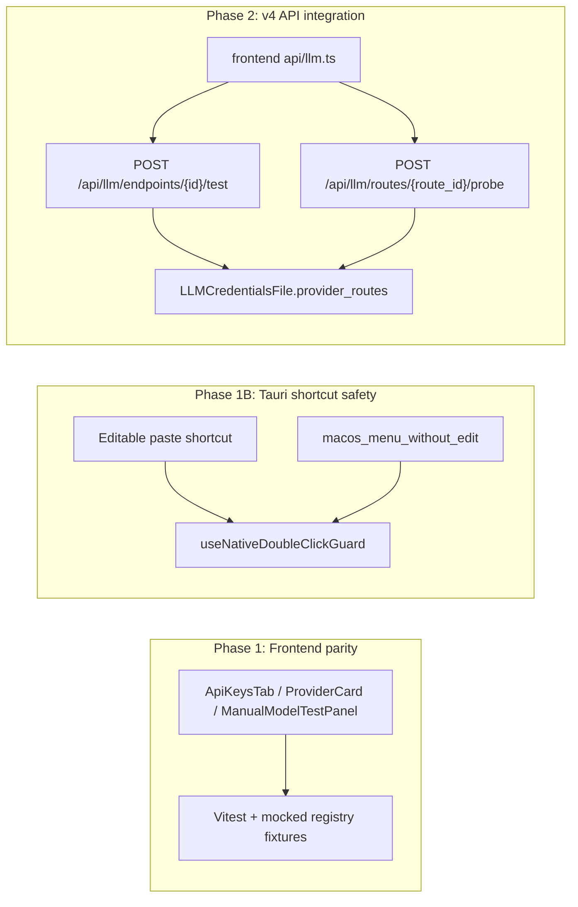
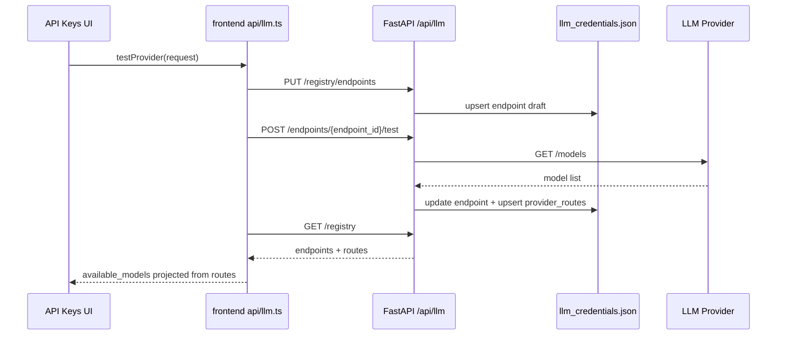

# Studio API Keys 回归加固设计

## Overview

本设计把 API Keys 回归修复拆成两个明确阶段：先恢复删除前 API Keys 前端状态和 Tauri 粘贴/双击安全，再接 v4 API。Phase 1/1B 只恢复 UI/交互 parity，用前端 fixture/mock 和现有 v4 DTO 形状验证页面行为，不新增后端能力、不恢复 v3 API。Phase 2 再完成 v4 registry 接线和后端 route 持久化，保证 Test / refresh / Manual probing 结果都来自 `provider_routes`。

当前 v4 生产契约以 `.kiro/specs/llm-provider-intelligence-v2/design.md` 为准。`.kiro/specs/studio-api-keys-redesign/` 仅作为删除前 UX/交互参考，不恢复其中的 `/credentials`、`/providers/test`、`/providers/test-models` v3 路径。

### Goals

- Phase 1: API Keys 前端恢复到删除前的可用状态，包括 Official/Third-party 分区、ProviderCard、AddProviderForm、ManualModelTestPanel、Skeleton、DeleteConfirmDialog、InputGroup 行内动作、mask/show/copy、窄视口稳定布局。
- Phase 1B: 修复 Tauri/macOS 双击提示音与 `Cmd+V` paste 冲突，并同步修订 `FRONTEND_UI_SPEC.md`。这一步属于前端恢复，必须早于 v4 API integration。
- Phase 2: Provider Test 走 v4 endpoint/route registry，成功后从 provider model list upsert routes，刷新后由 `provider_routes` 投影 `available_models`。

### Non-Goals

- 不整包 cherry-pick `33a4135`。
- 不恢复 v3 credentials API。
- 不新增多 SDK 自动探测；v4 `Available SDKs` 默认展示 endpoint 单个 `protocol`。
- 不做任意 model id 一键创建 route 的批量 API；Manual probing 默认采用方案 B。

## Architecture

### Existing Architecture Analysis

当前前端已经有重建中的 `apps/studio/frontend/src/components/studio/api-keys/` 目录，但它不是 `33a4135` 的直接恢复版，且仍存在已知偏离：API key hidden 时使用 `type="password"`、Manual probing 只更新本地 state、`testProviderModels()` 是本地 stub。当前后端 `POST /api/llm/endpoints/{endpoint_id}/test` 只更新 endpoint 状态，不写 `ProviderRoute`。

v4 registry 的事实源为：

- Endpoint: `ProviderEndpoint`
- Route: `ProviderRoute`
- Registry: `GET /api/llm/registry`
- Secret hydration: `GET /api/llm/registry/endpoints/{endpoint_id}/secret`
- Endpoint upsert: `PUT /api/llm/registry/endpoints`
- Endpoint test: `POST /api/llm/endpoints/{endpoint_id}/test`
- Route probe: `POST /api/llm/routes/{route_id}/probe`

### Boundary Map



## Phase Decisions

### Phase 1: Frontend Parity First

Phase 1 restores frontend shape and interactions before v4 API changes. It may use mocked registry responses in tests and local fixture data for notable models. It must not add backend endpoints or change `copilot_test.py`.

Phase 1 acceptance:

- Official Providers renders Anthropic, OpenAI, Gemini, DeepSeek, Ark.
- Third-party Providers supports add, cancel, edit fields, delete confirmation.
- API key input is always `type="text"` and mask is CSS-only.
- Input row actions use local `InputGroup` components.
- ManualModelTestPanel UI supports add/remove rows, run state, result rendering, and de-dupe display through mocked responses.
- ProviderCard and ManualModelTestPanel tests pass without requiring backend route upsert behavior.
- Browser/manual check covers page layout and narrow viewport, using mocked or existing local data.

### Phase 2: v4 API Integration

Phase 2 connects the restored UI to v4 registry. It fixes backend Test first enough for frontend to consume real routes, then updates frontend API projection.

Endpoint Test flow:



Backend route upsert must reuse the same slug/canonicalization semantics as v3-to-v4 migration:

- `_route_slug(provider_model_id)`
- `canonicalize_model(endpoint_id=..., provider_model_id=route_slug)`
- `normalize_route_capabilities(...)`
- `route_id = f"{endpoint_id}:{route_slug}"`

Existing routes are preserved. If a discovered model maps to an existing route, user-owned `display_name`, `metadata`, and manual/probed capabilities are not overwritten unless backend owns and verifies the field.

### Phase 2 Manual Probing: Scheme B

Manual probing does not create arbitrary new routes. It works only on route candidates that already exist in `provider_routes`.

Flow:

1. User runs endpoint Test or imports route candidates.
2. Backend creates route candidates from model list / metadata / import draft.
3. Manual panel maps user-entered model ids to existing routes by `endpoint_id + provider_model_id`.
4. For matched routes, frontend calls `POST /api/llm/routes/{route_id}/probe`.
5. Frontend refreshes registry and re-renders models from `provider_routes`.
6. For unmatched model ids, UI shows a non-success result such as “route candidate is not registered”; it does not locally append the model.

This keeps the v4 route-first model intact. If PM later wants arbitrary model ids to create routes from the Manual panel, that is Scheme A and requires a separate backend API design.

### Phase 1B: Tauri Paste + Double Click

The target invariant is: no native macOS `Edit` menu path that reintroduces double-click alert sounds, while focused editable controls still support `Cmd+V`.

Design target:

- Restore/keep `macos_menu_without_edit` in `apps/studio/tauri/src/lib.rs`.
- Keep `useNativeDoubleClickGuard` preventing native selection only for non-editable chrome.
- Add a tested editable paste shortcut path for input/textarea/contenteditable/Monaco.
- Update `docs/development/FRONTEND_UI_SPEC.md` to remove the current requirement that custom macOS menu must include native `Edit`.

## Components and Interfaces

| Component | Layer | Intent | Phase | Key Contracts |
|---|---|---|---|---|
| `ApiKeysTab` | Frontend UI | Own API Keys page sections and restored parity workflows | 1 | v4-shaped credentials state, no backend new API |
| `ProviderCard` | Frontend UI | Render provider credential controls, Test, chips, Manual panel | 1 | `type="text"`, `InputGroup`, DeleteConfirmDialog |
| `ManualModelTestPanel` | Frontend UI | Restore add/remove/probe UI, later map to route probe | 1/2 | Phase 1 fixture, Phase 2 route candidates only |
| `api/llm.ts` | Frontend API | Project v4 registry into API Keys state | 2 | no v3 endpoint paths |
| `copilot_test.py` | Backend service | Parse provider model-list responses | 2 | returns all model ids, not first only |
| `routers/llm.py` | Backend API | Test endpoints and upsert routes | 2 | persists route candidates |
| `tauri/src/lib.rs` | Tauri shell | Avoid native Edit double-click path | 1B | no native Edit submenu |
| `useNativeDoubleClickGuard` + paste hook | Frontend runtime | Prevent double-click alert sound and keep paste | 1B | editable target allowlist |

## Data Contracts

### Provider Test Result

Backend `PingResult` should change from a single `model_seen` field to a list-capable shape while retaining compatibility:

```python
@dataclass(frozen=True)
class PingResult:
    latency_ms: int
    model_ids: tuple[str, ...] = ()

    @property
    def model_seen(self) -> str | None:
        return self.model_ids[0] if self.model_ids else None
```

Parser rules:

- OpenAI/Anthropic style: collect every string `data[].id`.
- Gemini style: collect every string `models[].name`, stripping a leading `models/`.
- Ignore malformed entries.
- De-dupe exact strings while preserving order.

### Available SDKs

In v4, `available_sdks` means displayable protocol chips for the configured endpoint, not multi-SDK probing. The projected value is `[endpoint.protocol]` unless a later approved design reintroduces route-level multi-protocol probing.

## Testing Strategy

### Phase 1 Frontend Parity Tests

- `ProviderCard.test.tsx`: API key input is `type="text"` in visible and masked states; show/copy buttons use `InputGroupButton`; chips render from provider state.
- `ManualModelTestPanel.test.tsx`: row add/remove, run loading state, duplicate model result display, unmatched result display.
- `ApiKeysTab` / `SettingsPage` tests: Official and Third-party sections render; add/cancel/delete confirm flows work with mocked state.
- Narrow viewport test with Playwright/browser check before closing Phase 1.

### Phase 2 API Integration Tests

- Backend parser tests in `apps/studio/backend/tests/services/test_copilot_test.py`.
- Backend router tests in `apps/studio/backend/tests/routers/test_llm_registry_api.py`.
- Frontend API tests in `apps/studio/frontend/src/api/llm.test.ts`.
- Frontend Manual probing tests proving no local-only append.

### Phase 1B Tauri Tests

- Existing `native-double-click.spec.ts` coverage remains.
- Add paste shortcut unit/e2e coverage for focused editable input.
- Rust menu test should assert the custom macOS menu omits native `Edit`, or equivalent invariant documented in code.

## Rollout

1. Complete Phase 1 with frontend parity tests and manual UI check.
2. Complete Phase 1B Tauri shortcut fix and `FRONTEND_UI_SPEC.md` update.
3. Complete Phase 2 backend route upsert and frontend v4 projection.
4. Run full targeted verification before marking the spec complete.
