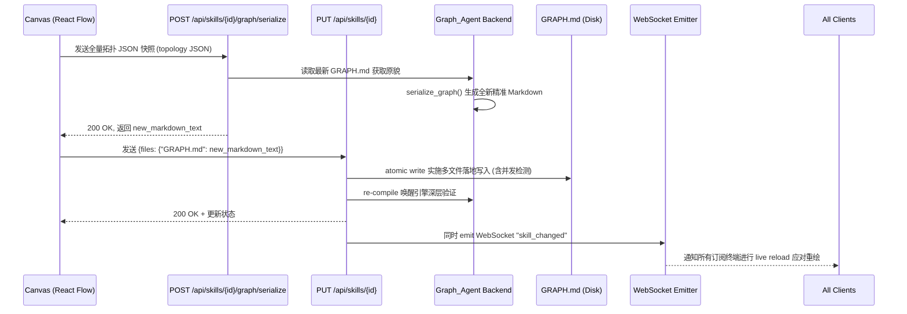

# Studio Canvas V2 - Design (Engine Round-trip)

**Spec**: studio-canvas-v2
**Status**: Design (Kiro Step 3)
**Date**: 2026-05-16
**Author**: a2 (Resident Architect)

> 我已读以下 11 份文件:
> 1-3. `.kiro/specs/` (graph-agent-v2.1 与 state-mgmt-optimization 的前置文档集)
> 4. `apps/studio/frontend/src/components/GraphCanvas.tsx` / `App.tsx` 等前端布局态势
> 5. `apps/studio/backend/app/services/skills.py` 内部获取接口环境
> 6. `packages/graph-agent/src/graph_agent/core/parser.py` (AST/Token 数据探底)
> 7. `packages/graph-agent/src/graph_agent/core/loader.py` (核对编译装配流向)
> 8-10. `apps/studio/backend/app/routers/skills.py` + `services/skills.py` + `models/skills.py` (深度核实最新由 T-apps-1 ship 上线的 multi-file 统筹端点数据交互协议变动实况与 Pydantic 字段级变更)

---

## §0 核心范围重设与框架定调 (Framing Reset)

在系统最深刻的设计原点上，我们对 Canvas 画布的定位必须进行一次彻底的思想“拨乱反正”。过往认为的“Canvas 拥有并管控拓扑文件，Copilot 控制逻辑文件”的楚河汉界式“各司其职”理念已经被证实是具有极端误导性的反模式论调。

**正确的思想核心：`GRAPH.md` 磁盘文件是这个宇宙中唯一的绝对核心真相 (Single Source of Truth, SSOT)！**
画布（Canvas）**绝对不是**拓扑数据的所有者，它仅仅是那个 Markdown 文件的一副精美的“全息投影透镜（图形化双向 View）”。在当前与未来的整个开放架构宇宙中，无论是借由 Canvas UI 去拉扯线条、还是用户在 T-apps-1 多文件编辑器中极其熟练地敲打代码块重组文档，亦或是 Copilot 通过调用强大的内部 File Tool 能力实施宏观编排改写，所有的一切渠道都**平等地**是对着同一个文件 `GRAPH.md` 发起无差别的 Mutation（基因突变）。

因此，这个 Canvas-V1 Spec 将自己的最高职责定义为建立一座极其精密的桥梁：不仅能负责任地将画布操作安全、不漏痕迹地持久化转化回原文件，更是要时时刻刻如同警惕的哨兵一般，确保在任何其他的兄弟源（外部 Vim 修改、T-apps-1 编辑、Copilot 改动）发生了改变事实时，立刻接收信号并精准在图形界面上忠诚同步再现这一变化全貌。这是从“单一操控者”向着成熟的“多源同步共振 (Multi-source sync)”演进的伟大跨越。

为了确保画布这一职责的纯洁性，所有的拓扑修改最终都必须回归到对于 `GRAPH.md` 文本的精准修改。而 Canvas 只是一个高度发达的、拥有丰富交互逻辑的前端视窗而已。我们需要将这种多源视角根植到从 Engine 层序列化、Backend 接口协同到 Frontend UX 响应的每一个毛孔之中。

---

## §1 Engine 层 AST 反向序列化设计

要实现从变动过的内存对象倒写回 `GRAPH.md` 物理文件，**严禁利用简单的正则表达式** 来执行不精确且易崩溃的狂轰滥炸式字符串提取与修改。正则表达式在处理包含大量自然语言注释、多层级 HTML 标签转义以及不规范的空格缩进时充满了边缘 case，极易导致写入时丢行或破坏文件原有格式结构。

### T1.1 GraphManifest 数据结构的精确复用
- 应当直接复用系统已有的 `GraphManifest` Pydantic 类，它位于 `packages/graph-agent/src/graph_agent/core/manifest.py` 中。当前结构足可支撑，无需过度造出并行的孪生类体。
- `GraphManifest` 及下属的 `GraphPhaseRef` 本身已经包容了如 `id`, `src`, `depends_on` 等基础要素。为了辅助序列化时对应到精准行，可以在加载时进行非侵入式的信息保留，而不去推翻原有骨架。对于从 `loader.py` 加载出的原始行号，可以在 `_RawPhaseAttrs` 这个中间过渡对象中加以利用和传递，避免过度污染纯净的业务 AST 模型。

### T1.2 Serialize_Graph 算法设计：Token-Level AST 重写
真正的无损写入机制应当是**Token 级别的 AST 解析与重组**，即利用确定的分词与序列化规则来确保文体架构不可被外力摧毁：
- **函数签名**: 
  ```python
  def serialize_graph(manifest: GraphManifest, original_md: str | None = None) -> str:
      """
      Serialize a GraphManifest back to Markdown.
      :param manifest: The mutated manifest object.
      :param original_md: The original markdown text for reference. If None, generates from scratch.
      :return: Byte-exact preserved Markdown text with new topologies applied.
      """
      pass
  ```
- **核心算法实现**: 
  由于 Python 生态中标准的 `markdown_it` 更偏向于生成 HTML 渲染树，并不完全适合于双向数据绑定（Round-trip）的修改保留。因此，我们将通过自定义受限迷你状态机解析器，将 `original_md` 原始输入流彻底分解成界限极其分明的四类 Token：
  1. `frontmatter token`: 以 `---` 包裹的内容。
  2. `comment token`: `<!-- ... -->` 等注释块。
  3. `phase token`: `<phase ... />` 标准行块。
  4. `whitespace token`: 空格与换行。
  当序列发生器重走遍这些列表时，对于未变更或是闲散的内容标记作全量释放保留；一旦碰触到发生变化的 `phase token`，只定点爆破其对应的属性区域（例如仅字符串替换 `depends_on="old"` 为 `depends_on="new_A, new_B"`），而它的缩进、单双引号风格与其他配置标签（如 `src`）丝毫不动。
- **Fall-through 边缘边界处理**: 
  - **修改 `depends_on`**：仅定点刷新属性区间，确保该行上下其余间隙空间不动如山。
  - **新增 phase**：默认采取 Append 末尾追加战术，组装成全新的完整的 `<phase id="..." src="..." depends_on="..." />` 并稳妥停靠于文件底座末端，追加一个前置换行符确保格式独立。
  - **删除 phase**：由于内存的变更表（Manifest）里该项已被拔除，重组解析期间遇到对应的老派 `phase token` 时，生成器将其标记为抛弃对象不再输出，同时顺延剥离与其绑定的后续单个空行，实现无痕移除。

### T1.3 决策：拓扑重排还是保持原文顺序？
**决策**：坚定不移地选择**保持原文顺序**！
**理由**：这不仅是一场效率的选择，更是一场关于尊重（Minimal Diff 优先）的保卫战。当使用者在 Canvas 上随手拨动了一根线条时，若系统为了“某种伪拓扑理论秩序”而掀翻并重置了原有文档中所有平白无故代码行的顺序，这不叫智能化辅助，这叫破坏生态！这必将导致 Git Diff 的结果呈现出灾难级别的杂乱噪音，让长长的红色和绿色块霸占屏幕，毁灭性打击 Code Review 的可读性。因此，维持原始存在的秩序，仅做极小干预，让无辜者不产生飘移是最不容动摇的底线铁律。用户拖拽 Canvas 上的节点不应该引起无关 `phase` 行的无端飘动。

### T1.4 注释无损保留的 "Downward Attachment" 算法
`GRAPH.md` 中必定散落着不可估价的业务构想注释，务求 100% 被原路安全保留。具体的算法机制如下：
- **Frontmatter 注释**：依赖底层已被妥善配装在 `parser.py` 之中的 `ruamel.yaml` 机制，首段全域元数据及其井号注解实现整块完好无损的流转与投射。同时必须特别声明：**canvas 绝对不动 `schema_version` 字段**。在 V2.1 Hard Cutover 大前提下，`schema_version` 永远被锁定为 `"2.1"`，`serialize_graph` 必须无条件保留该原值。
- **Phase 周边 Markdown/HTML 提示块**：实施“**向下附着关联法则 (Downward Attachment)**”。当迷你状态机读取源码时，遇到任何散落的文本行或注释块（非 `phase`、非 `input/output`），都将被暂存至一个待分配的附着列表（Attachment Buffer）中。一旦接下来探寻遭遇到了一个有效的 `<phase>` 标记，该 Buffer 里的所有内容就被无差别地吸附绑定至该 `phase token` 上，成为其专属的“先置属性”。这不仅保护了有效信息，更能在对应节点遭遇裁撤移除时，极其贴心地顺道处理掉这些“已经失去了依附母体”变成代码垃圾的附庸说明语段。如果到了文件末尾依然有未分配的文本，则归属于一个全局的 Footer Buffer，予以永久保留。

### T1.5 DoD 测试矩阵基线
序列化引擎代码必须稳定涵盖并在任何发布前无伤穿越这 5 大致命边界用例防线，这不仅是验收标准，更是系统稳定运行的锚点：
- **Case 1 等价转化**: `parse(serialize(parse(text))) == parse(text)`。这证实了不管流转多少回合，其转换产生的 AST 逻辑模型保持坚定不移。现有的 9 个 V2.1 skill 以及专为压测而设的 `fake_canvas_fanout` 夹具等都应畅通无阻地全数通关。
- **Case 2 物理幂等**: `serialize(serialize(...))` 能够做到严丝合缝的字节级别绝对复制粘贴一致。重复的序列化操作不得引入意料之外的多余空格、换行符或属性位移。
- **Case 3 定向污染规避**: 更新某依赖（修改 `depends_on`）使得生成的 Git Diff 结果被彻底束缚，确认仅改变对应的孤立那 1 行源码空间，绝无第二行受到波及。
- **Case 4 追加无感**: Canvas 追加新节点后，新渲染出来的文件其 Git Diff 应仅展现最后末端单独的 `+1` 行，不影响原文件的末尾句末控制。
- **Case 5 附属剥离**: 删除某一个阶段节点行为时，断言系统正确带走了附着于顶上的关联型注释碎片，不留残骸，也不会误伤其他相邻阶段的附着物。

---

## §2 Backend 层重新评估与重设 (因 T-apps-1 新事实)

### T2.1 新事实介入：T-apps-1 的 Multi-file 端点已经启航
随着深入 `apps/studio/backend/app/routers/skills.py` 内部路由及周边系统的最新实况审计发现：属于 T-apps-1 范畴内的宏大统一文件修改推送端点 `PUT /api/skills/{skill_id}` 已经被全面升级武装上线（配合其新装载的 `update_skill_files` 服务方法以及承载重量级数据的 `files: dict[str, str]` Pydantic 结构，详见 `routers/skills.py:47-68` 和 `services/skills.py:491-530`）。这意味着现在所有的真实落盘动作已经被强有力地合并在了这条主通路之上。T-apps-1 是一个多文件纯文本编辑器，它能够接受并处理项目中包括 `GRAPH.md` 在内的任意修改文书，并且在服务层统一接管了针对这些修改的安全检测和存储调度。

### T2.2 端点选型深度抉择与 trade-off 对比
由于这种大一统环境的既定事实，“双头平行写入”这种不仅割裂还容易引起多方碰撞抢锁的方案必须重新被评估。我们拥有了若干个变种选项：

- **方案 B'（备选）：仍然加独立的 `/graph` 端点**。这使得 Canvas 走一条专属更新通道，与 T-apps-1 平行。
  - *Trade-off*：缺点过于致命，后端会平白多出一个端点，且同一个文件（`GRAPH.md`）存在两条相互竞争的写路径，导致原本可以统一控制的文件 Race Condition （竞态条件）处理变得极其复杂。
- **方案 A'（强推，默认）：Canvas 复用 T-apps-1 的 Multi-file 端点**。Canvas 的最终操作无论如何最终都转化为对于 `GRAPH.md` 文本的修改，然后再发送给后端的 `PUT /api/skills/{id}` (body `{files: {"GRAPH.md": new_markdown_text}}`)。而在这之中，序列化的责任归属又派生出几个细分选项：
  - *选 a（前端自己序列化）*：不调后端，完全信任前端生成的 text。
    - *Trade-off*：省了一次 round-trip，但前端需要硬用 TypeScript 重写一份能够百分百还原 Python 端正则和逻辑的 `serialize_graph`，跨语言代码重复度极高，极易产生 drift 和难以维护的技术债。直接否决。
  - *选 b（后端拦截隐藏校验）*：调用，后端 `update_skill_files` 端点在检测到接收 `GRAPH.md` 文件时，内部隐式地执行 parse + reserialize 进行 round-trip 校验，失败则返 422。
    - *Trade-off*：接口职责不再单一。对于一个本应是“你传文本我保存”的接口，强行混杂过多的隐式篡改逻辑显得异常丑陋且耦合过深。
  - *选 d（前端拉原文去补丁）*：不开 helper 端点，前端拿现有的 `GRAPH.md` GET 请求结果，引入 `jsdiff` 等库去 patch 出新 text，再 PUT 回去。
    - *Trade-off*：同样存在 patch 逻辑放置于前端而产生的代码重复和异常难以捕捉的巨大劣势。
  - **选 c（强烈推荐拍板：新增 Backend Helper 协助序列化，走多文件写入）**：新增轻量辅助端点 `POST /api/skills/{id}/graph/serialize`，接收干净的 Topology JSON，后端负责转换出精准 Markdown 纯文本。前端拿到该文本后，再走统一的 Multi-file 接口进行写盘。

**推荐方案：A' + 子选项 c**
**一句话理由**：这种设定使得各个层次的责任边界极其纯粹高洁——前端画布仅仅理解节点坐标与线缆关联 (纯净生成 JSON 模型)，后端独家承载和拥有绝对正确的 `serialize_graph` 复杂重构解析真理；两步配合转换完成后，统一并入那条安全而宏大的 T-apps-1 文件保存干线 (Multi-file Endpoint)。

### T2.3 Canvas 数据流向新范式与前端协同契约
在确立了以 A'c 为首选的设计策略后，具体的执行生命周期流向规范如下：
1. **Frontend 发送辅助序列化请求**：Canvas 响应用户的保存操作，提取全量阶段拓扑，以极其干净的标准载体提交给系统。
2. **Backend 序列化组装 Helper (新增端点)**：
   **Endpoint**: `POST /api/skills/{id}/graph/serialize`
   **Payload Schema**:
   ```python
   from typing import Literal
   from pydantic import BaseModel, Field

   class PhaseRef(BaseModel):
       id: str = Field(..., description="Unique identifier for the phase node")
       src: str = Field(..., description="File path source, typically 'phases/<id>'")
       depends_on: list[str] = Field(default_factory=list)
       mode: Literal["logic", "subgraph", "skill"]

   class SerializeGraphReq(BaseModel):
       # 我们坚定推荐使用 Snapshot 快照模式！全量的 Phase 列表最易于进行后端的正确性重建，极大地降低了状态处理难度。
       phases: list[PhaseRef] = Field(..., description="Full list of phases representing current canvas state")
   
   class SerializeGraphRes(BaseModel):
       markdown_content: str = Field(..., description="Byte-exact Markdown string generated by engine")
   ```
   后端接收到该请求后，内部调用 `engine.serialize_graph()` 辅以磁盘拉取的原版文书做底本，安全返回一串毫无瑕疵的 `GRAPH.md` 文本。
3. **完成投递 T-apps-1 接口闭环**：前端取得这段宝贵的文本后，不假思索立刻把它装入标准大快递包 Payload `{"files": {"GRAPH.md": <得到的Markdown字符串>}}`，然后用力推送给已被全量武装好的正规渠道 `PUT /api/skills/{id}` 正式落户磁盘安家。
4. **协调约定防破坏盾 (Cross-spec contract)**：T-apps-1 的 multi-file 端点必须坚守其包容广阔的初衷，**绝不因为 Canvas 的存在而对其行为设卡阻拦**。任何 source（不管它是由人类手写或是机器生成）都能合法地向其投递 `GRAPH.md` text 且不应遭到莫名的系统拒收或报错阻挠。Canvas-v1 的加入，只会丰富而绝不会破坏 T-apps-1 已 ship 的任何稳固行为。

### T2.4 完整健壮的错误状态与并发控制协议
在这个复杂网络中，各种异常控制都需要严谨对待。
- **并发 Race Condition 与 mtime 控制**：如果用户在编辑画布，而外部突然更改了文件。虽然我们在后续引入了 Multi-source Sync 的实时覆盖机制，但由于前端在发送请求和后端接受之间的那一丝丝空隙，仍然可能发生强力撞车。此时，`PUT /api/skills/{id}` 可以根据前端传递的（或者是其内部拓展出来的） `expected_mtime` / `ETag` 进行比对。
- **错误码协议体系**：
  - **200 OK**: 一切顺遂，正常无损序列化并利用多文件端点成功落盘。
  - **400 Bad Request**: Payload 不合规范，包含了非法的字段或缺失必填内容，由 Pydantic 无情阻击。
  - **409 Conflict**: 时间戳对撞印鉴失败，后端发现硬盘的 mtime 已经走到了前端记录的未来。此时返回错误阻击此次更新，附带最新 Snapshot 指导重载。
  - **422 Unprocessable Entity**: 引擎序列化深度异常。包括死锁（cycle detected）或是游离断裂阶段等架构禁忌。此时应当由 `serialize` Helper 端点直接揭露返回，并且附带可读的业务异常明细体。
  - **500 Internal Server Error**: 落盘 IO 失败引起的硬件级系统崩溃，抛出标准异常。

### T2.5 数据流序列图表 (Sequence Flow)
下面是一个明确表达方案 A'c 下各个子系统沟通接驳步骤的序列图（Sequence Diagram）：


---

## §3 Frontend UX 深潜打磨细节及 Multi-source Sync 设计

### T3.1 多源同步防线 (Multi-source File Sync)
这是本轮 Spec 最深层次的核心跨越：它宣告了 Canvas 从一个霸道的私有掌控器华丽转变成为了一个永远警惕、永远忠诚的“多端全息共振接收与回响端”。
- **Backend Filewatcher 探测与推送**：依赖后端的探测守护探针监听。任何由在远处的某一个黑暗命令行 vim 当中进行的人工干预更改、或者是大模型 Copilot 探出的 AI 代码触手完成的文件写入行为被触发时，亦或是由 T-apps-1 本地编辑器落盘引发的更改，后端毫不含糊立刻向所有前线接驳着存活链接的终端客户发射附带着全套修改详情说明的 WebSocket 警报事件包裹 `{type: "skill_changed", skill_id: "...", changed_files: ["GRAPH.md"]}`。（经确认，`App.tsx` 的 264 行已经拥有了能够收纳并识别这一 `skill_changed` 类的基础 WebSocket 流处理能力，直接予以强力复用即可。）
- **Frontend 冲突化解处理（强烈推荐拍板方案 Y: Prompt 弹窗提示法）**：当 Canvas 前端这副雷达接收到这一震荡波动发现 `changed_files` 赫然包含 `GRAPH.md` 并发生重大改变后，**绝对不能**使用那虽然能立刻生效但是极易造成在画布这端因为修改到一半尚未及保存的用户心血成果被瞬间静默无脑碾平涂抹覆盖掉造成毁灭伤害的 Option X (Silent Reload)。至于 Option Z（自动合并逻辑）由于图形拓扑依赖合并异常复杂，强行实施容易出现四不像图甚至脏乱死循环连接，也应当放弃。
  **一句话理由**：我们推荐方案 Y，因为它充分尊重并且保护了使用者此时此刻可能仍滞留在未落盘阶段的私有宝贵编辑操作心血！这种设计不仅极为成熟且媲美顶级 IDE (如 VS Code) 的防御体验。
  **交互细节**：若此时前端 Canvas 内并不存在任何 Local Unsaved Mutation 脏数据，那么顺理成章直接在后台发起静默重新获取请求并在 <2秒的时间内更新视图。但若有用户修改积累未下发保存，前端立刻弹出一枚防灾气泡警告：*"GRAPH.md 已被外部系统（Copilot / 文本编辑器）更改。您是希望丢弃本地修改以重新加载远端最新网络，还是倔强保留并试图覆盖回去？"*。
- **冲突防线联动**：如果在极短时间内用户忽略外部警告并发起了对 `GRAPH.md` 的强推落盘，与后端 POST 端点的 `expected_mtime` 对撞校验时将会产生预期的 `409 Conflict` 防暴阻拦，继而从容不迫地重走弹窗或是静默获取的刷新老路进行强制纠正。
- **跟 T-apps-1 协调点**：T-apps-1 multi-file editor 若是由用户亲自敲打修改了 `GRAPH.md` 文本并在那里点击了保存，后端也同样会尽职尽责地触发这一 WebSocket 通知！此时 Canvas 的行为逻辑是一致的，收到广播后走同样的重载分析判读流程，一视同仁，绝无二致。

### T3.2 Dagre 注入与多入多出机制极清交互
React Flow 11 框架由于其极简特性本身仅提供了默认单一的 Top 和 Bottom 句柄。在这种条件下应对巨大的多分支拓扑非常容易产生严重的遮挡干扰灾难。
- **算法与排版介入**：在 Dagre 的干预辅佐下，各相位将处于层级严密的布局图谱内。每一次重新载入与新增，Dagre 将为所有节点指派分层等级，从而彻底防止交叉回环重叠的窘境出现。
- **染色与区分度实现 (高对比度着色方案落地)**：对于同一个从上方集结汇聚而来的 Target 节点的无数分支来说，应当利用极度聪明的哈希算法对上游 `source phase id` 进行换算并派生出一个稳定的高亮可辨识 HSL color 颜色值（例如 `const hue = hash(source_id) % 360; const color = \`hsl(${hue}, 70%, 50%)\``）。随后利用 React Flow 在声明 `edge` 时利用内置属性 `style: { stroke: derived_color, strokeWidth: 3 }` 的便利能力对边进行高亮着色渲染。
- **Mockup 示例描绘**：我们并不打破现有的 `CustomNodes.tsx` 那极具标志性的单蓝紫 Handle 设计，我们专注于改造边本身。设想如果出现 3 个平行的解析器 phase (A, B, C) 同步 Fan-in 并向下一个名叫 `assemble` 的最终整合节点进行并线时，3 条粗重明显并各自具备 赤、翠、蓝 颜色的圆滑贝塞尔连接曲线 (`type: "bezier"` 或 `"smoothstep"`)，将以类似波塞冬三叉戟 Trident 一般极其优美的独立弧度并拢合并到 `assemble` 节点独一的纯蓝色 Top Handle 圆点上。不仅规避重叠干扰，且让庞大的分发/汇合工作流成为一种高级的赛博图形艺术。

### T3.3 完备的子图嵌套与下钻结构 (Drill-down)
- **子图切换流向**: 当触发对于 `SubgraphNode` 这个带有深意特殊节点的双击动作，应用不再展现那些可能会打乱全局排版美观度极低粗鄙内联铺平结构，而是以凌厉的姿态瞬间转换整体画布，全面展示其子图内部的辽阔深层拓扑景观。并在界面的核心导航左上区域构建例如 `<SkillName> > <SubgraphPhaseName>` 这般醒目的深水潜水路径展示。
- **状态及路由的掌控**: 使用现成引入并被广泛接受的 Zustand 状态管理总管构建 `navStack: PhaseRef[]`。所有的深入操作通过 `push` 压栈动作累积呈现，反之点击导航面包屑则是极为顺滑的 `pop` 回退剥离。这种模式无需过度繁杂依赖 React Router 的 `#/skills/<id>/graph/<phase_id>/subgraph` 强加干预去造成跳转重绘的卡顿。
- **钻入跨越特殊案例决策 (拍板决定)**：如果钻入深海的底层 Subgraph 所承接委派的内容跨越了雷池跑向了其他外部系统存在的不同 SKILL（譬如 `subgraph: examples/subgraph-sample/story-deconstruction`），**决定：在当前的 SKILL 画布上下文中，仅仅将该外部的子 SKILL 拓扑展现为纯粹的不可编辑的安全只读层！** 毕竟那是一份归属于别家的独立资产文件，如果允许跨域篡改将导致不同业务流间引发责任坍塌与权责失序！
- **平滑感官加持**: Drill-in 深入或回退发生瞬间，施加带有缓冲性的淡入淡出动画过渡来弥补视觉生硬感。

### T3.4 双击触发系统联动之桥梁 (Cross-Event Coordinate)
- **联动媒介契约 (拍板决定)**：我们需要舍弃强依赖、容易引发过度组件重绘绑定噩梦的沉重的 global store 状态大共享方案。相反地，**采用松耦合且足够优雅的原生机制 CustomEvent 发送派发监听模型**更为恰当。在画布里如果有诸如 `AgentNode` 发生了双击事件意图检视其背后的 Python 或 Prompt 深层源文件，系统果断抛射出带有诸如 `CustomEvent("canvas:open-phase-file", { detail: { skill_id, phase_id, file: "LOGIC.md" | "SKILL.md" } })` 的高精尖独立事件信号。同时在作为接收方的 T-apps-1 文本编辑器系统中安装相应的监听组件 `window.addEventListener("canvas:open-phase-file", handler)` 去执行无缝跨域传唤接应。使得在图形这侧进行轻轻叩击后，代码文本侧便自动切出焦点并跳转打开对应的逻辑页面。

### T3.5 自动布局的大脑：Dagre 生命循环与手动存储策略 
- **引燃点把控**: 在进行初次的初生画布组件 Mount 的加载起手势阶段拉取数据并完成基础拓扑拼图时，让后台严阵以待的 Dagre 主动出击计算每个模块在世界体系中的座标。同理，当存在 onConnect、onAdd 甚至 onDelete 的操作改变产生，Dagre 将重算以保障美观分布。
- **持久化方案论证与敲定 (拍板决定)**: **果断采用不记忆、不存留 localStorage 而纯依赖动态自动重算的灵活法则！** 任何带有僵化固步自封的绝对位置持有在这个变化万千的多源协作系统之中都显得愚不可及。节点增加或连线改变会引起重力拉扯的偏移，应当接受由于拓扑改变顺应而成的重算阵型演变！我们仅须辅以手动 "Reset Layout" 按键，就能以最小成本提供最高自由容错。
- **存储操作桥接转化与防灾保护**: 基于现在的多源大环境，Canvas 的状态池 `onNodesChange` 及 `onEdgesChange` 被牢牢圈禁在控制前台状态层面；为了避免频繁轰炸网络导致数据覆写死锁不断，前端并不随着连线立即提交修改！前端界面依托手动释放保存的 **"Save" 按钮**动作意图去聚合提交所有的局部操作变更！以此减少对于多端同步的过密广播扰乱！

---

## §5 施工任务详细拆分与里程碑 (Phase Break-down)

### T1: Engine 层无伤强化工程 (预估耗时: L - 15h)
- **T1.1 (工时 S)**: `GraphManifest` 对象的无损复用架构梳理及嵌入整合。
- **T1.2 (工时 L)**: 打造基于精巧型状态机及切分 Token 思想并完美实现 Token-level 保护保留机制的极高精密 `serialize_graph` 修改转换核心部件。
- **T1.3 (工时 M)**: 向下附着关联法则系统对于周边复杂 Markdown/HTML 注释群落进行精准的捕捉以及同生共死绑定附着能力。
- **T1.4 (工时 M)**: 构建落实应对五大边界等价（5 DoD cases）测试覆盖环境部署确保底盘稳定性。

### T2: Backend 层网络交通改造与整合 (预估耗时: M - 8h)
- **T2.1 (工时 S)**: 全新基于 A'c 方案战略设定的专属协作端点 `POST /api/skills/{id}/graph/serialize` 起手架设。
- **T2.2 (工时 M)**: Pydantic 极其严密完整的接口 `SerializeGraphReq` 以及深层防御网关的制定。
- **T2.3 (工时 M)**: 对于在面对大并发由于 expected_mtime 引发的极小并发对峙所特意做出的防御 409 回退 snapshot 数据拦截保障。
- **T2.4 (工时 S)**: 标准协议错漏反馈及 422 致命回环死锁抛异常阻隔文档齐备补全。
- **T2.5 (工时 S)**: 会同 T-apps-1 发出统筹配合协调宣告。

### T3: Frontend 层交互感知与多源接管升级 (预估耗时: L - 20h)
- **T3.1 (工时 M)**: 在 React Flow 系统中进行 Dagre 模块植入部署自动位置换算控制引擎。
- **T3.2 (工时 M)**: 对于连线条实行充满活力带有识别极高的多层级流向与 HSL 各司其职色彩区分动效展示贝塞尔呈现。
- **T3.3 (工时 M)**: 完备无缝完成对于特殊 `SubgraphNode` 基于 Zustand 管理树和栈的面包屑钻入下探穿梭交互。
- **T3.4 (工时 S)**: 各界沟通交流核心的 CustomEvent 发起跨服代码探索打开事件通道部署及 T-apps-1 接收挂靠配合。
- **T3.5 (工时 S)**: 屏蔽前端过度持久化的无谓记忆负荷完成每次纯排版算力生成的不强制占库配置落定，及 WebSocket multi-source sync 防震荡重刷新体系建设。

---

## §6 Cross-spec contract 与跨界统筹备忘录

本部分专门列出与外部模块，特别是与 **T-apps-1 (Multi-file Editor)** 的对接点与强约束声明：
1. **多文件端点的绝对接纳包容原则**：既然 T-apps-1 开发小组已经铺就了伟大的 Multi-file endpoint 并承载了 `files: Record<str, str>` 操作大统一落盘，那么它绝不可以对任何源抛来的文件——无论它是画布还是终端亦或是文本编辑器所产生或编改过来的带有拓扑性质的 `GRAPH.md`——做出限制屏蔽甚至是人为的拦截或越界再次擅自干涉修改。它应该扮演好纯粹的高级数据大总管。
2. **联动监听器的强制加装部署任务请求**：对于处于隔离宇宙范畴之中的文本编辑器端开发人员请立即关注：双击触发探索产生的跳脱交互并不是神迹，它是由系统前端画布触发极其高质精准的 `CustomEvent("canvas:open-phase-file")` 自定义定制信号发射达成的。文本编辑端切记必须完成对应该项指令的高级 Event Listener 的埋设动作，用以及时响应打开 Tab 等交互逻辑，以此达到共筑 Studio 强大融合体验操作阵地的愿景诉求！
3. **多源变动全息推送共享红利**：由 T-apps-1 中完成对于文件写盘带来的成功变更应当作为标准动作触发系统后备的 WebSocket 事件流分发程序以触动全局警报，这不仅造福 Canvas，更为全系统的自动响应进化埋下了优渥且深厚的铺垫。
