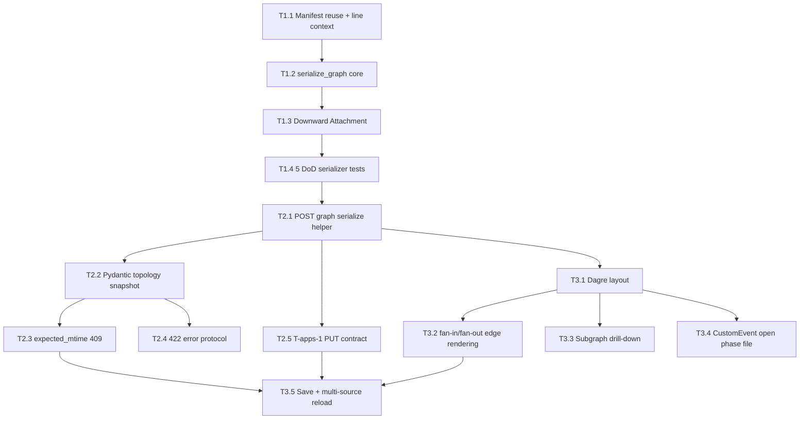

# Section 1: Overview

Studio Canvas V2 (engine round-trip) 将 Canvas 从旧版“禁止写 DSL”的只读预览，升级为 `GRAPH.md` 的双向图形化 View。`GRAPH.md` 是唯一 SSOT；Canvas、T-apps-1 多文件编辑器、Copilot File Tool、外部 IDE 都只是平等写入源。Canvas 的职责是忠实读取、可控编辑拓扑、最小 diff 写回、并在外部文件变化时重新对齐磁盘真相。

本任务拆分严格沿用 design §5 的三层编号，不重新命名、不跳号：T1.1/T1.2/T1.3/T1.4 是 Engine 层反向序列化；T2.1/T2.2/T2.3/T2.4/T2.5 是 Backend helper 与 T-apps-1 写入通路整合；T3.1/T3.2/T3.3/T3.4/T3.5 是 Frontend React Flow、Dagre、Subgraph drill-down、CustomEvent 与 multi-source sync 体验建设。

Owner 边界：T1 与 T2 由 parent master 负责，因为它们落在 `packages/graph-agent/` 与 `apps/studio/backend/`；T3 由 apps master 负责，因为它们落在 `apps/studio/frontend/`，并需协调 T-apps-1 已 ship 的多文件编辑器。跨 master 同步点必须明确：T2.1/T2.2 的 helper API 可用后，T3.x 才能完成 save 流；T3.4 只 fire `CustomEvent("canvas:open-phase-file")`，T-apps-1 端 listener 不属于本 spec 实施。

关键边界：本 tasks 不包含 T-apps-1 的 multi-file editor 实施；不包含 Copilot 改 `GRAPH.md` 的专门流程；不包含 WebSocket `skill_changed` 后端事件的跨 spec 实施；不实施跨 SKILL 编辑，R1.4 子图跨 SKILL 只读展示；不做业务 Prompt/Python/io schema 文本编辑，具体文件编辑归 T-apps-1。

总工时方向：T1=L 约 15h，T2=M 约 8h，T3=L 约 20h，总计约 43h。Critical Path 主链为 T1.1 -> T1.2 -> T1.3 -> T1.4 -> T2.1 -> T2.2 -> T2.3 -> T3.5；T2.4/T2.5 与部分 T3 UX 任务可并行推进，但不能绕过 helper API 与 multi-file 写入契约。

# Section 2: 任务总表

| 编号 | 层级 | Owner | 任务名 | 涉及文件 | DoD | 工时 | 依赖 |
|---|---|---|---|---|---|---|---|
| T1.1 | Engine | parent master | `GraphManifest` 无损复用与行级定位输入整理 | `/home/sevenx/coding/agent-harness/packages/graph-agent/src/graph_agent/core/manifest.py`; `/home/sevenx/coding/agent-harness/packages/graph-agent/src/graph_agent/core/loader.py`; `/home/sevenx/coding/agent-harness/packages/graph-agent/src/graph_agent/core/parser.py` | 不新增平行 manifest；能从 `GRAPH.md` 解析阶段 id/src/depends_on 与原始行上下文；保持现有编译行为兼容 | S | 无 |
| T1.2 | Engine | parent master | `serialize_graph` token-level 反向序列化核心 | `/home/sevenx/coding/agent-harness/packages/graph-agent/src/graph_agent/core/graph_serializer.py`; `/home/sevenx/coding/agent-harness/packages/graph-agent/tests/core/test_v21_graph_serializer.py` | `serialize_graph(manifest, original_md)` 可更新 depends_on、新增 phase、删除 phase；frontmatter 和无关文本 minimal diff 保留 | L | T1.1 |
| T1.3 | Engine | parent master | Downward Attachment 注释无损保留 | `/home/sevenx/coding/agent-harness/packages/graph-agent/src/graph_agent/core/graph_serializer.py`; `/home/sevenx/coding/agent-harness/packages/graph-agent/tests/fixtures/canvas_serializer/**` | phase 前 Markdown/HTML 注释向下附着；删除 phase 时清理其附属注释；footer 全局保留 | M | T1.2 |
| T1.4 | Engine | parent master | 五大序列化 DoD case 测试矩阵 | `/home/sevenx/coding/agent-harness/packages/graph-agent/tests/core/test_v21_graph_serializer.py`; `/home/sevenx/coding/agent-harness/packages/graph-agent/tests/fixtures/fake_canvas_fanout/**`; `/home/sevenx/coding/agent-harness/skills/**/GRAPH.md` | 覆盖空 phase、单 phase、串行、多 phase fan-out、depends_on 改动；parse/serialize 幂等与 diff 断言通过 | M | T1.2/T1.3 |
| T2.1 | Backend | parent master | 新增 helper endpoint `POST /api/skills/{id}/graph/serialize` | `/home/sevenx/coding/agent-harness/apps/studio/backend/app/routers/skills.py`; `/home/sevenx/coding/agent-harness/apps/studio/backend/app/services/skills.py` | endpoint 能读取最新 `GRAPH.md`，调用 Engine serializer，返回 markdown text；不写盘 | S | T1.2/T1.4 |
| T2.2 | Backend | parent master | Pydantic `SerializeGraphReq/Res` 与拓扑快照校验 | `/home/sevenx/coding/agent-harness/apps/studio/backend/app/models/skills.py`; `/home/sevenx/coding/agent-harness/apps/studio/backend/app/routers/skills.py` | 请求体含 phases 全量快照；phase id/src/mode/depends_on 校验；非法字段/缺必填返回 400 | M | T2.1 |
| T2.3 | Backend | parent master | expected_mtime/409 并发回退 snapshot | `/home/sevenx/coding/agent-harness/apps/studio/backend/app/services/skills.py`; `/home/sevenx/coding/agent-harness/apps/studio/backend/app/models/skills.py` | mtime 不匹配时返回 409 与最新 snapshot；前端可据此 reload/提示；不绕过 T-apps-1 PUT | M | T2.1/T2.2 |
| T2.4 | Backend | parent master | 标准错误协议与 422 serializer fatal | `/home/sevenx/coding/agent-harness/apps/studio/backend/app/routers/skills.py`; `/home/sevenx/coding/agent-harness/apps/studio/backend/app/services/skills.py`; `/home/sevenx/coding/agent-harness/apps/studio/backend/tests/**` | cycle/orphan/serializer fatal 返回 422；错误体可读；日志包含 serialize 耗时与影响面 | S | T2.2 |
| T2.5 | Backend | parent master | T-apps-1 multi-file PUT 协调契约固化 | `/home/sevenx/coding/agent-harness/apps/studio/backend/app/routers/skills.py`; `/home/sevenx/coding/agent-harness/apps/studio/backend/app/services/skills.py`; `/home/sevenx/coding/agent-harness/apps/studio/backend/tests/**` | Canvas helper 只产 markdown；保存仍走已 ship 的 `PUT /api/skills/{id}/files` 或等价 multi-file PUT；不重复造写端点 | S | T2.1 |
| T3.1 | Frontend | apps master | React Flow 注入 Dagre 自动布局 | `/home/sevenx/coding/agent-harness/apps/studio/frontend/src/components/GraphCanvas.tsx`; `/home/sevenx/coding/agent-harness/apps/studio/frontend/src/**/*graph*`; `/home/sevenx/coding/agent-harness/apps/studio/frontend/package.json` | 初次加载、节点增删、连线变化后自动布局；100+ phase 可用；提供 Reset Layout | M | T2.1 |
| T3.2 | Frontend | apps master | Fan-in/Fan-out 连线高识别渲染 | `/home/sevenx/coding/agent-harness/apps/studio/frontend/src/components/GraphCanvas.tsx`; `/home/sevenx/coding/agent-harness/apps/studio/frontend/src/components/CustomNodes.tsx`; `/home/sevenx/coding/agent-harness/apps/studio/frontend/src/**/*.css` | 多入多出边按 source phase 稳定 HSL 着色；smoothstep/bezier 清晰；拖拽反馈 <16ms | M | T3.1 |
| T3.3 | Frontend | apps master | Subgraph drill-down 与只读跨 SKILL view | `/home/sevenx/coding/agent-harness/apps/studio/frontend/src/components/GraphCanvas.tsx`; `/home/sevenx/coding/agent-harness/apps/studio/frontend/src/store/**`; `/home/sevenx/coding/agent-harness/apps/studio/frontend/src/components/**` | 双击 SUBGRAPH 进入子图画布；breadcrumb 可返回；跨 SKILL 子图只读，不允许编辑保存 | M | T2.1/T3.1 |
| T3.4 | Frontend | apps master | `canvas:open-phase-file` CustomEvent 发射 | `/home/sevenx/coding/agent-harness/apps/studio/frontend/src/components/GraphCanvas.tsx`; `/home/sevenx/coding/agent-harness/apps/studio/frontend/src/components/CustomNodes.tsx` | 双击普通 LOGIC/SKILL 节点 fire event，detail 含 skill_id/phase_id/file；本 spec 不实现 T-apps-1 listener | S | T3.1 |
| T3.5 | Frontend | apps master | Save 流、无位置持久化、多源 reload UX | `/home/sevenx/coding/agent-harness/apps/studio/frontend/src/components/GraphCanvas.tsx`; `/home/sevenx/coding/agent-harness/apps/studio/frontend/src/App.tsx`; `/home/sevenx/coding/agent-harness/apps/studio/frontend/src/services/**` | 手动 Save 调 helper 再走 multi-file PUT；不存 localStorage 坐标；`skill_changed` 含 GRAPH.md 时 <2s reload 或 dirty prompt | S | T2.3/T2.5/T3.1/T3.2 |

# Section 3: 各 task 详细

## T1.1 — `GraphManifest` 无损复用与行级定位输入整理

Owner: parent master。

工时: S (<=2h)。

涉及文件: `/home/sevenx/coding/agent-harness/packages/graph-agent/src/graph_agent/core/manifest.py`; `/home/sevenx/coding/agent-harness/packages/graph-agent/src/graph_agent/core/loader.py`; `/home/sevenx/coding/agent-harness/packages/graph-agent/src/graph_agent/core/parser.py`。

目标: 不创建 Canvas 专属 manifest 或平行 AST。继续复用 `GraphManifest` 与 `GraphPhaseRef`，只补足 serializer 所需的原始文本、phase 行、属性区间等非侵入式元信息来源。

实施步骤: 梳理 `_RawPhaseAttrs`、`_extract_phase_attrs`、`parse_markdown_parts` 输出；确定是否新增内部 token 数据结构；保持 `compile_skill()` 返回结构兼容；不改变现有 loader fatal 语义。

DoD: 现有 V2.1 loader 测试不回归；serializer 可取得 phase 原文行和 id/src/depends_on；frontmatter、input/output 标签、非 phase 文本的边界能被后续 T1.2 使用。

依赖: 无。

风险: 过度污染 Pydantic manifest 会扩大 API 面。Fallback 是把 token metadata 保持为 serializer 内部结构，不暴露给业务模型。

## T1.2 — `serialize_graph` token-level 反向序列化核心

Owner: parent master。

工时: L (6-15h)。

涉及文件: `/home/sevenx/coding/agent-harness/packages/graph-agent/src/graph_agent/core/graph_serializer.py`; `/home/sevenx/coding/agent-harness/packages/graph-agent/tests/core/test_v21_graph_serializer.py`。

目标: 新增 `serialize_graph(manifest: GraphManifest, original_md: str | None = None) -> str`。使用受限状态机 token 化 `GRAPH.md`，严禁用粗暴正则重排整文。

实施步骤: 定义 frontmatter/comment/phase/whitespace/footer token；支持 depends_on 定点替换；支持新增 phase 末尾追加；支持删除 phase；保留原 phase 行的缩进、单双引号风格和无关属性顺序。

DoD: 单 phase 修改 depends_on 只改 1 行；新增 phase 只追加 1 条 `<phase ... />`；删除 phase 不破坏其他行；`schema_version`、frontmatter 注释、input/output ref 原样保留。

依赖: T1.1。

风险: HTML 注释、多行 Markdown 与 phase 行混排容易丢内容。T1.3 专门补 attachment 算法；T1.2 先交付可工作的核心 token 重写。

## T1.3 — Downward Attachment 注释无损保留

Owner: parent master。

工时: M (3-5h)。

涉及文件: `/home/sevenx/coding/agent-harness/packages/graph-agent/src/graph_agent/core/graph_serializer.py`; `/home/sevenx/coding/agent-harness/packages/graph-agent/tests/fixtures/canvas_serializer/**`; `/home/sevenx/coding/agent-harness/packages/graph-agent/tests/core/test_v21_graph_serializer.py`。

目标: 实现 design §1.4 的向下附着法则。phase 前的 Markdown/HTML 注释归属到下一个 phase；文件尾部未绑定文本归属 footer。

实施步骤: 在 token stream 中维护 attachment buffer；遇到 phase token 时把 buffer 绑定为该 phase 前置块；删除 phase 时一起删除绑定块；保留 footer buffer；增加复杂注释 fixture。

DoD: 删除 phase 会带走其直属注释，不留下悬空垃圾；删除 phase 不误删上一个 phase 的尾注或全局 footer；frontmatter 内 YAML 注释完全不参与 attachment。

依赖: T1.2。

风险: 用户可能有全局说明恰好放在第一个 phase 前。DoD 以 design 的 downward attachment 为准；需要全局说明应放 footer 或 frontmatter description。

## T1.4 — 五大序列化 DoD case 测试矩阵

Owner: parent master。

工时: M (3-5h)。

涉及文件: `/home/sevenx/coding/agent-harness/packages/graph-agent/tests/core/test_v21_graph_serializer.py`; `/home/sevenx/coding/agent-harness/packages/graph-agent/tests/fixtures/fake_canvas_fanout/**`; `/home/sevenx/coding/agent-harness/skills/**/GRAPH.md`。

目标: 把 design §1 的 5 个 DoD case 固化为可重复测试，覆盖空 phase 列表、单 phase、多 phase 串行、多 phase fan-out、depends_on 改动。

实施步骤: 构建空 phase GRAPH fixture；覆盖 hello-world 单 phase；覆盖串行链；复用 `fake_canvas_fanout`；对真实 skills 的 `GRAPH.md` 做 parse/serialize/parse 逻辑等价断言。

DoD: `parse(serialize(parse(text))) == parse(text)`；重复 serialize 字节幂等；depends_on diff 只动目标行；新增 phase 只末尾追加；删除 phase 清理 attachment。

依赖: T1.2/T1.3。

风险: 真实 skills 存在历史格式差异。Fallback 是先记录 fixture 覆盖范围，再把无法 round-trip 的格式纳入 serializer 支持，不降低 minimal diff 契约。

## T2.1 — 新增 helper endpoint `POST /api/skills/{id}/graph/serialize`

Owner: parent master。

工时: S (<=2h)。

涉及文件: `/home/sevenx/coding/agent-harness/apps/studio/backend/app/routers/skills.py`; `/home/sevenx/coding/agent-harness/apps/studio/backend/app/services/skills.py`; `/home/sevenx/coding/agent-harness/apps/studio/backend/tests/**`。

目标: 实现 A' + c 方案中的 helper。Canvas 发送拓扑 JSON 快照，后端读取磁盘最新 `GRAPH.md`，调用 `serialize_graph()`，只返回 markdown 文本，不直接写盘。

实施步骤: 在 skills router 增加 POST 路由；service 层定位 skill root 与 `GRAPH.md`；构造 `GraphManifest` 或等价 phase refs；调用 Engine serializer；返回 `SerializeGraphRes`。

DoD: endpoint 200 返回 `markdown_content`；响应耗时 p95 <500ms，本地 serializer <200ms；没有新增独立写盘路径；不会影响现有 GET topology 与 T-apps-1 PUT。

依赖: T1.2/T1.4。

风险: backend import graph-agent package 路径不稳定。Fallback 是在 service 层复用现有 compile/preview 的 import 方式，避免 duplicated parser。

## T2.2 — Pydantic `SerializeGraphReq/Res` 与拓扑快照校验

Owner: parent master。

工时: M (3-5h)。

涉及文件: `/home/sevenx/coding/agent-harness/apps/studio/backend/app/models/skills.py`; `/home/sevenx/coding/agent-harness/apps/studio/backend/app/routers/skills.py`; `/home/sevenx/coding/agent-harness/apps/studio/backend/tests/**`。

目标: 定义稳定接口模型，Canvas 传全量 phase snapshot，而不是传增量 patch。phase 包含 `id`、`src`、`depends_on`、`mode`。

实施步骤: 新增 `PhaseRef`、`SerializeGraphReq`、`SerializeGraphRes`；校验 mode 只允许 `logic|subgraph|skill`；校验 depends_on 是 list[str]；拒绝重复 phase id、缺 src、非法字段。

DoD: 缺字段/类型错返回 400；合法 payload 可序列化；OpenAPI schema 可被前端生成类型；测试覆盖 fan-in depends_on 多值。

依赖: T2.1。

风险: 前端已有 topology shape 与后端模型命名不一致。Fallback 是 adapter 在 T3.5 做转换，后端模型保持与 design 契约一致。

## T2.3 — expected_mtime/409 并发回退 snapshot

Owner: parent master。

工时: M (3-5h)。

涉及文件: `/home/sevenx/coding/agent-harness/apps/studio/backend/app/services/skills.py`; `/home/sevenx/coding/agent-harness/apps/studio/backend/app/models/skills.py`; `/home/sevenx/coding/agent-harness/apps/studio/backend/tests/**`。

目标: 防止 Canvas 基于旧 snapshot 保存时覆盖外部修改。helper 或后续 multi-file PUT 可携带 `expected_mtime`/ETag，后端检测冲突并返回 409。

实施步骤: 在 request 模型或服务参数中承接 expected mtime；读取磁盘 `GRAPH.md` 当前 mtime；不匹配时返回 409，包含最新 topology/mtime/markdown 摘要；前端可 reload 或 prompt。

DoD: 测试模拟 mtime 前进后保存返回 409；错误体包含最新 snapshot；不会执行 serializer 写入；不会吞掉 T-apps-1 已有安全检查。

依赖: T2.1/T2.2。

风险: 文件系统 mtime 精度在不同 OS/WebView 环境不同。Fallback 是 ETag/hash 比对；tasks 中允许 T2.3 选择 mtime 或 hash，但 API 语义必须是 expected snapshot。

## T2.4 — 标准错误协议与 422 serializer fatal

Owner: parent master。

工时: S (<=2h)。

涉及文件: `/home/sevenx/coding/agent-harness/apps/studio/backend/app/routers/skills.py`; `/home/sevenx/coding/agent-harness/apps/studio/backend/app/services/skills.py`; `/home/sevenx/coding/agent-harness/apps/studio/backend/tests/**`。

目标: 固化 400/409/422/500 错误协议。serializer 发现 cycle、orphan、非法 topology、无法保留文本时返回 422，前端 Toast 可直接展示。

实施步骤: 捕获 Engine serializer 的业务异常；映射为 HTTP 422；保留异常 code/message/detail；记录 serialize 耗时和变更影响面；补测试覆盖 cycle 和 unknown dependency。

DoD: cycle/orphan 返回 422 而非 500；400 用于 Pydantic payload 错；409 用于 snapshot 冲突；日志能定位 skill_id、phase count、elapsed_ms。

依赖: T2.2。

风险: Engine 现有异常类型分散。Fallback 是新增 canvas serializer 专用异常包装，不改全局异常层级。

## T2.5 — T-apps-1 multi-file PUT 协调契约固化

Owner: parent master。

工时: S (<=2h)。

涉及文件: `/home/sevenx/coding/agent-harness/apps/studio/backend/app/routers/skills.py`; `/home/sevenx/coding/agent-harness/apps/studio/backend/app/services/skills.py`; `/home/sevenx/coding/agent-harness/apps/studio/backend/tests/**`。

目标: 明确 Canvas 不新增写盘端点。helper 返回 markdown 后，前端必须通过已 ship 的 T-apps-1 multi-file PUT 写入 `GRAPH.md`。

实施步骤: 在 backend tests 中证明 `GRAPH.md` 可被 multi-file PUT 接纳；确认路径校验允许 `GRAPH.md`；确认写入后触发已有 recompile/skill_changed 行为如存在；文档化调用顺序。

DoD: Canvas 保存通路没有第二条写文件 API；`PUT /api/skills/{id}/files` 或当前等价 multi-file PUT 接收 `{files: {"GRAPH.md": text}}`；T2 helper 不落盘。

依赖: T2.1。

风险: 当前路由名可能是 `PUT /api/skills/{id}` 而 brief 写 `{id}/files`。DoD 以已 ship T-apps-1 实际端点为准，但不得重复造新写端点。

## T3.1 — React Flow 注入 Dagre 自动布局

Owner: apps master。

工时: M (3-5h)。

涉及文件: `/home/sevenx/coding/agent-harness/apps/studio/frontend/src/components/GraphCanvas.tsx`; `/home/sevenx/coding/agent-harness/apps/studio/frontend/src/**/*graph*`; `/home/sevenx/coding/agent-harness/apps/studio/frontend/package.json`。

目标: 用 Dagre 替代硬编码坐标堆叠，初次加载和拓扑变更后生成层级清晰的 DAG 布局。

实施步骤: 增加 layout helper；读取 backend topology 后生成 nodes/edges；onConnect/onAdd/onDelete 后重算布局；加入 Reset Layout 控件；保持 React Flow pan/zoom 流畅。

DoD: 串行链从左到右或上到下稳定排布；fan-out 分支分层展开；100+ phase 画布可平移缩放；无 localStorage 坐标依赖。

依赖: T2.1。

风险: Dagre 计算触发过频导致卡顿。Fallback 是只在拓扑变更和 reset 时重算，不在拖拽每帧重算。

## T3.2 — Fan-in/Fan-out 连线高识别渲染

Owner: apps master。

工时: M (3-5h)。

涉及文件: `/home/sevenx/coding/agent-harness/apps/studio/frontend/src/components/GraphCanvas.tsx`; `/home/sevenx/coding/agent-harness/apps/studio/frontend/src/components/CustomNodes.tsx`; `/home/sevenx/coding/agent-harness/apps/studio/frontend/src/**/*.css`。

目标: 在 React Flow 中清晰呈现多入多出。保持单 source/target handle 模型，但用 edge 样式、颜色和曲线降低遮挡。

实施步骤: 根据 source phase id 计算稳定 HSL；设置 `edge.style.stroke/strokeWidth`；选择 `smoothstep` 或 `bezier`；确保 onConnect 创建 edge 后立即视觉反馈；删除 edge 同步内部 depends_on。

DoD: `fake_canvas_fanout` 三路 fan-in 在画布中三条边可分辨；边颜色稳定不闪；拖拽连线反馈 <16ms；移除边后目标 depends_on 正确删源。

依赖: T3.1。

风险: 色彩过多导致可读性下降。Fallback 是限制饱和度/亮度并加 hover 高亮，不引入复杂端口系统。

## T3.3 — Subgraph drill-down 与只读跨 SKILL view

Owner: apps master。

工时: M (3-5h)。

涉及文件: `/home/sevenx/coding/agent-harness/apps/studio/frontend/src/components/GraphCanvas.tsx`; `/home/sevenx/coding/agent-harness/apps/studio/frontend/src/store/**`; `/home/sevenx/coding/agent-harness/apps/studio/frontend/src/components/**`。

目标: SUBGRAPH 节点双击后进入子图画布，使用 breadcrumb 返回。跨 SKILL subgraph 只读展示，不允许编辑保存。

实施步骤: 建立 `navStack` 状态；识别 SubgraphNode 与 `sub_skill_ref`；加载目标 graph topology；breadcrumb pop 返回；跨 skill 标记 read-only，隐藏或禁用 Save/connect/delete。

DoD: 本 skill 内子图可 drill-down；跨 SKILL 引用只读；breadcrumb 显示 `<SkillName> > <SubgraphPhaseName>`；返回后父画布状态保持。

依赖: T2.1/T3.1。

风险: 子图路径解析与 backend skill id 体系不一致。Fallback 是先支持已有 `sub_skill_ref` 可解析路径，复杂跨 repo 留后续 spec。

## T3.4 — `canvas:open-phase-file` CustomEvent 发射

Owner: apps master。

工时: S (<=2h)。

涉及文件: `/home/sevenx/coding/agent-harness/apps/studio/frontend/src/components/GraphCanvas.tsx`; `/home/sevenx/coding/agent-harness/apps/studio/frontend/src/components/CustomNodes.tsx`。

目标: 双击普通 LOGIC/SKILL 节点时，不在 Canvas 内编辑业务文本，而是向 T-apps-1 多文件编辑器发送打开文件事件。

实施步骤: 节点双击构造 `CustomEvent("canvas:open-phase-file", {detail})`；detail 包含 `skill_id`、`phase_id`、`file`；LOGIC 指向 `LOGIC.md`，SKILL 指向 `SKILL.md`，SUBGRAPH 走 T3.3 drill-down。

DoD: 浏览器 window 可监听到 event；payload 稳定；Canvas 端不实现 listener；T-apps-1 端 listener 是 cross-spec 依赖，不在本任务完成。

依赖: T3.1。

风险: 事件名或 payload 与 T-apps-1 端约定漂移。Fallback 是在 cross-spec contract 中冻结 event name 与 detail shape。

## T3.5 — Save 流、无位置持久化、多源 reload UX

Owner: apps master。

工时: S (<=2h)。

涉及文件: `/home/sevenx/coding/agent-harness/apps/studio/frontend/src/components/GraphCanvas.tsx`; `/home/sevenx/coding/agent-harness/apps/studio/frontend/src/App.tsx`; `/home/sevenx/coding/agent-harness/apps/studio/frontend/src/services/**`。

目标: Canvas 只在手动 Save 时保存拓扑。保存先调用 T2 helper 获取 markdown，再调用 T-apps-1 multi-file PUT 写 `GRAPH.md`。节点坐标不持久化。

实施步骤: 维护 local dirty flag；Save 组装全量 phases snapshot；POST `/graph/serialize`；PUT `{files: {"GRAPH.md": markdown}}`；处理 409/422；监听已有 `skill_changed`，当 changed_files 包含 `GRAPH.md` 时 reload 或 dirty prompt。

DoD: 无 dirty 时外部 GRAPH 变化 <2s 静默重绘；有 dirty 时弹出 reload/keep prompt；409 触发冲突提示；422 Toast 展示 serializer 错误；不写 localStorage 坐标。

依赖: T2.3/T2.5/T3.1/T3.2。

风险: WebSocket `skill_changed` 是跨 spec，不保证本 spec 后端实现。Fallback 是复用 App.tsx 现有 handler；若事件源未 ready，前端保留 handler 和手动 refresh。

# Section 4: 测试矩阵

| 类别 | 覆盖任务 | 测试文件/位置 | 必测 case | 断言 | 命令 |
|---|---|---|---|---|---|
| Engine unit | T1.1/T1.2 | `/home/sevenx/coding/agent-harness/packages/graph-agent/tests/core/test_v21_graph_serializer.py` | 空 phase 列表 | 生成合法 GRAPH 或明确 422 语义；不破坏 frontmatter | `uv run pytest packages/graph-agent/tests/core/test_v21_graph_serializer.py -q` |
| Engine unit | T1.2/T1.4 | 同上 | 单 phase | parse/serialize/parse 等价；字节幂等 | 同上 |
| Engine unit | T1.2/T1.4 | 同上 | 多 phase 串行 | depends_on 链保留；原文顺序不变 | 同上 |
| Engine integration | T1.2/T1.4 | `/home/sevenx/coding/agent-harness/packages/graph-agent/tests/fixtures/fake_canvas_fanout/**` | 多 phase fan-out/fan-in | `depends_on="a,b,c"` 可 round-trip；fake_canvas_fanout 仍可 compile/assemble | `uv run pytest packages/graph-agent/tests/core/test_v21_graph_assembly_fanout.py packages/graph-agent/tests/core/test_v21_graph_serializer.py -q` |
| Engine diff | T1.2/T1.3/T1.4 | serializer tests | depends_on 改动 | git-style diff 只影响目标 phase 行；注释保留 | `uv run pytest packages/graph-agent/tests/core/test_v21_graph_serializer.py -q` |
| Engine attachment | T1.3 | serializer fixtures | 删除 phase + 注释 | 向下附着注释随 phase 删除；footer 不删 | 同上 |
| Backend API | T2.1/T2.2 | `/home/sevenx/coding/agent-harness/apps/studio/backend/tests/**` | helper 200 | POST serialize 返回 markdown_content；不写盘 | backend pytest 命令按 apps 现有规范执行 |
| Backend validation | T2.2 | backend tests | payload 缺 id/src/mode | 返回 400；错误体可读 | backend pytest |
| Backend conflict | T2.3 | backend tests | expected_mtime 过期 | 返回 409 + latest snapshot；不序列化覆盖 | backend pytest |
| Backend fatal | T2.4 | backend tests | cycle/orphan topology | 返回 422；message 含 cycle/orphan | backend pytest |
| Backend contract | T2.5 | backend tests | multi-file PUT 写 GRAPH.md | 复用已 ship T-apps-1 写入口；无重复写端点 | backend pytest |
| Frontend unit | T3.1 | `/home/sevenx/coding/agent-harness/apps/studio/frontend/src/**/*.test.*` | Dagre layout | 节点坐标分层；reset layout 生效 | frontend test 命令按 apps 现有规范执行 |
| Frontend unit | T3.2 | frontend tests | fan-in edge colors | source id hash 后颜色稳定；边类型正确 | frontend test |
| Frontend integration | T3.3 | frontend tests/Playwright | SUBGRAPH drill-down | breadcrumb push/pop；跨 skill read-only | frontend/e2e |
| Frontend event | T3.4 | frontend tests | `canvas:open-phase-file` | window listener 收到 detail；Canvas 不编辑正文 | frontend test |
| Frontend e2e | T3.5 | Playwright/canvas e2e | Save 流 | POST helper -> PUT multi-file；409/422 toast；dirty prompt | frontend e2e |
| Canvas 联调 | T1/T2/T3 | `fake_canvas_fanout` + Studio | 多入多出保存再 reload | Canvas 画出的 fan-out 保存到 GRAPH.md，reload 后形态一致 | backend + frontend e2e |

5 个 design §1 DoD case 的最小映射：

1. 空 phase 列表：serializer 处理空 topology 或明确返回 422，不能崩成 500。
2. 单 phase：hello-world 或等价 fixture round-trip 字节幂等。
3. 多 phase 串行：串行 depends_on 链 serialize 后 parse 等价。
4. 多 phase fan-out：复用 `packages/graph-agent/tests/fixtures/fake_canvas_fanout/`，验证多入多出。
5. depends_on 改动：只改目标 phase 的 depends_on 行，frontmatter 和其他 phase 不动。

# Section 5: Critical Path + 并行机会

Critical Path 可视化：

主 Critical Path: T1.1 -> T1.2 -> T1.3 -> T1.4 -> T2.1 -> T2.2 -> T2.3 -> T3.5，共 8 节。这个路径决定 Canvas 能否从真实 `GRAPH.md` 解析、生成 minimal diff、通过 backend helper 产出 markdown、并在前端完成安全保存与冲突处理。

可并行机会：

- T1.1 完成后，T1.2 serializer core 与 T1.4 的 fixture 草案可以并行准备，但 T1.4 最终断言依赖 T1.2/T1.3。
- T2.1 helper skeleton 可在 T1.2 API 形态稳定后开始，T2.2 request model 与 T2.4 错误协议可并行。
- T2.5 是 cross-spec contract 验证，可与 T2.2/T2.3 并行，但必须在 T3.5 save 流前完成。
- T3.1 Dagre layout 可在 T2.1 的读取/serialize API shape 确认后开始；T3.2、T3.3、T3.4 都可在 T3.1 基础画布状态模型稳定后并行。
- T3.5 是前端汇合点，依赖 T2.3 的 409 协议、T2.5 的 multi-file PUT、T3.1/T3.2 的拓扑状态与边模型。

Cross-master 同步点：

- parent master ship T2.1/T2.2 后，apps master 才能把 T3.5 Save 按真实 helper API 接通。
- parent master 必须确认 T-apps-1 已 ship 的 multi-file PUT 能接收 `GRAPH.md`；apps master 不重复造保存 API。
- T3.4 只 fire `CustomEvent("canvas:open-phase-file")`；T-apps-1 listener 是 frontend-v2.1 multi-file editor 后续/并行协作项，不在本 spec 内完成。
- WebSocket `skill_changed` 是跨 spec 共享事件。本 spec 前端消费它；后端事件源若由 T-apps-1 或其他 spec 提供，不在本 tasks 中重复实现。

# Section 6: 完成标准 (Final DoD)

- 14 个任务编号 1:1 完成：T1.1/T1.2/T1.3/T1.4/T2.1/T2.2/T2.3/T2.4/T2.5/T3.1/T3.2/T3.3/T3.4/T3.5 均有对应 PR 或提交记录。
- Engine 对齐 R2.2 Minimal Diff：修改 `depends_on` 只动目标 phase 行；frontmatter、注释、无关 phase、input/output ref 不漂移；新增/删除 phase 行为可预测。
- Engine 5 DoD case 全绿：空 phase 列表、单 phase、多 phase 串行、多 phase fan-out、depends_on 改动都有集成测试。
- Backend 对齐 A' + c：`POST /api/skills/{id}/graph/serialize` 只做 helper 序列化，不落盘；最终写入只通过 T-apps-1 已 ship 的 multi-file PUT。
- Backend 错误协议完整：400 payload 错、409 expected_mtime/ETag 冲突、422 serializer/cycle/orphan fatal、500 IO 或未知系统错误；日志含 skill_id 与 elapsed_ms。
- Frontend 对齐 R1.1-R1.6：可增删节点、连线、fan-in/fan-out；Save 后写回 `GRAPH.md`；Subgraph 可 drill-down；普通节点双击 fire open file event；外部 `GRAPH.md` 变更后 reload 或 dirty prompt。
- R1.4 跨 SKILL 子图只读：可视化外部子 SKILL 拓扑，但不允许在当前 Canvas 中编辑保存外部 skill。
- R3 Non-goals 保持：不在 Canvas 编辑 Prompt/Python/io schema；不做跨 SKILL 宏观编排；不实现 Undo/Redo；不做 CRDT 多人协作。
- Cross-spec 依赖显式验收：T-apps-1 multi-file editor 不在本 tasks 实施；T3.4 listener 不在本 tasks 实施；WebSocket `skill_changed` event 源不在本 tasks 重复实现；Copilot 改 `GRAPH.md` 只是 multi-source 的一个文件源。
- 最终联调：用 `packages/graph-agent/tests/fixtures/fake_canvas_fanout/` 或等价 Studio fixture，在 Canvas 创建 fan-out/fan-in，保存到 `GRAPH.md`，reload 后图形一致，Engine compile/assemble 不回归。
- R2.3 性能验收：画布加载 100+ phase 节点时，平移/缩放/滚动 FPS >=60，并用 React Flow 实测 fixture 在本地或 e2e 中记录结果。
- R2.4 Tauri 兼容验收：在 Tauri Wry Linux WebKitGTK 环境验证 Canvas 渲染可用性与降级渲染策略，且不在 macOS WKWebView / Windows WebView2 出现专属 break。
