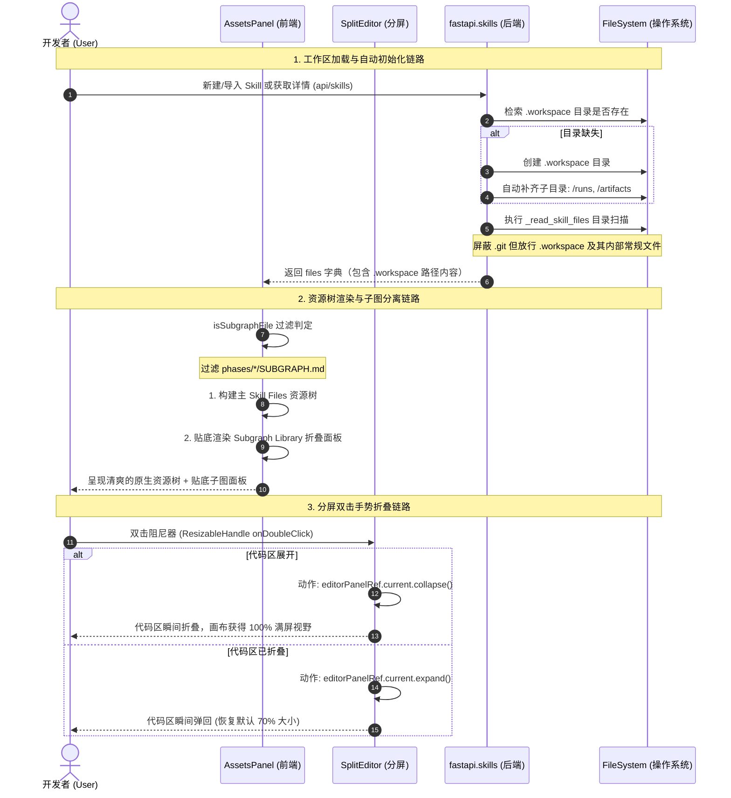

## 相关文档
- [本模块需求规格书 (requirement.md)](file:///Users/sevenx/Documents/coding/agent-harness/.kiro/specs/studio-feature-asset-explorer/requirement.md)
- [前端模块化与 UI 规范 (FRONTEND_UI_SPEC.md)](file:///Users/sevenx/Documents/coding/agent-harness/docs/development/FRONTEND_UI_SPEC.md)

# Studio Feature - Asset Explorer & Workspace Redesign (MVP0) — Design

## §0. 范围声明
本文档定义并指导 **Studio 资源管理器 (Asset Explorer)、工作区天然目录树及子图面板** 的 MVP0 最终形态设计。
范围涵盖：
1. **工作区目录树自然暴露**：在后端 `rglob` 文件列表中剔除 `.workspace` 根目录的硬阻拦，并在新建/导入 Skill 时由后端自动检验并补齐 `/runs` 与 `/artifacts` 标准目录。
2. **VS Code 风格贴底子图面板**：过滤主文件树中所有的子图残留，并在左侧 Assets 面板最下方构建贴底折叠、独立滚动的 Subgraph Library (子图库) 面板。
3. **分屏阻尼器双击折叠联动**：在 Monaco 与 Canvas 画布分割线上绑定双击手势，支持代码区瞬间折叠最大化画布以及双击展开回弹。

---

## §1. 技术选型与交互规范
* **后端过滤机制 (Backend Filter)**: Python `pathlib`，多点拦截机制，安全放行 `.workspace` 日志和产物，过滤 `.git`、`.DS_Store`。
* **分屏阻尼控制 (Split Handle)**: 基于 `react-resizable-panels` 的 `ImperativePanelHandle` 命令式控制，实现双击状态转换。
* **极客 UI 规范 (UI Style)**: 遵从 `FRONTEND_UI_SPEC.md`。使用 deep zinc 暗黑主题变量，圆角硬性限制在 `rounded-md` (0.375rem)。折叠面板具备旋转动画，支持 HTML5 拖拽语义。

---

## §2. 架构数据流图 (Architecture & Interaction Flows)

本模块在 Studio 系统中的完整数据流图如下：



---

## §3. 关键组件清单 (Before vs After)

### 3.1 后端服务模块 (Backend Core)

* **`apps/studio/backend/app/services/skills.py`**
  * **Before (现状)**:
    - 仅在创建新 Skill 时创建 `.workspace` 单个空目录，无子目录布局。
    - 导入 Skill 时完全不进行校验或工作区补足。
    - `_read_skill_files` 使用 `part.startswith(".")` 对所有隐藏路径进行硬阻断，完全关闭了读取 `.workspace` 日志和产物的可能性。
  * **After (设计形态)**:
    - 新增 `ensure_workspace_layout_initialized(skill_dir: Path) -> None`，负责静默、无损地构建 `.workspace/runs` 和 `.workspace/artifacts` 目录。
    - 在新建 Skill、导入 Skill 以及每次解析 Skill 物理路径 (`resolve_skill_dir_async`, `ensure_workspace_skill_dir_async`) 时均自动执行该校验与补齐。
    - 修改过滤逻辑：
      ```python
      if any((part.startswith(".") and part != ".workspace") or part in {"__pycache__", "node_modules"} for part in parts):
          continue
      ```

---

### 3.2 前端资源管理面板 (Frontend Assets Panel)

* **`apps/studio/frontend/src/components/studio/panels/AssetsPanel.tsx`**
  * **Before (现状)**:
    - 主文件树中全量包含了所有的子图文件（如 `phases/prep/SUBGRAPH.md`），界面显得冗余和杂乱。
    - `Subgraphs` 与主树平铺在同一 `ScrollArea` 内，当项目庞大或滚动条发生冲突时，次级元素经常无法查看或拖拽。
  * **After (设计形态)**:
    - 编写前端 `isSubgraphFile(path: string, content: string): boolean` 过滤辅助函数：
      ```typescript
      function isSubgraphFile(path: string, content: string): boolean {
        if (!path.endsWith(".md")) return false
        const parsed = parsePhaseFrontmatter(content)
        return parsed.ok && (parsed.frontmatter.mode === "subgraph" || !!parsed.frontmatter.target_skill || !!parsed.frontmatter.sub_skill_ref)
      }
      ```
    - 在 `buildAssetTree` 树构建流程中彻底过滤子图。
    - 将子图面板绝对贴底，使用独立的折叠状态记录器 `const [isSubgraphsCollapsed, setIsSubgraphsCollapsed] = useState(false)`。
    - 折叠标头为整行点击的 `button` 组件，包含 Lucide 的 `Workflow` 图标以及旋转 Chevron。
    - 内部包裹独立的最大高度为 `220px` 的滚动容器 `<ScrollArea className="max-h-[220px] ...">`，保证多子图时交互稳健。
    - 子图节点挂载 `draggable={true}`，且在 `onDragStart` 中塞入目标技能 ID 拖拽数据，彻底规范化拖拽生态。

---

### 3.3 前端垂直分屏 (Frontend Split Editor)

* **`apps/studio/frontend/src/components/studio/SplitEditor.tsx`**
  * **Before (现状)**:
    - 顶层 `<ResizablePanel id="top-editor">` 无法被命令式控制。
    - `<ResizableHandle />` 为纯展示/常规拖拉，双击没有任何交互绑定。
  * **After (设计形态)**:
    - 顶层 Monaco 容器注入 `ref={editorPanelRef}` 以及 `collapsible={true}`，解除命令折叠封印。
    - 绑定高度灵敏的分割线双击交互处理器：
      ```typescript
      const handleHandleDoubleClick = () => {
        const panel = editorPanelRef.current
        if (panel) {
          if (panel.isCollapsed()) {
            panel.expand() // 回弹展开 70%
          } else {
            panel.collapse() // 折叠代码区，让画布 100% 满屏
          }
        }
      }
      ```

---

## §4. 接口契约与目录映射规范

### 4.1 `.workspace` 目录标准物理布局
无论由何种途径导入或新建，Skill 工作区必须自动维持如下物理路径规范：
```
<skill_dir>/
├── .workspace/                # Studio 专属隐藏数据及监控工作区
│   ├── runs/                  # 包含各次历史运行的详细监控日志及数据库
│   │   ├── latest/            # 最新一次运行的直接物理软链/复写副本
│   │   └── <run_id>/          # 各次独立运行文件夹
│   │       ├── checkpoints.db # 运行断点 SQLite 物理数据库
│   │       ├── trace.jsonl    # 运行时全量轨迹流事件日志
│   │       └── artifacts/     # 运行中各 Step 吐出的局部中间文本和图表产物
│   └── artifacts/             # 顶层工作区独立构建的静态导出产物
├── GRAPH.md                   # 描述 Skill Canvas Topo 的底层声明文件
└── phases/                    # 具体的子 Phase 运行单元文件夹
```

---

## §5. 分屏双击折叠状态机

阻尼分割线双击折叠交互遵循二元状态转换算法：

```
                    +-----------------------+
                    |                       |
                    |     State: Expanded   | <-------+
                    |    (Code Panel size)  |         |
                    |                       |         |
                    +-----------------------+         |
                                |                     |
                   Double Click |                     | Double Click
                   (collapse)   |                     | (expand)
                                v                     |
                    +-----------------------+         |
                    |                       |         |
                    |    State: Collapsed   | --------+
                    |    (Code Panel size=0)|
                    |    Canvas occupies    |
                    |      100% Viewport    |
                    +-----------------------+
```

---

## §6. 性能、安全与错误处理策略
1. **体积安全过滤限制**: 
   由于解除了 `.workspace` 的文件流扫描过滤，为了防止大容量的 SQLite 文件（如 `checkpoints.db`）被以普通文本形式灌入前端导致 DOM 崩溃，`skills.py` 中的 `path.stat().st_size > 1024 * 1024`（1MB 阈值判定）必须保持生效，对于大文件或二进制文件自动过滤。
2. **事件气泡防御机制**:
   在分割线上进行双击以折叠代码区时，为了防范该双击事件由于 React 合成事件气泡冒泡，误触发 Canvas 画布内部的缩放/居中命令，`onDoubleClick` 内部执行 `event.stopPropagation()`。
3. **原生选择防护机制**:
   拖动分割线时极易误选中编辑器内的代码或画布的文字。我们需要配合 `FRONTEND_UI_SPEC.md` 的全局 `select-none` 防护层，阻断选择噪音。

---

## §7. 实施进度 Phase 规划

### Phase A: 后端基础补足与工作区初始化
* 在 `skills.py` 中写好自动初始化逻辑。
* 重构黑名单拦截，向前端安全释放 `.workspace/`。
* 运行 `test_skills_folder_import.py` 断言，确保后端测试 100% 通过。

### Phase B: 前端主树过滤与贴底子图面板构建
* 在 `AssetsPanel.tsx` 中增加子图 Frontmatter 判断并从主文件树中将其剔除。
* 编写底端 "Subgraph Library" 可折叠独立滚动侧栏。
* 注入拖拽语义。

### Phase C: 垂直分屏阻尼器双击手势折叠交互
* 在 `SplitEditor.tsx` 中增加 Imperative Ref 命令式引用。
* 绑定分割线双击折叠与展开状态机。

### Phase D: 全面系统联调与交叉检验
* 在浏览器及 Tauri 物理壳中，进行包含单文件展开、拖动分割线、双击折叠画布 100% 满屏等在内的全链路手动验收。
