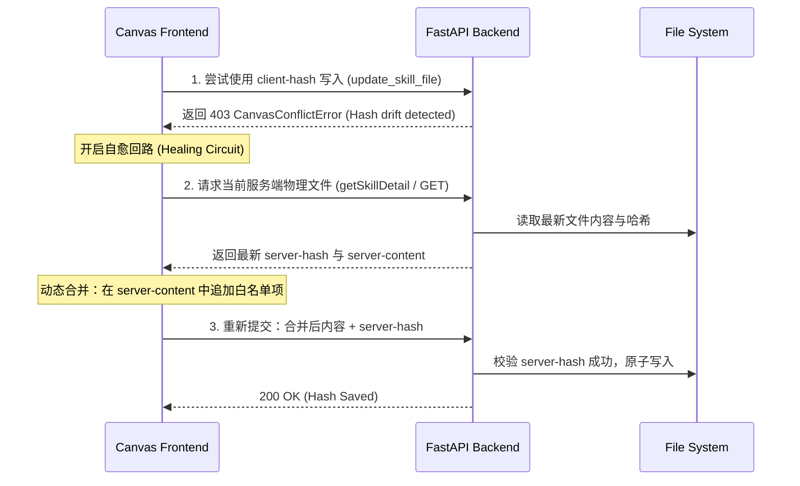

# Specification: studio-feature-skill-lifecycle (Research)

本篇调研文档针对当前代码库中哈希保存、测试输入管理、进程批处理的现有逻辑及瓶颈进行了深度解析，并给出了技术演进的可行路径。

---

## 1. 现有代码技术架构审计 (Codebase Analysis)

### 1.1 覆盖白名单保存冲突路径 (`Allow Overwrite`)
* **前端调用链**：
  `GraphCanvas.tsx` (handleAllowSequentialOverwrite)  
  ➡️ `Workspace.tsx` (onPhaseFileSave / handlePhaseFileSave)  
  ➡️ `api/client.ts` (writeSkillFile)
* **核心哈希生成代码**：
  在 `handleAllowSequentialOverwrite` 中，使用前端本地 `crypto.subtle.digest('SHA-256', text)` 动态计算当前客户端内存中内容的 SHA-256：
  ```typescript
  const hash = await sha256Hex(currentContent);
  await onPhaseFileSave({ path: relativePath, content: updatedContent, expectedHash: hash });
  ```
* **后端校验逻辑**：
  在 `app/services/skills.py` 中的 `update_skill_file`：
  ```python
  current = target.read_text(encoding="utf-8") if target.exists() else ""
  current_hash = _graph_content_hash(current)
  if expected_hash is not None and current_hash != expected_hash:
      raise CanvasConflictError(current_hash=current_hash, current_markdown_content=current)
  ```
* **技术瓶颈**：
  若服务器上的物理文件内容已更改（`current_hash != expected_hash`），后端会返回 `CanvasConflictError` 并通过 FastAPI 转换为 403 冲突响应。由于整个合并流程完全是在客户端单向闭环，前端接到 403 后直接抛出错误提示，没有对应的自愈合并（Three-way merge）或者强制覆盖覆盖入口，导致画布操作挂死。

---

### 1.2 测试输入 API 端点结构
* **路由文件**：[test_inputs.py (Router)](file:///Users/sevenx/Documents/coding/agent-harness/apps/studio/backend/app/routers/test_inputs.py)
* **核心路由定义**：
  ```python
  @router.post("", response_model=TestInputMetadata)
  async def create_test_input(skill_id: str, request: Request) -> TestInputMetadata:
      raise_not_implemented(f"create test input for skill {skill_id}")
  ```
  `create_test_input` 和 `delete_test_input` 全都硬编码为 `raise_not_implemented`。
* **物理目录结构**：
  通过 `test_inputs_dir_for(skill_id)` 指向 `.workspace/test_inputs`。目前 `list_test_inputs` 只检索以 `.json` 结尾的文件，忽略了其他非结构化的物料。
  ```python
  for path in sorted(inputs_dir.glob("*.json")):
      ...
  ```
* **技术瓶颈**：
  1. 缺少针对多类型文件（如 `.md`, `.txt`）的元数据列举支持。
  2. 接口层完全未打通，前端上传无处对接。

---

### 1.3 批量运行引擎实现机制
* **核心服务**：[run_manager.py](file:///Users/sevenx/Documents/coding/agent-harness/apps/studio/backend/app/services/run_manager.py)
* **批量执行调度器**：
  ```python
  async def start_batch_run(self, skill_id: str, input_ids: list[str]) -> BatchRunResponse:
      ...
      for input_id in input_ids:
          inputs = _load_test_input(skill_id, input_id)
          metadata = await self.start_run(skill_id, RunRequest(input_data=inputs))
          items.append((input_id, metadata.run_id))
  ```
* **参数提取逻辑**：
  `_load_test_input` 期待的是一个完整的 JSON 参数字典。
* **技术瓶颈**：
  `start_batch_run` 属于“点对点”的 JSON 触发，不具备遍历、过滤以及运行时正则映射能力。我们需要在 `run_manager.py` 或独立的流水线服务中增加一层“提取与映射机制”。

---

> ⚠️ **以下 §2 已被 `design.md` 取代(2026-06-01 收敛)**。
> 原方案(客户端哈希自愈 / multipart 上传 / 正则映射管道)在"本地单用户 + 不过度设计"的前提下被大幅简化:
> 哈希自愈移出本特性(降级为本地小修,见 DEF-011);上传改为 Rust 原生选路径 + Python 读入(非 multipart);
> 正则管道删除,改为"假定输入干净 + 序列文件自动批量"。
> **§1 代码审计仍然有效**,§2 仅作历史留底。

## 2. 技术演进设计方案 (Technical Design) —— 已被 design.md 取代

### 2.1 哈希锁死自愈方案 (Conflict Healing Flow)
前端在触发覆盖写入时，加入二阶段检测与自愈流程：



如果上述自动合并由于文件结构损坏而崩溃，前端将渲染一个覆盖选择框：
1. **Force Overwrite**：向后端发起特殊参数请求（不传 `expectedHash` 或设置 `force=true`），直接覆盖。
2. **Manually Revert**：清除本地临时白名单缓存，还原状态。

---

### 2.2 测试物料管理器 (Ingestion API & UI)
1. **API 层**：
   - **后端实现**：支持 `POST /api/skills/{skill_id}/test_inputs` 接收 `multipart/form-data` 格式的多文件上传。
   - 提取文件名并保存在 `.workspace/test_inputs/<filename>` 下。
   - **物料罗列**：修改 `list_test_inputs` 的 glob 规则为 `*`，排查特殊系统文件，识别扩展名分类为 `JSON` 或 `Raw Material`。
2. **UI 层**：
   - 前端 [InputPanel.tsx](file:///Users/sevenx/Documents/coding/agent-harness/apps/studio/frontend/src/components/studio/panels/InputPanel.tsx) 新增 Ingestion Section，使用 React Drag Event 封装拖拽多文件上传交互。

---

### 2.3 正则流转提取管道 (Pipeline Configurator)
1. **匹配与管道映射定义 (YAML/JSON Contract)**：
   在 `BatchRunRequest` 结构体中，引入 `pipeline_config` 参数：
   ```json
   {
     "pipeline_config": {
       "glob_pattern": "chapter_*.md",
       "exclusion_pattern": "*draft*",
       "mappings": [
         {
           "graph_property": "chapter_id",
           "source": "filename_regex",
           "regex_pattern": "chapter_(\\d+)\\.md",
           "group_index": 1
         },
         {
           "graph_property": "text_body",
           "source": "file_body_content"
         }
       ]
     }
   }
   ```
2. **后端提取器**：
   在 `run_manager.py` 中：
   - 遍历 `test_inputs` 目录，通过 `glob_pattern` 检索所有符合条件的文件。
   - 正则匹配文件名提取出对应的输入参数，读取文本填充为 `file_body_content` 输入，组装为临时的 `input_data`，并依次调用 `start_run`。
