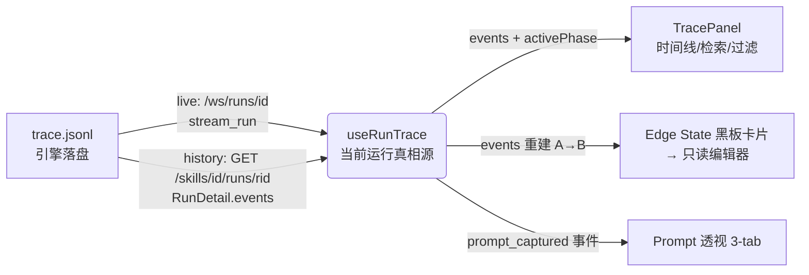

# Design — Trace Inspector(运行追踪 / 去黑盒)

> 实现 [requirement.md](./requirement.md)。第一性原理:① 看到所有操作日志 ② 找到想看的那条。
> **关键判断**:80% 的活是「**接线 + 接真实数据**」,不是造新组件 —— `TracePanel`、`useRunStream`、search/filter/虚拟列表**都已实现**,只是没挂上;边 dot 的 context 现在是 mock。

---

## 1. 核心架构:单一「当前运行 trace」真相源

三个消费者(Trace 控制台 / 边 state 黑板卡片 / Prompt 透视)读的是**同一份**当前运行的事件流。先把"当前运行的 events"做成单一真相源,再分发。

- **`useRunTrace(runId)`(新增,薄封装)**:`runId` 来自当前活跃运行(实时)或 TimelinePanel 选中的历史运行。内部:运行中 → 复用 [`useRunStream(runId)`](../../../apps/studio/frontend/src/hooks/useRunStream.ts)(已实现,WS+重连+100ms 批刷);已结束 → `useRunHistory().fetchRunDetail(runId)` 取 `RunDetail.events`([`useRunHistory.ts`](../../../apps/studio/frontend/src/hooks/useRunHistory.ts))。对外统一暴露 `{ runId, events: CallbackEvent[], status }`。
- 后端**无需改动**:live = [`/ws/runs/{run_id}`](../../../apps/studio/backend/app/routers/websockets.py)(`stream_run` 运行中返回活跃 queue、结束后 replay),history = `GET /skills/{skillId}/runs/{run_id}` → `RunDetail.events`([`run_manager.py`](../../../apps/studio/backend/app/services/run_manager.py))。

---

## 2. 改动清单(逐组件,忠实现状)

| 组件 / 文件 | 现状 | 改动 | REQ |
|---|---|---|---|
| `components/TracePanel.tsx` | 已实现(114行,含 TraceSearchBar / TraceFilter / VirtualTraceList / useTraceFilter),**零引用** | **挂载**;传 `traceLogs=events`、`activePhase=selectedNode?.id`、`onSelectPrompt`、`onSelectEvent` | 1,2,5 |
| `hooks/useRunStream.ts` | 已实现,零引用 | 被 `useRunTrace` 引用,无需改 | 1 |
| `hooks/useRunTrace.ts` | 不存在 | **新增**:合并 live/history 两源为单一真相源 | 1 |
| `panels/Panels.tsx` + `Toolbar.tsx` + `WorkspaceContext.tsx` | `PanelKind = assets\|input\|timeline\|properties\|local-history` | union **加 `"trace"`**;`Panels` switch 加 `activePanel==="trace" → <TracePanel/>` | 1 |
| `panels/TimelinePanel.tsx` | 只读历史列表,卡片无 onClick | 卡片加 onClick → `setActiveRunId(run.run_id)` + `onPanelChange("trace")` | 1 |
| `edges/ContextEdge.tsx` | dot click → `getMockEdgeContext()` + `onPanelChange('properties')` | **删 mock**;改为用真实 events 经 `buildEdgeContext()` 重建 → 打开 state 卡片;`onPanelChange('trace')` 而非 `'properties'` | 3,6 |
| `lib/buildEdgeContext.ts` | 不存在 | **新增**:`(events, sourcePhaseId, targetPhaseId) → EdgeContextJson` | 3 |
| `panels/PropertiesPanel.tsx:195-280` | `if(selectedEdge)` 倾倒 inputs/phase_outputs/frame JSON | **删除该分支**,属性栏只剩静态节点配置 | 6 |
| `EdgeStateCard` + 只读编辑器 | 无 | **新增**:黑板卡片 → 点击进 Monaco(**read-only**)看完整 state | 3,4 |
| `PromptInspector`(3-tab) | 无(数据已在 `prompt_captured`) | **新增**:Template / Variables / Rendered,数据取自事件 `variables` / `resolved_prompt` | 5 |

---

## 3. 关键设计决策

### D1 — 节点 → trace 过滤靠 `phase_name`(已有机制)
[`utils/trace.ts`](../../../apps/studio/frontend/src/utils/trace.ts) 的 `eventPhase(e)=e.phase_name ?? e.current_phase ?? e.run_id ?? 'system'`,`useTraceFilter` 已支持 `activePhase`。设计:`activePhase = selectedNode?.id`。
**契约(已验证 ✅)**:画布 `selectedNode.id` **就是 `phase.name`**([`GraphCanvas/build-nodes.ts:183`](../../../apps/studio/frontend/src/components/GraphCanvas/build-nodes.ts)、[`utils/graph.ts:41`](../../../apps/studio/frontend/src/utils/graph.ts)),与事件 `phase_name` 同源 → 直接 `activePhase = selectedNode.id`,无需映射。

### D2 — 边 A→B state 从 events 按需重建(替换 mock)
`buildEdgeContext(events, src, tgt)`:
- `phase_outputs` = 最后一条 `phase_end && eventPhase==src` 的 `context.phase_outputs`;
- `inputs` = 第一条 `phase_start && eventPhase==tgt` 的 `context.inputs`;
- 找不到(节点未跑到)→ 返回 empty state,卡片优雅显示「该边尚无运行数据」。
> `CallbackEvent.context` 当前是**非类型化透传字段**(`api/types.ts` 的 `& Record<string, JsonValue>`);建议在 `CallbackEventBase` 补 `context?: { inputs?; phase_outputs?; scratch? }` 类型,避免裸 any。

### D3 — 「当前运行」选择与生命周期
- 新增 Workspace 状态 `activeRunId`。
- **实时**:发起 run → `activeRunId = 新 runId`,Trace 面板自动跟随 live 流。
- **回看**:TimelinePanel 点历史卡片 → `activeRunId = 该 runId`,`useRunTrace` 切到 history 源。
- **无运行**:沿用 research 决策 —— 自动选 **Latest Run**;一次都没跑过 → 控制台空态。

### D4 — 边 dot → 卡片 → 只读编辑器(只读,确认)
dot click → 打开 `EdgeStateCard`(轻量黑板预览)→ 点卡片 → Monaco **read-only** 全量查看(深层可折叠)。**只读**;编辑-续跑是 DEF-005(后端 501),不在本轮。卡片/编辑器入口与 REQ-4(从时间线 state 条目进)复用同一 `EdgeStateCard`/编辑器组件。

### D5 — PropertiesPanel 单一职责
删 `if(selectedEdge)` 分支后,`selectedEdge` 不再驱动属性栏;边状态只走 trace 控制台 / 卡片。属性栏回归"静态节点配置"。

### D6 — 后端事实、前端决定渲染
对齐 [event-bus-alignment](../../../docs/studio/03_platform/state-engine/event-bus-alignment.md):后端只发事实(phase started / 事件 / token),边框色、红灯、tab、过滤全由前端依事件派生。本设计无需后端发 UI 指令。

---

## 4. 交互流程

1. **运行时实时**:run 开始 → `activeRunId` 置位 → TracePanel live 流入,突出 phase 边界 / 错误红灯 / token·延迟。
2. **选节点看 trace**:画布选节点 → `activePhase=node.id` → 控制台只剩该节点事件;再叠加 search/事件类型筛。
3. **点 dot 看 state**:dot → `buildEdgeContext` 真实数据 → 黑板卡片 → 点卡片 → 只读编辑器看完整黑板。
4. **点 LLM 事件看 Prompt**:llm 事件 → Prompt 透视 Template / Variables / Rendered 三 tab。

---

## 5. 边界 / 非本轮交付

- **REQ-7 结构化 DIFF**:P2,依赖引擎 emit reducer 级 diff;本轮先做 REQ-3 的 state **查看**,不做 added/modified/deleted 高亮。
- **编辑-续跑**:DEF-005,后端 resume 501,单独能力。
- **Compile 报错底部 drawer**:DEF-010,属 authoring,不在本 spec。但注意 **R4**。

---

## 6. 风险 / 待验证

- **R1(已消解 ✅)**:`selectedNode.id` == 事件 `phase_name` —— 节点 id 即 `phase.name`(`build-nodes.ts:183`、`utils/graph.ts:41`),与 trace 同源。节点过滤可直接落地,无需映射。
- **R2**:`context` 字段在哪些事件类型上存在?已确认 `phase_start/phase_end/run_started/run_ended` 有;其余事件无 → `buildEdgeContext` 只依赖 phase_start/end,安全。补类型定义见 D2。
- **R3(性能)**:单事件 payload 可能极大(如 10MB 工具输出)。TracePanel 列表与编辑器**必须截断**(超阈值显示 `__TRUNCATED__` + 展开按钮),防浏览器 OOM(沿用旧 spec 关键约束)。
- **R4(布局协调)**:Trace 控制台在底部面板区;Compile drawer(DEF-010)也从底部弹。两个底部面 surface 需协调,勿冲突。
- **R5**:`stream_run` 结束后 replay + None 哨兵;`useRunTrace` 切 live→history 时避免事件重复/丢失(以 runId 为界重置)。

---

## 7. 落地切片(详见 tasks.md)

1. **P1-a 接线只读控制台**:`useRunTrace` + Panels 加 `"trace"` + 挂 TracePanel + TimelinePanel 卡片点击。→ 「看到所有日志 + 历史回看」可用。
2. **P1-b findability**:`activePhase=node.id`(过 R1)+ 复用内置 search/filter。→ 「找得到」可用。
3. **P1-c 真实 state**:`buildEdgeContext` + EdgeStateCard + 只读编辑器 + 删 PropertiesPanel 分支 + dot 改道。→ mock 下线。
4. **P1-d Prompt 透视**:3-tab 组件接 `prompt_captured`。
5. **P2 REQ-7**:引擎 emit reducer diff 后再做结构化高亮。

## 相关文档
- [requirement.md](./requirement.md) · [research.md](./research.md)
- 接线锚点:`TracePanel.tsx` / `useRunStream.ts` / `Panels.tsx` / `ContextEdge.tsx` / `PropertiesPanel.tsx` / `run_manager.py` / `websockets.py` / `api/types.ts`(CallbackEvent)
