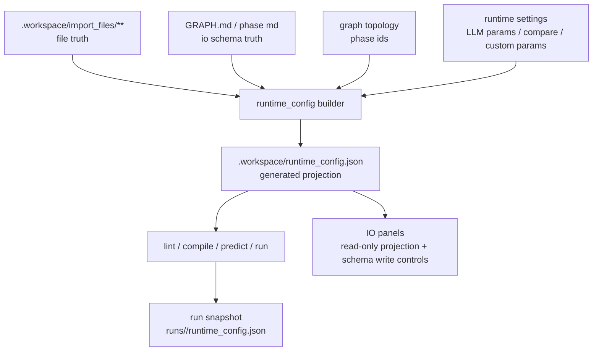
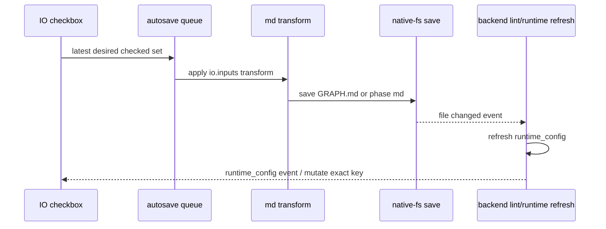

# Studio I/O Runtime Data Management - Design

状态: Draft for review
日期: 2026-07-06

## 1. Research Findings

本轮先查现状，不写生产代码。关键发现:

- 后端 runtime_config 和 io_scan 目前只忽略 `history/`，没有忽略 `.history/`。
- runtime_config 的 field binding 现在按字段名写入 dict，重复字段可能被后写入项覆盖，无法暴露冲突。
- 新建 skill 目前只创建 `.workspace/`，没有创建 `.workspace/import_files/.phase/<phase_id>/`。
- Input 面板仍保留 `Configure input` 折叠按钮和 `Save input config` 手动保存。
- 文件行编辑 `.workspace/import_files/...` 时，前端把缺失于 `skillDetail.files` 的路径当成空字符串，导致没有走磁盘读取，编辑器打开为空。
- runtime_config 已经在 lint/compile 前刷新，这是正确方向；需要把布局校正、冲突检测和 `.history/` 过滤下沉到同一层。

## 2. Data Ownership



规则:

- 文件是否存在，以 `.workspace/import_files/` 为准。
- 字段是否声明，以 md `io.inputs` / `io.outputs` 为准。
- runtime_config 只回答“当前运行时会看到哪些文件字段、哪些字段能绑定、哪些字段有诊断”。
- UI 勾选状态不是独立状态，而是 schema truth 和 runtime projection 的派生结果。

## 3. Workspace Layout

标准布局:

```text
.workspace/
  import_files/
    <root graph/test input files>
    .phase/
      setup/
      segment/
      review/
  runtime_config.json
  runs/
    <run_id>/
      runtime_config.json
```

约束:

- `import_files/` 根目录只服务 graph input 和 test input。
- phase node 只扫描 `.phase/<phase_id>/`。
- `.phase/<phase_id>/` 目录必须按当前 graph topology 自动创建。
- `history/` 和 `.history/` 在任何扫描层级都跳过。
- 非当前 phase id 的目录不进入 runtime_config，并在 skill init 或 graph 结构变化时清除。
- `.phase/` 下目录集合必须强同步当前 graph topology: 新增 phase 立即创建空目录，删除 phase 立即删除目录，重命名 phase 按新 id 重建目录。

## 4. Layout Reconciler

新增统一布局校正器:

```text
ensure_import_layout(skill_dir, phase_ids)
```

职责:

- 创建 `.workspace/import_files/`。
- 创建 `.workspace/import_files/.phase/`。
- 为每个当前 phase 创建 `.workspace/import_files/.phase/<phase_id>/`。
- 删除不属于当前 graph topology 的 `.phase/<phase_id>/` 目录。

调用点:

- native-fs 新建 skill 后，创建默认 phase 目录，保证用户立刻能看到标准文件树。
- backend 读取 skill detail / runtime_config GET / lint / compile / predict / run 前幂等调用。
- phase 新增、删除、重命名或 graph 保存后调用。

## 5. Runtime Config Shape

runtime_config 继续是单文件统一运行时配置层，但 input 部分需要显式表达 manifest、binding 和 diagnostics:

```json
{
  "schema_version": "studio.runtime_config.v1",
  "inputs": {
    "import_root": "import_files",
    "manifest": {
      "root": [],
      "phases": {
        "segment": []
      }
    },
    "root": {
      "chapters": {
        "path": "import_files/chapters.json",
        "value_type": "array",
        "content_kind": "json",
        "source": "file"
      }
    },
    "phases": {
      "segment": {}
    },
    "conflicts": {
      "root": [],
      "phases": {
        "segment": []
      }
    },
    "diagnostics": []
  },
  "llm": {
    "node_params": { "nodes": {} },
    "compare_candidates": { "nodes": {} },
    "custom_params": { "nodes": {} }
  },
  "artifacts": []
}
```

说明:

- `manifest` 保留文件树和解析结果，供 UI 展示。
- `root` / `phases` 只包含无冲突、可唯一绑定的字段。
- `conflicts` 记录同 scope 下多候选匹配同一字段的情况。
- `diagnostics` 记录解析失败、非结构化文件类型等不一定让 lint/compile 失败的问题。
- golden 和 UI 配置不进入 runtime_config。

## 6. File Parsing

统一解析器输出 candidate:

```text
scope: root | phase:<phase_id>
field_name: string
normalized_name: string
value_type: object | array | string | number | integer | boolean | file | media | unknown
content_kind: json | text | csv | pdf | image | audio | video | binary
path: import_files-relative path
source_file: file or folder entry
```

解析规则:

- JSON object: 顶层 key 是字段。
- JSON array: 文件名 stem 是字段，类型 array。
- Markdown/txt: 文件名 stem 是字段，类型 string。
- CSV/TSV: 文件名 stem 是字段，类型 array，metadata 记录列名。
- PDF/image/audio/video/binary: 文件名 stem 是字段，类型 file/media，不解析内部结构。
- 解析失败: manifest 中保留文件项，candidate 为空，diagnostics 记录错误。

## 7. Matching Algorithm

输入:

- 当前 scope 的 schema properties，保持 md 声明顺序。
- 当前 scope 的 runtime candidates。

步骤:

1. 对 schema 字段名和 candidate 字段名使用同一 normalize 函数。
2. 按 normalized name 建索引。
3. 对每个 schema 字段按声明顺序查候选。
4. 无候选: missing。
5. 一个候选且类型兼容: matched checked。
6. 一个候选但类型不兼容: type error。
7. 多个候选: conflict，不生成 binding；checkbox 仍可操作，因为 checkbox 的职责是修改 md schema，不是选择具体候选文件。
8. schema 字段处理完后，剩余 candidates 按文件树稳定顺序展示为 available unchecked。

排序:

- matched/missing/conflict 的 schema 字段按 schema 顺序置顶。
- 同一个文件组里，schema 匹配字段排在未匹配字段前。
- 完全未匹配文件组按 manifest 顺序排在后面。

冲突定义:

- 同一 scope、同一 normalized field name，有两个或更多 candidate。
- 类型相同也必须报冲突，因为系统无法知道用户想绑定哪个文件。
- 类型不同则报冲突并附加 schema/type mismatch 诊断。

## 8. Lint / Compile Gates

新增或细化错误:

- `STUDIO_RUNTIME_INPUT_MISSING`: required schema 字段无 runtime binding。
- `STUDIO_RUNTIME_INPUT_CONFLICT`: schema 字段存在多个 runtime candidates。
- `STUDIO_RUNTIME_INPUT_SCHEMA_INVALID`: candidate 类型与 schema 不兼容。
- `STUDIO_RUNTIME_IMPORT_PARSE_FAILED`: 文件无法解析为可绑定字段；默认诊断，只有被 required schema 依赖时阻断。

lint 和 compile 必须在 engine compile 前读取刷新后的 runtime_config，把错误挡在运行前。

这里的“阻断”只指动作结果:

- lint: 返回 error diagnostics，不能显示为 lint 通过。
- compile: 返回 error diagnostics，不产出新的 compiled runnable artifact，也不把图状态标记为 compile succeeded。
- run/predict: 如果依赖 compile 成功，则不能基于有冲突的输入启动。
- UI 编辑不被阻断，用户仍可继续改 schema、改文件、导入或删除文件来修复错误。

## 9. Frontend Projection Model

前端新增一个纯派生模型:

```text
deriveIoCandidateTree({
  scope,
  ioSchema,
  runtimeConfig,
  graphTopology
}) -> sections
```

它不拥有真相，只负责:

- 按 schema 顺序输出 checked/missing/conflict。
- 输出 available unchecked。
- 输出文件组路径、tooltip 文案、打开目标。
- 输出 conflict/missing/type-error 原因；checkbox 不因 conflict 禁用。

重新派生触发:

- runtime_config SWR 数据变更。
- 当前 md 文件内容变更。
- 当前选中 node/scope 变更。
- graph topology 变更。

不允许通过组件 remount 或 timer 作为数据同步手段。

## 10. Input Panel UX

目标布局:

```text
Input
  Preview / current runtime input summary
  Input configuration
    Graph inputs
      chapter  missing / matched / conflict
    Imported files
      chapters.json    import_files/chapters.json    [edit] [open folder] [delete]
        [x] chapters    array · runtime file
```

变化:

- 删除 `Configure input` 按钮。
- 删除折叠态，内容默认展开。
- 删除 `Save input config` 按钮。
- panel 内所有修改都直接写真实数据源，和 Properties 面板一样实时保存。
- 保存中显示轻量 `saving` tag，保存完成或失败遵循统一 autosave 状态。
- checkbox 变化立即进入 md autosave 队列。
- checkbox 的语义就是修改 md 里的 `io.inputs` schema；写回后上方 input schema 示例立即使用最新 md 内容重新渲染。
- 文件路径截断时用 Tooltip 显示完整路径。
- Edit 打开 `.workspace/import_files/...` 的真实文件内容。
- Open folder 打开包含目录。
- Delete 删除 import truth 文件或目录，并触发 runtime_config refresh。

Import 入口:

- 同一个 import 按钮同时支持选择文件和文件夹。
- root input 面板导入到 `.workspace/import_files/`。
- phase node 面板导入到 `.workspace/import_files/.phase/<phase_id>/`。
- 导入完成后触发 runtime_config refresh 和 candidate tree 重新派生。

## 11. Schema Write Back

勾选/取消勾选走同一条 schema 写入链:



并发语义:

- 只保存最新 checked set。
- in-flight 请求被新 payload supersede 后，旧响应不得覆盖 UI。
- hash 冲突时，用最新 md 内容重新应用结构化 transform；失败则提示用户。

## 12. Output / Artifacts Parity

Output 和 artifacts 不在本轮只做输入的例外路径。它们使用同一套:

- 文件真相源。
- runtime projection。
- schema order first。
- conflict diagnostics。
- tooltip/open/edit/open-folder 行为。

具体输出文件落点仍按 engine/studio 设计源执行；本规格只要求交互模型和 runtime 投影一致。

## 13. Implementation Surfaces

Backend:

- `apps/studio/backend/app/services/runtime_config.py`
- `apps/studio/backend/app/routers/io_scan.py`
- `apps/studio/backend/app/services/skills.py`
- backend tests for layout, `.history`, conflicts, lint/compile errors, snapshot.

Frontend:

- `apps/studio/frontend/src/lib/io-config.ts`
- `apps/studio/frontend/src/components/studio/panels/InputPanel.tsx`
- `apps/studio/frontend/src/components/studio/panels/IoConfigDialog.tsx`
- `apps/studio/frontend/src/components/studio/Workspace.tsx`
- tests for derived ordering, autosave schema write, edit file loading, tooltip/open folder.

Tauri:

- `apps/studio/tauri/src/native_fs.rs` for new skill scaffold directories.

Docs:

- `docs/engine/skill-spec/00-FORMAT-GROUND-TRUTH.md`
- `docs/studio/mvp1/03_regions/input/mvp1-alignment.md`
- frontend handbook slices and generated `index.html` after implementation.

## 14. Open Design Decisions

1. Delete button: confirmed as deleting the physical import file/folder, because files are the truth source. “只从 schema 取消绑定”由 checkbox 负责。
2. Orphan phase dirs: confirmed as not retained. Skill init and graph structure changes must clean stale `.phase/<phase_id>/` dirs.
3. Checkbox: confirmed as the user's direct control for md `io.inputs` schema. The input schema preview must update immediately after the autosaved md change.
