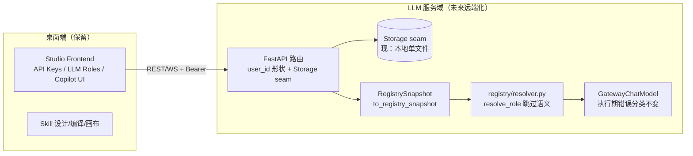

# LLM Gateway & Roles Redesign — Design

## Overview

本设计在新 registry/gateway 架构内重新植入两个被 2026-05-25 hard cutover 丢失的行为
（save 解耦、resolver 优雅跳过），并把测试状态从前端易失态改为后端 SSOT 回写。所有改动遵循
[architecture-direction.md](./architecture-direction.md) 的远端服务化方向：**形状对齐远端、实现先本地、
绝不 Rust 化数据层**。

### Goals

- 角色保存/删除与凭证状态解耦，消除 400 死锁（Req 1）。
- runtime resolver 对未配置/不可执行路由优雅跳过 + WARNING，仅空链报错（Req 2）。
- 测试状态写回后端 SSOT，切 Tab/重启不丢，删除前端并行真值源（Req 3）。
- 所有接口预留 `user_id` 维度并经由 Storage 抽象边界（Req 4）。

### Non-Goals

- 不 Rust 化任何 LLM 配置数据层。
- 不接 DB/KMS/加密/真实多用户认证（远期独立 spec）。
- 不做协议翻译、动态选型、第三方分类归一（延后）。
- 不采用"状态提升"治标方案。

## Regression Root Cause（设计依据）

| 行为 | 旧版（5-25 前，参考实现） | 当前（回归） | 本设计目标 |
|---|---|---|---|
| 保存校验 | `validate_references(data)` 仅查 YAML 自洽 | `validate_references(data, known_route_ids=active_route_ids)` 焊死凭证 → 死锁 | 传 `None`，仅 schema 校验 |
| 解析期缺路由 | `config/llm_config.py:resolve_role` 用 `continue` 跳过 + `logger.warning` | `registry/resolver.py:57` `raise RegistryResolutionError` 崩在第一个 | 跳过 + WARNING，空链才报错 |

参考实现：`git show ecab5fe1^:packages/graph-agent/src/graph_agent/config/llm_config.py`（`resolve_role` lines 144-205）。

## Architecture

### 部署边界（远端化方向，本次只做"形状"）



牵手点 = `RegistrySnapshot`（`apps/studio/backend/app/models/llm_config.py:279 to_registry_snapshot()`），
control-plane 与 runtime-plane 的唯一数据交换格式，位于 LLM 服务域**内部**，不跨桌面边界。

## Requirements Traceability

| Requirement | 摘要 | 关键改动点 |
|---|---|---|
| 1 | save 解耦 | `apps/studio/backend/app/routers/llm.py:_save_roles_with_active_routes` |
| 2 | resolver 优雅跳过 | `packages/graph-agent-gateway/src/graph_agent_gateway/registry/resolver.py:resolve_role` |
| 3 | 测试状态 SSOT 回写 | backend 测试 job 落盘 + 前端从后端读；删前端唯一真值源 |
| 4 | 远端就绪形状 | 接口 `user_id` 参数位 + Storage seam，本地实现 |
| 5 | 侧边栏过滤（核实=误诊，已撤回） | 见 requirements.md Req 5 / DEF-006 |
| 6 | WaveSpeed 诚实失败 | 记录，任务延后 |

## Components And Interfaces

### C1 — Save 解耦（Req 1）

`_save_roles_with_active_routes(data, *, user_id=...)`（`llm.py:4726`）：
- 改为 `validate_references(data, known_route_ids=None)` + `save_roles_file(path, data, known_route_ids=None)`。
- `validate_references(..., known_route_ids=None)` 已实现"早退跳过路由引用校验"（`services/llm_roles.py:88`），
  无需改 service 层，只改 router 调用点。
- 形状：函数签名预留 `user_id`；路径解析经 `llm_paths.py` 的 Storage seam（见 C4）。

### C2 — Resolver 优雅跳过（Req 2）

`resolve_role`（`registry/resolver.py:33-132`）的遍历循环（当前 55-71）改为：

```python
skipped: list[tuple[str, str]] = []   # (route_id, reason)
for entry in entries:
    route = snapshot.provider_routes.get(entry.route_id)
    if route is None:
        skipped.append((entry.route_id, "not_configured")); logger.warning(...); continue
    if route.status not in EXECUTABLE_ROUTE_STATUSES:
        skipped.append((entry.route_id, "not_executable")); logger.warning(...); continue
    endpoint = snapshot.provider_endpoints.get(route.endpoint_id)
    if endpoint is None or _no_credential(endpoint, ...):
        skipped.append((entry.route_id, "no_credential")); logger.warning(...); continue
    # ... 既有 profile 选择 / resolved_routes.append(...)
if not resolved_routes:
    raise RegistryResolutionError(f"role has no executable route: {role_name}; skipped={skipped}")
```

- **空链契约（唯一）**：上面 `raise RegistryResolutionError` 经 `ModelResolver.resolve`
  （`resolver.py:99`）映射为 `GatewayRoleNotConfiguredError`。`AllProvidersFailedError`
  （`resolver.py:104`，需 `resolve_role` 返回非空但执行期全败）**只属执行期**——解析期空链不走它，
  保证 TDD 断言唯一、稳定。
- `model_override` 单点路径**不放宽**：未命中仍抛 `[F-v3-gateway-role-not-configured]`（Req 2.4）。
- 执行期（`GatewayChatModel._generate`）的 fallback/fail-fast 分类**完全不变**。
- 这是对 `docs/graph-agent-gateway/mvp0/mvp0-alignment.md` "Runtime 行为" 的有意修订，
  须同步更正该文档（见本 spec 配套 doc 修订）。

### C3 — 测试状态 SSOT 回写（Req 3）

现状（审计）：route 最终 status 已落 `provider_routes[].status`（credentials.json，后端 SSOT），
但前端 `routeStatusOverrides`(`CopilotTab.tsx:166`)/`roleTestStates`(`LlmRolesTab.tsx:125`) 自建并行内存态，
切 Tab/重启即丢；test job 仅在内存 `_role_test_jobs`(`llm.py:232`)。

设计：
- 后端：Role/Copilot Test 完成时，除更新 `provider_routes[].status` 外，落盘足够诊断
  （每路由 ready/unsupported + reason + attempted_at）到 SSOT（沿用 credentials 文件结构或其旁路记录，
  经 Storage seam 写，预留 `user_id`）。
- 后端：在 `GET /api/llm/registry`（或 roles 读取）响应中带出可重建 UI 的测试状态投影。
- 前端：进入页面/重挂载/重启后从后端响应渲染就绪灯；`routeStatusOverrides` 降级为"测试进行中"的
  乐观显示，完成后以后端值为准；删除"内存态作为唯一真值源"路径。

### C4 — 远端就绪形状（Req 4，横切）

- **Storage seam**：在 `llm_paths.py` / `llm_credentials.py` / `llm_roles.py` 的读写入口前置一层薄抽象
  （函数参数或轻量 Protocol），当前实现 = 本地单文件；调用方不假设单文件形态。
- **user_id 维度**：C1/C3 涉及的读写接口签名预留 `user_id`，当前以单一本地用户常量填充。
- 不引入 DB/KMS；不写 Rust。

## Error Handling

- Save（Req 1）：schema 非法 → 400（不变）；路由引用不再触发 400。
- Resolve（Req 2）：逐条跳过记 WARNING（含 route_id + reason）；空链 → `resolve_role` 抛
  `RegistryResolutionError` → `ModelResolver.resolve` 映射 `GatewayRoleNotConfiguredError`
  （`resolver.py:99`）。`AllProvidersFailedError`（`resolver.py:104`）仅执行期全败，不用于解析期空链。
- 执行期错误分类**保持不变**（沿用 `classify_exception`）。真实语义：network/timeout/429/5xx 与 401/402/403/404 → fallback；400-capability（unsupported/invalid model 等）→ fallback；400(非 capability)/413/422 → fail-fast。（早期"400/401/403/404/422 全 fail-fast"的简写有误，已更正——详见 client-layer-decision-record.md M5。）
- 禁止静默：所有跳过、降级必须有 WARNING 日志（logging 铁律）。

## Testing Strategy

- Backend（TDD，先红后绿）：
  - `test_role_save_unconfigured_route_success`：未配 openrouter 时保存含
    `openrouter-prod:deepseek.deepseek-r1` 的角色返回 200（Req 1）。
  - resolver：chain=[未配置, 已配置] → 解析得到已配置那条且有 WARNING（Req 2.1/2.2）；
    全未配置 → 抛结构化错误（Req 2.3）；`model_override` 未命中仍 fail-fast（Req 2.4）。
  - 测试状态：测试后 SSOT 持有结论；重新读取（模拟重启）仍能重建（Req 3）。
- Frontend（Vitest）：更新 SettingsPage/CopilotTab/LlmRolesTab 测试以反映"状态来源=后端"
  （预期需修改测试，不是零回归通过）。
- 全量：`uv run pytest` + `npm run test` 在提交前跑通。

## 与 platform-control-plane-runtime spec 的关系

本 spec 是该平台 spec 的**近期回归修复子集**，不重复其 Requirement 9（draft evidence、in-place
official probe、typed groups 等）。两处都触及 Role Test 时，以平台 spec 的 evidence 语义为准，
本 spec 只负责"测试状态不丢"的 SSOT 回写与 resolver 跳过。
