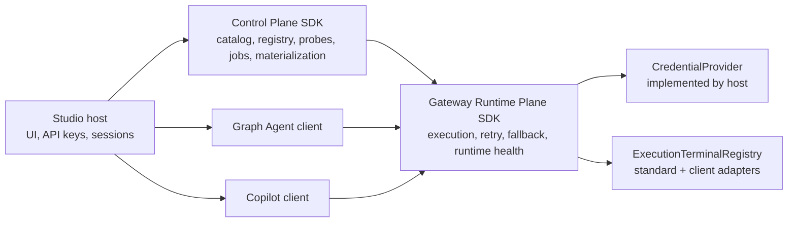
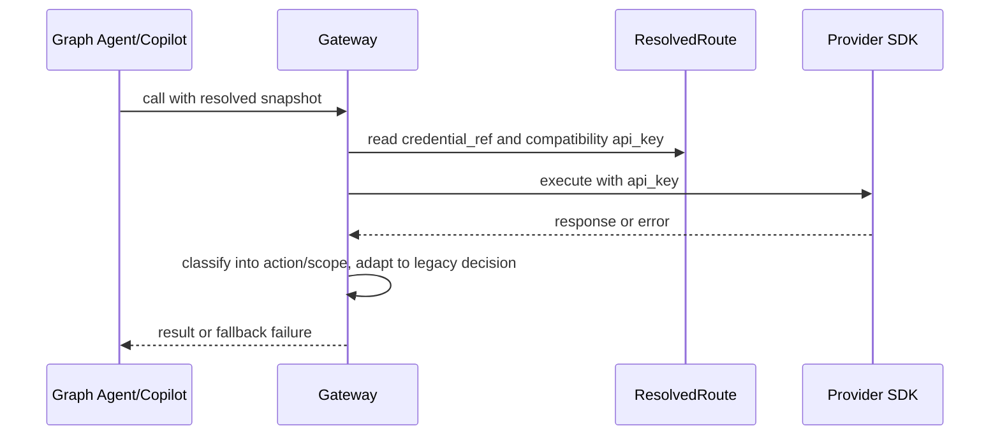
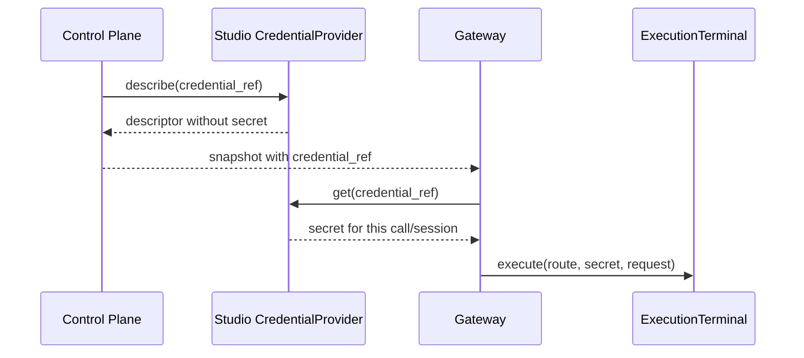

# Studio LLM Platform Control Plane / Runtime Plane Design

## Overview

This design implements the v1.1 LLM Platform direction as a phased SDK architecture. Studio remains the first host, but the reusable platform boundary is Control Plane for configuration intelligence and Gateway Runtime Plane for execution governance.

The current branch starts with a compatibility kernel. It introduces the data contracts needed for secret-free snapshots and richer runtime decisions while preserving the current `api_key` execution path until CredentialProvider runtime retrieval is wired.

### Goals

- Establish the Control Plane / Gateway boundary as SDK facades.
- Move snapshots toward `credential_ref` and versioned contracts without breaking current runtime.
- Model retry, fallback, and fail-request as separate decisions.
- Make draft discovery, provider list observations, and route probes durable evidence with explicit trust states.
- Keep v1.1 implementation traceable through Kiro tasks.

### Non-Goals

- Do not turn Control Plane or Gateway into service processes.
- Do not delete `ResolvedRoute.api_key` in the first compatibility slice.
- Do not move Studio provider-specific probe code to Gateway until Gateway probe primitives are implemented.
- Do not let draft evidence alone mark a route as active runtime-ready.

## Architecture

### Boundary Map

Gateway never imports Studio or Control Plane internals. The only host callback is CredentialProvider.

### Technology Stack

| Layer | Choice | Role |
|---|---|---|
| Gateway SDK | `packages/graph-agent-gateway` Python package | Runtime schema, resolver, terminal contracts, error classification |
| Studio backend | FastAPI app | First host and current Control Plane location |
| Studio frontend | React/Tauri | Consumer of Control Plane projections; unchanged in this slice |
| Storage | Studio local registry JSON/SQLite | Current credential, route, health, and job state until extraction |

## System Flows

### Compatibility Runtime Flow

### Target Credential Flow

## Requirements Traceability

| Requirement | Summary | Components |
|---|---|---|
| 1.1-1.4 | SDK boundary and one-way dependencies | Formal design doc, Gateway contract models |
| 2.1-2.5 | Credential references and secret lifetime | `ProviderEndpoint.credential_ref`, `ResolvedRoute.credential_ref`, CredentialProvider contract, SecretLifetimePolicy |
| 3.1-3.4 | Versioned snapshot and config/evidence split | SnapshotVersion contract, Kiro phase tasks |
| 4.1-4.5 | Retry and error action semantics | TerminalRetryPolicy, ErrorContext, ErrorActionClassification |
| 5.1-5.4 | Test path equals runtime path | Phase 2/3 tasks |
| 6.1-6.4 | Studio backend/frontend consumption | Phase 3/UI tasks |
| 7.1-7.4 | Phased migration | Kiro tasks, legacy doc banner |
| 8.1-8.6 | Copilot credential-provider runtime integration | Copilot SDK terminal adapter, CredentialProvider callback, session cache policy |
| 9.1-9.13 | Draft evidence and route testing semantics | Role intent migration, profile probe writeback, evidence library, provider/list/probe split, typed route families |

## Components And Interfaces

| Component | Domain | Intent | Requirements |
|---|---|---|---|
| CredentialProvider contract | Gateway public contract | Non-secret describe + execution-time get | 2 |
| SecretLifetimePolicy | Gateway runtime schema | Defines allowed secret-bearing cache lifetime and invalidation triggers | 2 |
| SnapshotVersion | Gateway/Control Plane schema | Records versions used by a materialized snapshot | 3 |
| TerminalRetryPolicy | Gateway runtime schema | Deterministic retry defaults by terminal/mode | 4 |
| ErrorContext classifier | Gateway runtime | Classifies provider/runtime errors into action + scope | 4 |
| Copilot SDK terminal adapter | Studio client adapter | Bridges route-backed Gateway resolution and Claude Agent SDK execution | 5, 6, 8 |
| Kiro spec | Planning/governance | Tracks complete v1.1 implementation phases | 7 |

### Gateway Contracts

Gateway owns provider execution contracts, but not product catalog state. The first slice adds schemas and compatibility behavior:

- `ProviderEndpoint.credential_ref` and `ResolvedRoute.credential_ref`.
- `ResolvedRoute.api_key` remains optional compatibility data and must stay redacted.
- `CredentialDescriptor` represents readiness without a secret.
- `CredentialProviderProtocol` declares host-provided secret lookup.
- `SecretLifetimePolicy` describes cache lifetime and invalidation semantics.
- `TerminalRetryPolicy` carries standard runtime/probe and SDK runtime/probe defaults.
- `ErrorContext` provides the data needed for route, endpoint, credential ref, method, mapper, runtime settings, role requirements, provider error type/message, status code, and stream phase.

### Studio Control Plane Shell

Studio backend currently hosts Control Plane behavior. Future tasks extract router job state and probe orchestration into services before package extraction.

### Draft Evidence Library

`ProviderImportDraft` began as a transient import queue. Requirement 9 extends it into a durable evidence library owned by the Control Plane side of Studio until package extraction. Evidence is advisory unless it has been promoted into active credentials through a successful live probe.

| Record | Key fields | Trust state |
|---|---|---|
| Provider documentation evidence | `provider_id`, `source_url`, `retrieved_at`, `capability_family`, `notes` | `doc-discovered`, `stale`, `deprecated` |
| Model documentation evidence | `provider_model_id`, `model_docs_url`, `input_modalities`, `output_modalities`, `model_type` | `doc-discovered`, `stale`, `deprecated` |
| Model-list observation | `endpoint_id`, `base_url_fingerprint`, `observed_model_ids`, `diff`, `observed_at` | `provider-list-observed` |
| Route candidate evidence | `route_slug`, `canonical_id`, `candidate_methods`, `candidate_capabilities`, `capability_family` | `draft-inferred`, `provider-list-observed`, `doc-discovered` |
| Probe evidence | `route_id`, `model_id`, `method_id`, `request_mapper_id`, `status`, `reason`, `attempted_at`, `scope` | `probe-verified`, `probe-failed` |
| Agent notes | `author`, `note`, `created_at`, `scope`, `links` | attached to the scoped evidence state |

Evidence storage is append-oriented. A failed probe records a new `probe-failed` item with reason, timestamp, and scope. It does not delete an older `probe-verified` item; active credentials readiness is updated only by the credential write path.

### Testing Semantics

Provider-level API Keys Test and Get Models validate connectivity and model-list availability. They may hydrate draft-inferred candidates and record diffs, but they do not generation-probe every model. Providers without a model-list API, such as Wavespeed-style endpoints, use draft evidence for suggestions; a 200 only proves endpoint/key connectivity.

Single-model tests and Role Test route probes execute generation probes. Success writes active credentials `verified_profiles`, route capabilities, and probe attempts, and also appends `probe-verified` evidence. Failure appends `probe-failed` evidence and returns the scoped failure reason to the current UI workflow.

Role Test must probe missing official `VerifiedProfile` data in place for the single route/model being tested. A successful probe continues the same role test using the profile it just wrote. A failed probe reports the concrete provider/profile error inside the role test result instead of redirecting the user to API Keys.

### Role Intent Migration

`official_first` and `ready_first` are removed as runtime intents. Existing persisted role data is migrated to `manual_order` at schema load time, and the migration preserves the existing order of `model_groups`, `provider_models`, and `fallback_chain`. The materializer no longer reorders user-authored provider chains based on provider kind or readiness.

Studio frontend treats Thinking as a preference switch. Enabled saves `thinking: "preferred"` and disabled saves `thinking: "off"`. Backend schemas keep `thinking: "required"` for admin or non-UI inputs, where unknown capability can still block pending a probe.

### Typed Capability Groups

Active runtime remains credentials plus roles. Draft evidence can seed, hydrate, or explain route candidates, but it cannot present unverified candidates as active runtime-ready. Route tags use a shared color vocabulary: green for live probe verified and active credentials, blue for inferred or observed candidates without generation proof, and warning/destructive for failed, deprecated, or stale evidence.

Language fallback chains admit only routes whose input and output modalities include `text`. Multimodal, embedding, audio, video, translation, 3D, moderation, and interactions-agent candidates are first-class provider capability records shown in typed groups until there are dedicated role types. Route and model records expose `model_type` or `capability_family` so UI grouping does not infer eligibility from names.

### Copilot Credential Runtime Path

Copilot is a Studio client of the LLM platform, not a separate provider registry. Its route selection must consume the same role materialization output as other Studio clients. The compatibility slice may still execute with inline `api_key`, but the target path is:

1. Studio materializes a Copilot-capable route with `credential_ref`.
2. Copilot readiness calls CredentialProvider `describe(ref)` and the Copilot SDK terminal probe.
3. Copilot execution calls CredentialProvider `get(ref)` immediately before creating or refreshing the Claude Agent SDK session.
4. Copilot session reuse keys on a non-secret credential fingerprint and follows SecretLifetimePolicy invalidation.
5. Credential lookup failures are route- or credential-scoped errors so the Gateway fallback chain can try the next Copilot route.

## Data Models

| Model | Key Fields | Notes |
|---|---|---|
| `CredentialDescriptor` | `ref`, `exists`, `status`, `fingerprint`, `scope`, `updated_at` | No secret fields |
| `SnapshotVersion` | `registry_version`, `catalog_version`, `client_id`, `client_version`, `terminal_version`, `probe_contract_version`, `client_route_profile_version`, `generated_at` | Supports stale snapshot/readiness detection |
| `TerminalRetryPolicy` | `standard_runtime`, `standard_probe`, `sdk_runtime`, `sdk_probe` | `max_attempts` includes the initial attempt |
| `ErrorActionClassification` | `action`, `scope`, `status_code`, `retryable`, `fallback_eligible` | New model; old decision adapter remains |

## Error Handling

Gateway classifies errors in two layers:

- New action model: `retry_same_route`, `fallback_route`, `fail_request`.
- Compatibility model: `fallback_allowed`, `fail_fast`, `fail_fast_with_route_context`.

The first implementation keeps Gateway callers on the compatibility adapter. Transient errors and route/credential scoped failures adapt to `fallback_allowed`; malformed request failures adapt to `fail_fast`.

## Testing Strategy

- Gateway schema tests cover credential refs, no-secret snapshots, secret redaction, terminal retry defaults, and snapshot version validation.
- Gateway resolver tests cover migration-generated and explicit `credential_ref`.
- Gateway classifier tests cover 529 retry, 402/404 fallback, 413 fail request, and old adapter compatibility.
- Full Gateway test suite remains the required verification for this slice.
