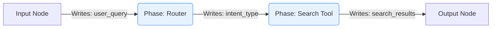

# 图执行与数据模型 (Graph Execution Model)

## 1. 13 大暴露 API 完整签名与使用场景

`packages/graph-agent` SDK 作为系统的心脏，向外（Studio 和 Cloud）保持极度克制的 API 面。以下是 4 个最具代表性的核心生命周期 API：

### `compile_skill()`
```python
def compile_skill(
    skill_path: str | Path,
    *,
    validate_context_writes: bool = True,
    cache: bool = True
) -> CompiledGraph:
    ...
```
- **使用场景**: 在运行或分析任何技能前必须调用的步骤。它读取 `SKILL.md`，构建 DAG（有向无环图）。
- **返回值**: 返回 `CompiledGraph` 对象，该对象可以被缓存和多次执行。若包含语法或依赖死锁问题，将引发 `CompileError`。

### `predict()`
```python
def predict(
    compiled_graph: CompiledGraph,
    inputs: dict[str, Any],
    *,
    mock_llm: bool = True,
    config: Optional[RunConfig] = None
) -> dict[str, Any]:
    ...
```
- **使用场景**: 专为 Studio 调试阶段设计（对应 MVP0 模块 5 的 Predict 按钮）。主要目的是跑通数据映射和 Python 代码逻辑。

### `run()`
```python
async def run(
    compiled_graph: CompiledGraph,
    inputs: dict[str, Any],
    *,
    config: Optional[RunConfig] = None
) -> AsyncGenerator[RunEvent, None]:
    ...
```
- **使用场景**: 真实的调用入口，与大模型通信，烧录 Token，产生真正的业务价值。
- **返回值**: 这是一个异步生成器，实时吐出 `RunEvent`（用于渲染前端的 Timeline 瀑布流），最后包含完整的终态结果。

### `resume()`
```python
async def resume(
    compiled_graph: CompiledGraph,
    thread_id: str,
    update_state: Optional[dict[str, Any]] = None
) -> AsyncGenerator[RunEvent, None]:
    ...
```
- **使用场景**: 配合 Human-in-the-Loop 或 Debug 流程，从指定的 Checkpoint ID 原地接续执行。

## 2. Graph 拓扑与上下文大黑板

Graph Agent 不使用全局变量，而是依赖于明确定义的 **Context 字典 (The Blackboard)**。



### DataMapper 行为与类型断言
每个 Phase 必须显式声明所需的输入和将产生的输出。在进入节点前，Engine 内置的 `DataMapper` 执行以下工作：
1. **提取**: 从 Blackboard 中依据变量名抠出所需的数据。
2. **断言**: 执行强制类型检查（例如，声明需要 `list`，但大黑板上存的是 `str`，则立即报 `DataFlowError` 断流错误）。
```python
# 伪代码演示 DataMapper 断言
def map_inputs(blackboard: dict, phase_inputs: list[InputDef]) -> dict:
    mapped = {}
    for inp in phase_inputs:
        val = blackboard.get(inp.name)
        if not isinstance(val, resolve_type(inp.type)):
            raise DataFlowError(f"Type mismatch for {inp.name}")
        mapped[inp.name] = val
    return mapped
```

## 3. Predict vs Run 状态差异与 Mock 注入

在 `predict` 空转模式下：
- 引擎底层的模型工厂会被挂载一个 `MockModelInterceptor`。
- 当执行到 LLM Node 需要调用大模型时，拦截器直接抛弃请求，并基于目标 Schema，使用轻量级库（如 `faker`）或静态占位符生成假的 JSON 响应（例如：`{"summary": "Mock summary generated here."}`）。
- 此模式下 `Tool_Call` 会用假参数调用真实的 Python 函数代码，确保所有工具层不会崩溃。

## 4. Checkpoint 内部结构与 Resume 协议

Engine 底层强依赖 `LangGraph` 框架的持久化层。

- **Checkpoint 结构**: 包含了序列化后的全局 Blackboard 状态、当前停留的节点指针（Next Node ID），以及一个不可篡改的 `thread_id` 作为会话唯一标识。
- **Resume 协议**:
  1. 前端获取暂停节点的 `thread_id`。
  2. 若用户干预了数据（例如修正了一个 JSON 字段），前端组装一个 `update_state` 字典。
  3. 后端调用 `resume()` API，框架加载对应的 Checkpoint，用 `update_state` 更新 Blackboard，然后从 `Next Node ID` 唤醒引擎继续流转。

## 相关 Spec
- [predict-v2](../../.kiro/specs/_archive/predict-v2/)
